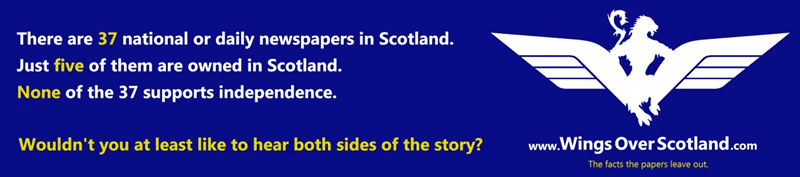

For the last wee while some of you may have noticed some news coverage about Scottish independence. This post is about the value of an independent Scotland for me, so if you are not interested in politics then move along. It will all be over in a few months and you will likely never have to hear about it outside of history again.

If you follow me on Facebook or twitter then you will have seen a plethora of posts about this subject. I have mostly kept this subject away from my company except for a small post about donating to Yes Scotland. I think that you can guess which side I come down on. However, there is a nefarious dynamic to the debate.

{ .post-img }

I have been appalled by the bias of the BBC and the mainstream media in general. Steven Borg warned me that my faith in the BBC was misplaced but I failed to listen. I am listening now, and even the BBC's own internal regulatory body has sanctioned it more than once for its position. Indeed, as we enter the final 200 days, there are tight rules forcing all media to be impartial. We can already see many that are flouting the rules. If its negative for the Independence debate, then it gets plenty of airtime, if its positive, it gets ignored.

{ .post-img }

Just look for coverage of the circa 2000 people who protested outside the BBC, or the [fake reports of 34,000 people turning up for Armed Forces Day](http://wingsoverscotland.com/conflicting-reports/)! Now that was a farce.

## The value proposition

For me, the question of independence is one of value. Value for me and for my children and their children. This is not a decision that I take on the basis of short term financial gain / or loss, nor even one of the wants and needs of my ancestors. I believe that Scotland should be an independent country. I believe that there is more value in being independent and being able to control our treaties with everyone, including England.

Some key issues for me:

1. **Self-determination** - I currently look at countries like Iceland, Norway, and even Ireland that are doing very well as small countries. Go and ask them if they would rather secede their self determination to another power and see how they would respond. Would Norway re-join with Sweden? Would New Zealand use its legal right to join with the Australian territories? Would the USA re-join the British union it has suggested is a good thing? No... None of them would. Even a US state has more tax raising and varying powers than Hollyrood has in Scotland .
2. **Scottish money spent in Scotland** - I work hard all over Europe and I pay taxes in Scotland. Those taxes are sent to Westminster and then a portion, that they determine, is allocated back to Scotland. Some of that money is spent on Trident and some is spent on HS2. Hell, some of that money is spent on Schools in London and Hospitals in Birmingham. Now while I am happy for them to get money, there is no value to me of a hospital in Birmingham or a School in London. What value is it for me or my kin to have a high speed rail link between London and Manchester? Not much I would wager.
3. **Less of a target** - Both on the geo-political level and the "war on terror" Britain's foreign policy, which is closely related to US policy, has made Scotland a target. Luckily for us [Al-Qaeda sent there dumbest guys our way](http://www.youtube.com/watch?v=7gMJBQoHJ4E), but they did send them. Even if I was willing to accept that this was just the cost of doing business in the modern world, I would draw the line at Westminster basing all of its [nuclear arsenal 20 miles outside of Glasgow](http://wingsoverscotland.com/map-ref-55n-5w/)! So, not just a target of modern warfare, but old school warfare as well. You never hear of Al-Qaeda saying "those damn Norwegians".
4. **More Immigration** - Scotland will not survive without an even higher immigration level than we have now. Its just reality that we are a small country with a small but aging population. Many immigrants come to our country and work for many years paying into the state pensions. Those folks pay taxes, and then when they become eligible for a pension, they move back to their country of origin with their nest egg. This leaves a ton of money that they paid into the pension. More immigrants please.
5. **Get a better deal** - Right now, if Scotland has utility or services that other parts of the UK wants, then it is negotiated by Westminster in favour of Westminster. This is an inherent conflict of interest, and even though the same can be said of Hollyrood, at least it will be Scots taking advantage of Scots and not another country taking that advantage. Its easier to sack our own.

## Into the unknown

Yes, the future is unknown. In fact, I would suggest that I have a much greater chance of knowing what the future holds with iScotland than with rUK. Both the Scottish government and the Westminster parties have laid down what they believe the future will look like. It is, however, just a prediction as no one can know what is around the corner.

If you take all of the scare stories out of the picture what will change? What do we know for sure?

- **In an independent Scotland (Yes)** - Well, we will not have a Tory government. We will have a government that we voted for. We will likely have more tax to pay for the higher level of services demanded by the Scottish people. We will likely still have a public NHS. We will have free higher education and prescriptions. We will be in the EU, and naval boats will continue to be built in iScotland. Oh and fracking will be banned, and a similar points based immigration system to Australia implemented.
- **In UK (No)** - Privatisation of the NHS is already underway in England, so Scotland would likely follow. We will have more austerity measures. Free prescriptions and free higher education will end. Immigration, so sorely needed to maintain the Scottish economy, will be reduced. Fracking has already been allowed, and £30 billion to be allocated to replace Trident. In short there will be less investment in out future.

How about a little exercise?

- **If yer Scottish** - Lets assume that in the long run shit always works out which ever way we decide in September. Take your current knowledge of both Westminster and the Scottish government positions. I want you to imagine a future world where you are bouncing your grand kids on your knee. Where would you rather be? iScotland or rUK?
- **If your American** - This is [not the same as North Dakota separating from the USA](http://wingsoverscotland.com/an-actual-letter-from-america/) and If, as your President recently attested, the Union looks to be working and should stick together. Why don't you give up your sovereignty and re-join the Union? Indeed, why did you leave the Union in the first place 100 years after it was formed?

I get asked, time and again, by both Europeans and Americans, which way I think it will go. While I support [Yes Scotland](http://www.yesscotland.com) (with money not just with platitudes and 'likes') I really do not know. The polls are so close, 3-5 points in it, with a large group of undecided and it is really hard to tell. This is a contest that will go to the wire, and have both sides pulling out the stops as we get closer to a result. It will either be a vista of democratic beauty or a brawl of epic proportions. I know what I am expecting, and we all need to be aware of the dangers ahead as well as the values.

I don't expect it to be pretty, but I am looking forward to Alex Salmond, the First Minister of Scotland, debating Alistair Darling, the chairman on the No campaign. Whatever happens on September 18th there will be a lot of unhappy people above and below the border.
