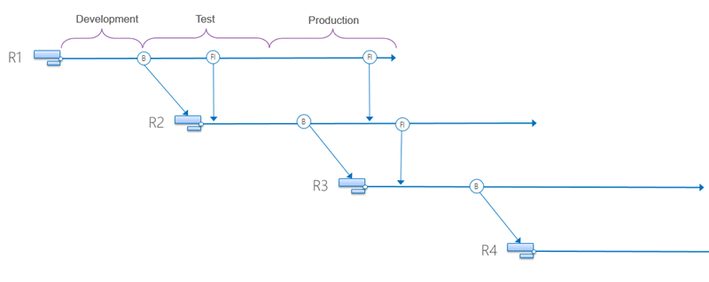

For the last few days I have been working with a customer in the UK on a grass roots engagement to help them solve their source control issues. They have ended up with a pick-n-mix branching anti-pattern and could not see the way out.

The pick-n-mix branching anti-pattern is something I encounter quite often and on the surface it looks like it should work and give the business flexibility. However the real result is lost code, failed releases, technical debt, unhappy customers, and an erosion of trust with the business.

For the last few release they had noticed that they had been missing things from the release and this had resulted in some major bugs and egg of the face of IT. This is obviously not acceptable and they were looking for advice on how to move forward. There current source code management model was not working for them.

{ .post-img }

In their current model they were doing something that I like to call pick-n-mix branching. In the diagram above you can see the pick-n-mix branching anti-pattern where in scenario #1 we are leaving behind some of the changeless. However in scenario #2 we are taking a couple of changeless that are dependant on some things that were left behind. This may result in a compile time error, or worse in the case of a website or some asset types. What if these were SQL changes... How hard would it be to debug why the development code line works and Test does not. Worse again when you compound the result and this happens over many years it may work out for a while but even just a year down the line how much code is there in development that was never pushed to test. And how to you know which is which when you are adding new features to development?

The pick-n-mix branching anti-pattern is a symptom of poor planning and almost always results in a code promotion model. In a code promotion model you are promoting source code from Development->Test->Production. This has the unfortunate consequence of complicating your quality assurance. You do not test code, you test the binaries that are a result of the compilation process. You might have clever packaging but ultimately you are releasing those binaries. However the reality is that if you create new binaries you are going to need to test them all over again to get any kind of assurance. Even without pick-n-mix code promotion is not the best of ideas but with! Now we are easily in a world of hurt.

On small projects with few developer this can work. I even had a customer that create a software tool around this so that they could scale. However this is dysfunctional behaviour and results in a number of issues:

- **Technical Debt (or an un-hedged fund)** - More and more code will ley unfinished in the Development branch which results in an inability to have 100% working software every build.
- **Merge Chaos** - Over time the difference between development and production will increase leaving developers with less and less idea of what dependencies they can take. This results in total chaos at merge time, and it will only get worse as time goes on.
- **Retest required** - if you are creating new binaries then you have to re-execute all of your tests even if you think nothing has changed. You have just created a brand new version of your application.
- **Business Trust** - As your software erodes you will more often have failed rollouts and more major bugs in production. The result is a total lack of trust in your ability to deliver by your business. This often results in a crazy and convoluted gated model for deployments with loads of ass-covering paperwork.

The pick-n-mix branching anti-pattern is used as a crutch for poor planning. The solution for this is a single branch line and using feature flippers (toggles) to determine what code is run. However this requires engineering work and cannot be turned on with a switch. It will take some time, often a considerable amount of time, to engineer into the product. The only way to mitigate this in the short term is to switch to a Feature branching model.

{ .post-img }

In a Feature branching model we have single main (or trunk) line with multiple branches for each feature. Features are one or more things that will ship together. There will be no pick-n-mix and everything on that feature line will merge to the 'main' line at the same time. This will require a little more planning as you need to separate your features early. And a little more coordination from your management to make features distinct. This however gives you the capability to continue to release some features and not others without changing your code too much.

There are still a few downsides:

- **Multiple instances** - we need an instance of our application per feature branch. This can be expensive and time consuming.
- **Break in binary pipeline** - as we are still on a separate branch and promoting code we can't have a seamless binary promotion model. We can however have one per feature and then an end-to-end one pipeline for Integration

In an ideal world you need to change your code, using agile engineering practices, to allow you to be able to turn any feature off at any point in the release cycle. This would allow you to not ship a new feature as late as the day of release (or later) without having to rebuild, change a single line of code, or run your full regression again. When you are able to do this then you can move to a more advanced branching model where you maintain either a single source line, or for business reasons you may have a step structure for major releases.

{ .post-img }

In the step model you go back and fix bugs on the oldest version that you support that has the bug. You can then push forward from parent to child in the clear safety of never having to choose between bugs and new features.

When you are in the zone with the need for withholding features between major versions for marketing reasons then you may need to work on separate branch lines. This is most effectively solved by using a step, or branch by release, model. This is not a branch for every bug fix or small change but instead is relegated only for the major changes. This allows your branch line to move through various states at different times depending on the criteria that you set. You may still have the idea of 'dev', 'test', and 'prod'. However the difference between the states is likely only one of rules-of-engagement.

However this is still just feature branching except we are looking at major releases. As you organisation realises the power of continuous delivery and the speed with which it can get function to market they will start to change and accept the reality. When that happens you can move to the most optimal branching model of all. The single line.

## Conclusion

If you are currently in a pick-n-mix branching model you need to move immediately to a Feature branching model to reduce risk and promote stability. It may take a while to get to this point but it will make your life easier and allow you to start building more trust with your business as you are more likely to be successful with releasing. At this point you can move to binary promotion on your main line to reduce your test matrix.

Once you are there you should look at implementing the engineering necessary in your product to implement Feature flippers to whatever level of granularity makes sense in your application. This may be by feature, user, or account and should provide you with the flexibility that your business require and is willing to pay for. Now we can move towards true binary promotion from our development phase all the way through to production.

Even while in a single branching model with binary promotion you may find the need to have a stepped model where you need to support multiple versions of your product. This can be achieved without crippling your teams by having your branching flow forward from parent to child as you move through major releases of your software.

Ultimately there is no excuse for using the pick-n-mix branching anti-pattern for branching. Step up, be professional, and fix this one for good.
