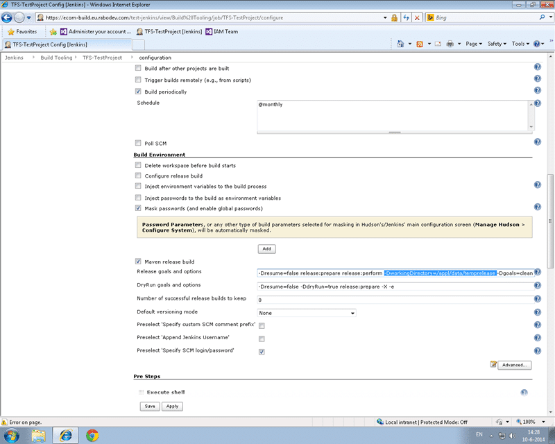

If you are using TFS and specifically switching from SVN to TFS then you might run into the issue that your Maven release perform tries to do a Get to a workspace sub folder. This will not work as TFS has a validation exception to trying to map a sub folder inside an existing workspace. That could be disastrous in a real situation.

Could you imagine if, while in the middle of a compile, another build kicked off and overwrite your files? Worse if that other build was executing an only slightly different version of your codebase and it created a successful compile of goodness knows what disaster waiting to happen. (shiver.)

To be honest I am not really a fan of the whole compile and release in one tool. The problem is that if I have just deployed and validated a version of the code I want that version deployed. Not a new one, which is exactly what I get it if I compile again. Compiled output always have meta data associated with them and that changes every time you build. So your output, while likely extremely code to your previous compile if the code has changes will always be different. No sensible QA manager would ever sign of on that. A more secure and consistent deployment can be gained by \[creating a binary release pipeline\] that starts at DEV.

Anyway, this issue was about the maven release perform stage where my build that I am trying to configure to use TFS tries to do a GET of the label it just created (what value there is in this I do not know) to a sub folder of the current workspace. This does not error, but does result in a missing folder and thus a missing .pom file.

```
[INFO] Scheme - https
[INFO] files: /appl/data/ci-test/jenkins/jobs/TFS-TestProject/workspace
[INFO] Command line - /bin/sh -c cd /appl/data/ci-test/jenkins/jobs/TFS-TestProject/workspace && tf checkin -login:hinshelwoodmjh,****** -noprompt '-comment:[maven-release-plugin] prepare for next development iteration' /appl/data/ci-test/jenkins/jobs/TFS-TestProject/workspace/pom.xml /appl/data/ci-test/jenkins/jobs/TFS-TestProject/workspace/TestProjectLibrary/pom.xml /appl/data/ci-test/jenkins/jobs/TFS-TestProject/workspace/TestProjectWeb/pom.xml /appl/data/ci-test/jenkins/jobs/TFS-TestProject/workspace/TestProjectEar/pom.xml /appl/data/ci-test/jenkins/jobs/TFS-TestProject/workspace/TestProjectDistribution/pom.xml
[INFO] err -
[INFO] Release preparation complete.
[INFO]
[INFO] --- maven-release-plugin:2.5:perform (default-cli) @ TestProject ---
[INFO] Checking out the project to perform the release ...
[INFO] scmUrl - https://tfs.comapny.com/tfs/DefaultCollection::$/MainProject/VisualStudioALM/JavaTestProject
[INFO] Scheme - https
[INFO] Command line - /bin/sh -c cd /appl/data/ci-test/jenkins/jobs/TFS-TestProject/workspace/target/checkout && tf get -login:hinshelwoodmjh,********** -recursive -force -version:LTestProject-1.4.10 /appl/data/ci-test/jenkins/jobs/TFS-TestProject/workspace/target/checkout
[INFO] err -
[INFO] Executing goals 'javadoc:jar deploy'...
[INFO] [INFO] Scanning for projects...
[INFO] [INFO] ------------------------------------------------------------------------
[INFO] [INFO] BUILD FAILURE
[INFO] [INFO] ------------------------------------------------------------------------
[INFO] [INFO] Total time: 0.100s
[INFO] [INFO] Finished at: Fri May 23 14:42:40 CEST 2014
[INFO] [INFO] Final Memory: 5M/10M
[INFO] [INFO] ------------------------------------------------------------------------
[INFO] [ERROR] The goal you specified requires a project to execute but there is no POM in this directory (/appl/data/ci-test/jenkins/jobs/TFS-TestProject/workspace/target/checkout). Please verify you invoked Maven from the correct directory. -> [Help 1]
[INFO] [ERROR]
[INFO] [ERROR] To see the full stack trace of the errors, re-run Maven with the -e switch.
[INFO] [ERROR] Re-run Maven using the -X switch to enable full debug logging.
[INFO] [ERROR]
[INFO] [ERROR] For more information about the errors and possible solutions, please read the following articles:
[INFO] [ERROR] [Help 1] http://cwiki.apache.org/confluence/display/MAVEN/MissingProjectException
[INFO] ------------------------------------------------------------------------
[INFO] Reactor Summary:
[INFO]
[INFO] Test Project ...................................... FAILURE [42.119s]
[INFO] Test Project - Common Library ..................... SKIPPED
[INFO] Test project - Web Application .................... SKIPPED
[INFO] Test Project - Enterprise Application for web application  SKIPPED
[INFO] Test project - Distribution project ............... SKIPPED
[INFO] ------------------------------------------------------------------------
[INFO] BUILD FAILURE
[INFO] ------------------------------------------------------------------------
[INFO] Total time: 43.130s
[INFO] Finished at: Fri May 23 14:42:40 CEST 2014
[INFO] Final Memory: 14M/31M
[INFO] ------------------------------------------------------------------------
```

This understandably results in a failed build/release. Not only did this one take a while to understand I had to consult with an awesome Java expert in the form of [Corstijan Kortsmit](http://nl.linkedin.com/pub/corstijan-kortsmit/74/ba2/a9b/en) who identified the solution in about three seconds. It was one of those "Oh… that… you just…" sort of answers.


{ .post-img }

If you head over to the configuration of your build and look for a section entitled "Build Environment". Here there are two important sections. We have a couple of boxs to put additional command line parameters for the maven release plugin. We need to add at least a "-DworkingDirectory" parameter with a specific folder for where to do the get.

\-Dresume=false release:prepare release:perform -DworkingDirectory=/appl/data/temprelease -Dgoals=clean install

The additional issues to think about are around multiple users as well as multiple builds working simultaneously and multiple users.

Multiple builds is solved by adding parameters for something unique to the instance. In Team Build each 'Agent' can only run one build at a time but you can run multiple agents on a single server. Each agent gets a unique ID and by default TFS created a distinct workspace for each instance that can be shared across instances of the same build. This makes the second build potentially faster on any given agent as you don’t need to always clean workspaces as you can sync them. Here I could not see an agent ID so we went with the Build Instance ID. The down side to this is that you have to do a full get for every build and it might be slower.

Multiple users is an easier issue to solve. We added pre-build commands to create a workspace in the folder above and we made it 'public' meaning that any user can use it. By default a workspace is created as 'private' and another user can't use that folder. With a 'public' workspace we can have the first user create it and then reuse it time again for other users.

This got the build working. Our only outstanding issue now is that build from SVN have a Tag created. In TFS this is done as a label, however labels are mutable. They can be changed after the fact with no audit record. We will likely solve this by creating a read-only branch instead of a label.

Let me know how you get on with your migrations to TFS.
