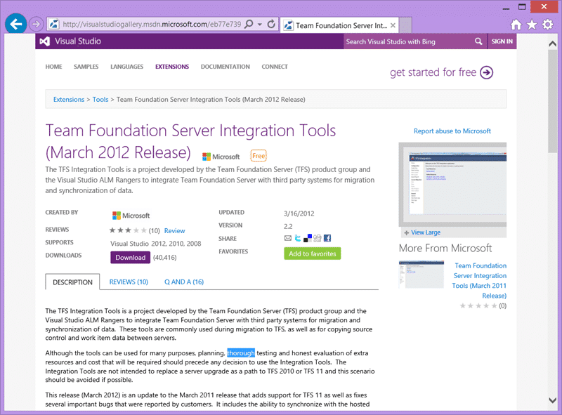
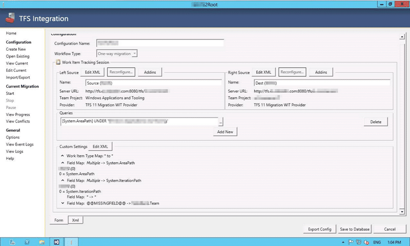
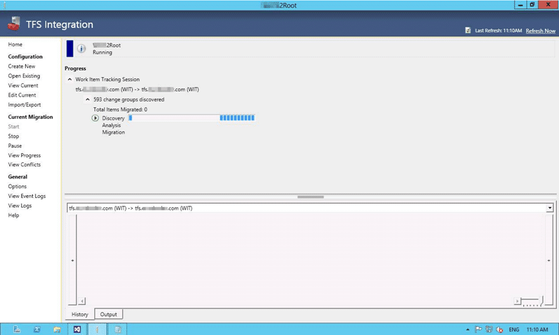
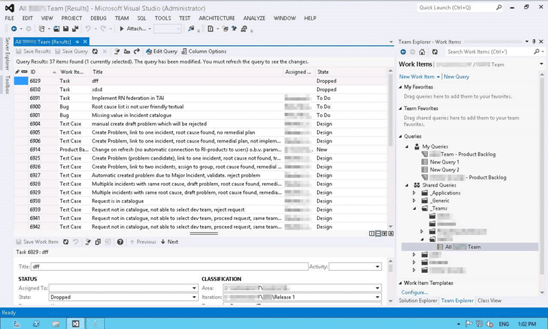
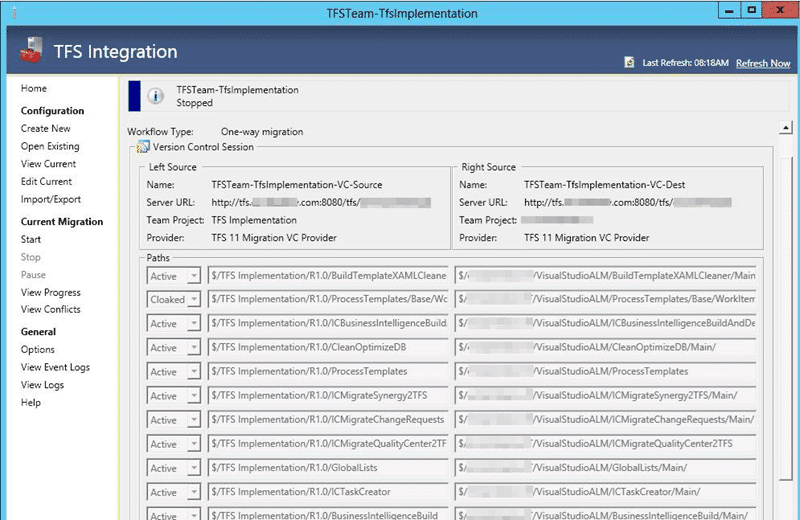
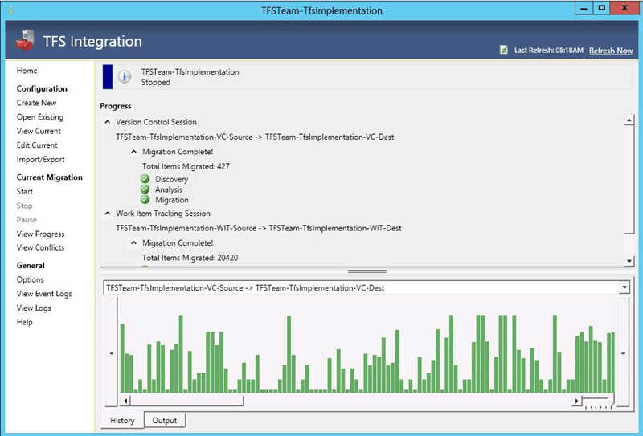

In TFS 2012 the product team introduced the concept of Teams into TFS. Before this many organisations created multiple Team Projects and now want to merge Team Projects into one, or at least fewer. There are many reasons you might have done this in the past but there is no reason to live with this.

The simplest way to merge Team Projects is to create a new Team Project, add all of your teams and start from scratch. However for many organisations this sort of disruption is just infeasible and they would rather work with the dysfunctional and limiting layout rather than start again. For them there is another way. I will however warn you now… pain and suffering lies ahead if you choose to proceed.

I am going to use the TFS Integration Tools to move consolidate Team Projects. You can use it to move Work Item and Source Control from one TFS server to another. I have used it to move work between collections, between team projects in the same collection, and to push data between TFS instances. Indeed I have used it to move TFS data to and from Visual Studio Online and a local TFS. While this tool is flexible it is difficult to use.

Note If you try to move source from the same TFS Server back to itself you will run into many workspace issues. It is VERY hard to resolve this in the current tools.

I would recommend that you do one or more dry runs for some of your more complicated code (branch and rename complicated) and see how it goes. If it's really hard you may need to give up and migrate without history or with limited history. If you like you can get a consultant in (hi) who may be able to do more, but often will hit the same issues. This post is to document some of the ways you can merge many TFS team projects into one and mitigate some of the pain.

## Installing TFS Integration Tools

Make really sure you use the version from the [Visual Studio Gallery](http://visualstudiogallery.msdn.microsoft.com/eb77e739-c98c-4e36-9ead-fa115b27fefe) rather than the one Codeplex. While the Codeplex one is newer it is not supported by Microsoft. Always go the fully supported route.


{ .post-img }

When you run the installer it will ask for a SQL Server location. This SQL Server will be used to host the tfs_Integration database and really should be local to the server. Nothing slows this tool down like a network between you and the DB. I recommend installing [SQL Server Express](http://www.hanselman.com/blog/DownloadVisualStudioExpress.aspx) locally. You need to also make sure that you have at least one version of TFS Client API's installed. You will only be able to select adapters that have access to the relevant API. So if you need the TFS 2010 adapter then you should install the TFS 2010 API's.

1. If you get an error when installing that you do not have Team Explorer when you do you likely installed just Team Explorer and not full Visual Studio. Unfortunately there is a bug in the Integration Tools that prevent it from detecting it. Same the following code as a .reg file and double click to solve your issue.

   ```
    Windows Registry Editor Version 5.00
   [HKEY_LOCAL_MACHINE\SOFTWARE\Wow6432Node\Microsoft\VisualStudio\11.0\InstalledProducts\Team System Tools for Developers]
   @="#101"
   "LogoID"="#100"
   "Package"="{97d9322b-672f-42ab-b3cb-ca27aaedf09d}"
   "ProductDetails"="#102"
   "UseVsProductID"=dword:00000001

   ```

2. Do not install the 'service' option. If you do the Integration Tools get installed in a move that will only use that rather than self-hosting. It is better to do manual runs with the tool window open. Better for debugging as well.

## Creating your Configuration

Once you have the TFS Integration Tools installed and you open them for the first time you will need to create a new configuration. This is a large XML format definition that sets all of the properties and settings for the migration. You will do a lot of editing of the XML directly as there is no nice UI for most of the cool and important stuff.

To create your first configuration you use the "Create New" link from the left navigation. This will pop a template selection box. All of the templates are xml files stored on disk. Once you have selected a template, the one below is the Work Item Only template.

Your first task will be to configure both the source and the destination. Here you select the adapter for the left and right sources. If you do not have the adapter you want listed please refer to 'pain mitigation #2' below.


{ .post-img }

Above I have configures both the left and the right source to be different Team Projects but within the same collection. Now, as I am moving between team projects it is possible that I could have the Scrum template on one and the CMMI template on another. While you can create a complex mapping file between the template, and I have had to do this many a time, you should try to avoid it. Use pain mitigation #3.

You can create some pretty complex migrations even within the bounds above. But let's look at some of the custom configurations that matter here.

1. If you don’t have the desired source and destination version of TFS you may have neglected to install the appropriate version of Team Explorer.
2. If you don't see a TFS 2013 adapter listed even though you have Team Explorer 2013 installed don't panic. Install Team Explorer 2012 and use the TFS 11 adapter. I am trying to get MSFT to \[open source the TFS Integration Tools\] so that I and others can fix these issues but so far they have not been forthcoming.
3. You should get the source and destination Work Item Type definitions into sync. This means that you may need to [migrate your process template](http://nkdagility.com/upgrading-your-process-template-from-msf-for-agile-4-to-visual-studio-scrum-2-x/). While not required it makes things much easier.

### Creating a custom configuration for work item tracking

The first thing to configure is work item tracking. I would recommend that you always pic "continuous manual" rather than the default of "One-way" migration as continuous manual lets you complete a migration, have folks check it out and then push any changes they have made in the interim. As long as changes are not being made in both places this works great.

The other major configuration I recommend is to enable bypass rules. Effectively the TFS Integration Tools work in two modes. The first is through the API's. If you are using the API you have to abide by all of the rules of work items. So all of the Work items that you try and save MUST be valid. This can be difficult if there are any differences between the source and the destination process. Remember that we are pushing history so all revision values must be valid. If we ever upgraded our process template the old values are still in there. Remember we are also migrating the revisions. For this we need to be able to bypass the rules and this can only be done through accessing the web services directly. While not strictly supported the TFS Product Team made a special case of the TFS Integration Tools.

If you add a custom setting of EnableBypassRuleDataSubmission and set it to 'true' like above you will enable this ability.

The next biggest thing is the ability to create composite or aggregate mappings. Specifically for the Area and Iteration paths. If I am merging many existing team propjets then where I had an area path of "\\MyArea" I want that to be translated to "\\TeamProjectA\\MyArea". I may also want to add other fields into the area path and this gives me that ability. When you get to the mapping of fields as you see above you need to add and Aggregated Fields section under your Field Maps one.

Here I am making sure that I do not have conflicts with the data by placing all migrated data under a new node called "TeamProjectA". You may want to do more specific field and value mappings but this is where I always start and is mostly good enough.

The only other non-standard thing I am doing here is that I am moving from a Team Project that does not use \[Team Field\] to one that does.

For that my field map contains some values, specifically my new Company.Team field, that only need to exist in the new template. I literally do a \* to "OldTeamProject" mapping. To do this you use @@MISSINGFIELD@@ to tell the integration tools not to go looking for it on the left.

We can then have a simple, and out only, value map of everything to "OldTeamProject".


{ .post-img }

If you are only configuring Work items then you can click start and execute the migration. Note that you can't delete work items per say. So once you migration you are done with no do-over. Technically you can use the Power Tools to delete one work item at a time however that is a little bit cumbersome if you have just pushed 30k work items and need to delete them. To help out I created a command line tool to [delete work items from TFS or VSO](http://nkdagility.com/delete-work-items-tfs-vso/).


{ .post-img }

Again I have done tones of migrations and consolidations this way and while it is never what you might call 'fun' it can and does do the job. The results can be mixed but if you persevere and learn the tool you can make magic.

Note: I would only recommend this for more than.. Say… 1000 work items to migrate. Less than 1000 you should consider a flat Excel migration.


{ .post-img }

I currently have 14 teams that have all migrated into a single team project. Some of those teams were already in TFS and needed to come across into a single Team Project. Others had [work items in Excel or SharePoint](http://nkdagility.com/import-excel-data-into-tfs-with-history/) or Quality Centre.

1. At this point, if you have enabled the bypass rules switch you will need to add the account that the TFS Integration tools are running under to the "Service Accounts" group on your TFS Server. You can do this through the [tfsecurity command line](http://nkdagility.com/tfs-integration-tools-issue-tfs-wit-bypass-rule-submission-is-enabled/). No, just giving the users the "on behalf of others" permission is not enough as the TFS Integration Tools check that specific group on the server. You will also need to add the account to both ends, source and destination servers if they are different.
2. Practice, practice, practice. Use a separate collection or even a complete test instance of TFS to run, re-run, and run again the migration to make sure the end result is what you want. You can use a query to scope the dry runs if you have many work items.

   The filter above is for everything under the Team Project but you can use any WIQL you like. If you don’t know WIQL you can create a query in Team Explorer and "Save as" a local XMLO file then nick the contents.

3. I usually create an area called "NewTeamProject\\\_Delete". If I have an unsucessfull migration in production I move all of the work items into this location. I can then use the API in either C#, VB, or PowerShell to load all work items under that Area Path and for each one call WorkItemStore.DeleteWorkItem(id). There is a command line tool for calling this but you need to log onto the TFS server to use it and I find this way quicker.
4. If you have Test Cases in your migration and they have Shared Test Steps then the link gets screwy. Devesh Nagpal from the product team has [a command line tool to fix the broken links](http://blogs.msdn.com/b/broken_shared_steps_link_after_migration_from_tfs_integration_platform/archive/2012/11/05/broken-shared-steps-link-after-migration-from-tfs-integration-platform.aspx) after the migration.

### Creating a custom configuration for source control

Most of the time a Source migration is pretty strait forward. However there are quite a few things that are supported in Source Control that gives the Integration Platform fits. One is large check-ins. If you have a point in time when someone did a bulk check-in of many thousands of files you may want to run a partial migration to that point and then manual deal with the issue before continuing. The other option is out of memory exceptions. Another is a complex interweave of branches. If you have branches within branches within branches then like as not you are going to have to leave history behind. If you encounter an ItemNotFoundException you may have found some spaghetti branching that you never knew was there.

On option we have, all being well, when you do a migration is to rearrange you source on the way in. If you want to try this you should do lots of practice somewhere you can't do any damage. This can mess up quick and can be traumatic.

[Willy-Peter](http://blogs.msdn.com/b/willy-peter_schaub/) has a perfect rule of thumb when migrating source and contemplating how long it will take:

It will take about as long as it took to check in in the first place.

That can be a considerable length of time if you have a lot of check-ins, however for most teams you can scope a large codebase down to individual applications to make things a little quicker.

Note Really you should do everything in you power to convince folks that they just need the 'tip'. No-one, really needs history.


{ .post-img }

In order to do a migration you have to add mapping like you can see above to the list. In this case I am trying (I failed by the way, with the ItemNotFoundException exception I mentioned) to change the layout of the source. For some reason many applications and branches ended up under the R1.0 folder on the left and we really want each application to have a R1 folder. I have done this before successfully but unfortunately this set of source is managed and worked on by 6 ALM consultants that think that they are smart (yes, I am in there too) and thus the migration failed. Sometime that’s just tough and you have to find another way forward. In the case of this source I just repeated it without the multi-mapping.


{ .post-img }

When you migrate your source and work items together the Integration Platform will maintain the relationships between the code and work. This can be invaluable and is worth maintaining if at all possible.

Let's take a little look at the configuration file and the key elements that matter.

Here we have the basic mapping; a source folder from your left source to a folder on the right source. Because we are mapping from many team projects to our new uber team project you will likely want to have the old team project name as a sub folkder of the new team project. Above we are creating that mapping.

1. If you are mapping Source between two team projects within the same collection then expect some pain and suffering with workspace collisions. Patience is the only way to solve this one…some magic fairy dust would not go amiss either.

You may have noticed the "Neglect" attribute. Well it’s a little reverse sociology and can be translated as "!Cloak". So "true" would therefore men that the folders should be clocked from the migration. This can be handy if there is a subfolder that you don’t want or you run into issues with a particular folder structure.

## Conclusion

And that’s really all there is to it. Don’t expect to get a successful migration the first time. Or the second, or even the third. But if you persevere you can do many migrations quickly. I have [migrated 20-30 small projects](http://nkdagility.com/one-team-project-collection-to-rule-them-allconsolidating-team-projects/) into one in only a few days, however I was luckily with the low complexity and small check-ins.

Go fourth and consolidate your Team Projects….
