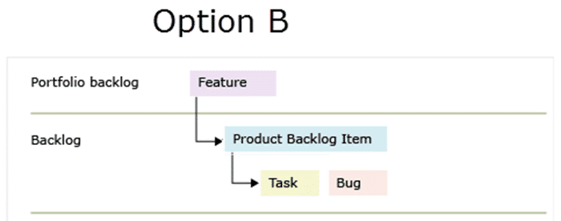

For the last few months, I have been working with an enterprise customer that has been steadily adopting Work Item Tracking in TFS. I have learned that you should avoid the Bug as a Task anti-pattern.

{ .post-img }

Updated

- 2023-10-10 - Updated to reflect Azure DevOps, and spelling fixes.

The customer that I have been working with is fairly large and there are quite a few DevOps Consultants helping them out. My task was to onboard one department of about 120 people and ~10 teams. Incidentally, these teams are, for the most part, Java teams. As with any enterprise, there are things that departments can decide for themselves and things that are handed down from on high and they are often fond of 'laterals'. A 'lateral' is a group of people who get together to make arbitrary and unilateral decisions about how a process should be implemented. Problems arise when these groups start prescribing the "how" and not just the "what". They start making technology decisions oh "how" things should be implemented, not necessarily understanding the technical ramifications.

To be fair in enterprise most 'laterals' take ownership of the process and leave the implementation of that process to the consultants on the ground. They push down responsibility for the 'how', while maintaining the 'what', to those best placed to make those decisions. However in this case the testing lateral has maintained ownership of the 'how' as well. Although they inherited the Bug as Task anti-pattern from the choice of the Agile for MSF template, having ownership of the 'how' means that those implementing do not have the lateral to make changes. This often causes a certain amount of friction as the teams adopt the tool. Agile teams, or teams moving to agile, are often restricted by the bug as a task anti-pattern.

## Why is Bug as a Task an anti-pattern?

Now you might be forgiven for coming down on the side of governance as 'we need some guidance to come from somewhere'. With many having organisational mandates to move towards agility, they are however unknowingly making decisions that are making the tooling a friction point for that move.

{ .post-img }

These decisions are often the result of the traditional silo-based delivery experience that has them not avoiding the Bug as a Task anti-pattern in TFS. If you are doing all of the development before you test then this is a necessary configuration. However, as we know that this is inherently dysfunctional making this compromise is sweeping issues under the rug rather than dealing with them. So why is having a Bug in the same domain as a Task a bad thing?

- **Not transparent** - if you do not have bugs on the backlog, then you no longer have a single unified, visible, and transparent list of things that you are working on. If you have two places to go, backlog and buglog, then how do you know priority? Suddenly you have two masters, the list of things hat the PO wants and the list of stuff we did not finish. In extreme circumstances, this buglog is not shown to the Product Owner. This is then getting pretty close to the line of fraud. Customers should always be fully aware of bugs.

- **Promotes low quality** - it's a little weird, but in my experience, if you have a way to be pedantic, then people will use it. Provide a way for the teams not to communicate and you may very well find them trying to communicate through work items. Avoid this at all costs. They are not there as a crutch for poor team communication. They are there to provide long-term traceability and to support the team's efforts to maintain priority.

- **No predictability of planning** - no really. If you have this many hidden bugs, your PO is not going to be able to understand what it takes to complete anything. If your bug rate is high then your technical debt is high and you are not really ever done. If you are not really done then you should get no points for that item.

So if there are all of these downsides why would you want to have bugs as a task. Well, maybe I do want to hid my bugs from a customer, but apart from the nefarious reasons, I can think of only one good reason: low quality.

## Where does the Bug as a Task anti-pattern come from?

If your software quality is so low that you repeatedly and consistently have many hundreds of small bugs then I can imagine the pain of always having to create one Bug and then one Task to fulfil that Bug. I see time and again teams creating PBI's called 'Bug Bucket' to hold the many smaller bugs so that the PO can prioritise them and so that they appear on the boards. If you are a product owner then do not put up with this! Ever! You should be able to prioritize one bug over another, or choose not to fix a bug at all. And if the bugs are too small for you to care about why are they not just fixed rather than spending time tracking and updating them?

Now that we understand the problem, we can dive a little deeper. We have discussed the symptoms of the bugs as tasks anti-pattern above but what about some of the causes and by inversion, solutions?

- **Poor communication** - If your testers and your coders don't talk then a lot of small things will drop through the cracks. Poor communication is a people problem and can only be solved there. Don't try to paper over the issue. Solve it...

- **Testing outside of the sprint** - Even if your team has good communication if the testing is not happening at the same time as the coding then things will get left behind. Your coders wild not be in the same headspace as when they originally wrote it, and then the testers are re-testing out of context. Poo..

- **No test first** - We need to have an idea of what we will be testing for before the developer begins to code. If you don't know enough to create at least one functional test then you should not be bringing it into the sprint. Think about it. The functional tests are the things that you use to measure whether the coder built what the customer asked for. If it is the measure you use to determine the correct outcome, then now can the coder ever be able to meet it without having it at the start? Make everyone's lives easier and eliminate rework by creating functional tests upfront. I often have to work with teams to help them understand what this looks like, however, they can very quickly get going with a little coaching.

## How do we deal with the Bug as a Task anti-pattern?

While the solutions above will work, they need to be owned and implemented by the Product Owner and the Development Team working together. Make things open and transparent and push the problem down to the people causing it. Yes, the development teams should have to create a Bug at the PBI level and then break it down into Tasks. Yes, even if they have to create a Bug and a Single task for a 10-minute piece of work. This is their penalty for not communicating effectively. If the PO is not providing enough detail in the PBI then their penalty is having to prioritize tonnes of little meaningless bugs.

{ .post-img }

By forcing the teams to treat all bugs as backlog items you force them to take a long, hard look at when they create a bug and how they deal with unfinished in-sprint work.

## Conclusion

Avoid the Bug as a Task anti-pattern in TFS at all costs. It promotes dysfunctional teams and will create friction for your teams that are doing agile. If you are still trying to [decide in the process template](http://nkdagility.com/agile-vs-scrum-process-templates-team-foundation-server/) or you have realised your mistake and [want to fix your process template](http://nkdagility.com/upgrading-your-process-template-from-msf-for-agile-4-to-visual-studio-scrum-2-x/) I have some posts to help. If you are on the right path, then awesome; however, resist all pressure to create Bug as a Task and focus instead on creating awesome agile requirements that include tests written upfront.

