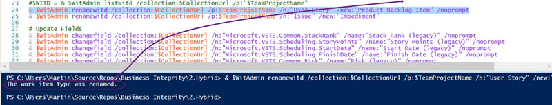

I encountered a bit of a red herring today when I was trying to rename a Work Item Type Definition (WITD) and received the message that you can't use WITADMIN on versions older than TFS 2010. However the server was TFS 2010.

I am onsite in London this week doing a migration from TFS 2010 and Perforce to Visual Studio Online (VSO) and hit a confusing error message. My Surface only has Visual Studio 2013 installed so I am calling the 2013 version of WITADMIN against the TFS 2010 server. Since TFS 2010 is fully supported this should work with no issues. However instead of working I got a strange message:

{ .post-img }

> witadmin.exe : You cannot change the display name of a work item type. The feature is not supported on versions earlier than Team Foundation Server 2010.

What do you mean visions older than TFS 2010! This is TFS 2010 dam it… so I bit the bullet and spun up my TFS 2012 box that has Visual Studio 2012 and the 2012 version of WITADMIN.

{ .post-img }

And lo and behold I got the very same message. This made me think that there was something wrong with the TFS server. The server was a native 2010 (no upgrades) so there should be no issues. I logged onto the server to take a look and what did I find? TFS2012 RTM.

So.. First things first I need to update the server. I will be using the TFS Integration Tools to move to VSO, OpsHub do not support changing Team Project name, but its so much easier when you have the same process template and I really need to update it. I was thinking of updating strate to 2013 but that would require an upgrade of SQL Server. I thought of upgrading to TFS 2012 but that would require a Service Pack for SQL Server. The least dangerous option in the end was to apply TFS 2010 Service Pack 1…

{ .post-img }

And after the upgrade?

{ .post-img }

Now I can run WITADMIN commands again.

You should always make sure that you have the latest version of whatever software that you want to use to make sure that you get compatibility with the tools. Even if you can't upgrade a full version you should never have less than TFS 2010 SP1, TFS 2012.4, or TFS 2013.2.

