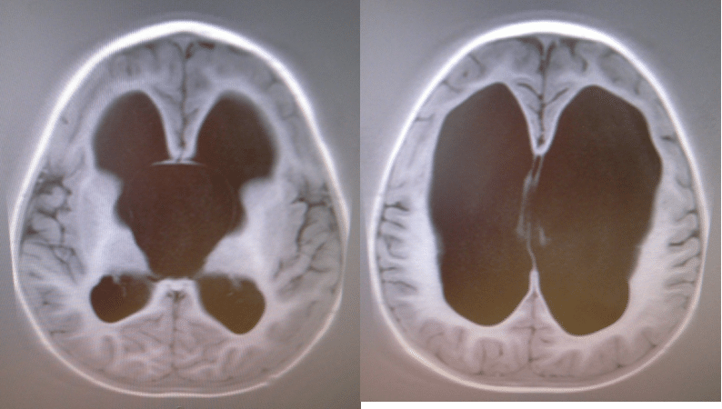

Yesterday [Buck Hodges](http://blogs.msdn.com/b/buckh/archive/2014/08/21/the-als-ice-bucket-challenge.aspx) took the ALS Ice Bucket Challenge. He was challenged by [Brian Harry](http://blogs.msdn.com/b/bharry/archive/2014/08/19/als-ice-bucket-challenge.aspx) who was in turn by [Adam Cogan](https://www.youtube.com/watch?v=P_4FM9laAl0). As I know all three of these folks it was only a matter of time before I got nominated. My torturer of the day is Buck. Really… how bad can it be? I did Tough Mudder this weekend my favourite obstacle is [Arctic Enema](https://toughmudder.co.uk/obstacles/arctic-enema) :p!!

This ALS Ice Bucket Challenge has been around for a few weeks now it has been hugely successful for ALS. This is a good thing and I that it can benefit other charities as well. In 2010 [my son Kaiden had to have brain surgery](http://kaiden.hinshelwood.com/2010/07/operation.html). He had an arachnoid cyst that was blocking the drainage of fluid from his brain. This was effectively like a blocked sink, causing hydrocephalus, or 'water on the brain'.

{ .post-img }

He was treated at the Southern General Hospital until we moved to the USA, then Seattle Children's Hospital for a few years, and now Yorkhill Children's Hospital in our home town of Glasgow in Scotland. Yorkhill is taking care of him now and I will be giving to the [Yorkhill Children's Charity](http://www.yorkhill.org/). So I guess it’s the **Yorkhill Ice Bucket Challenge**.

I am currently onsite in Norway with no transport and had to go on a mission to find some Ice. So I donned my running gear and sped down to the local supermarket. You would think that in Norway of all places there would be a ready supply of ice in stock...

{ .post-img }

... So with no Ice in Norway I decided that it would be best to do it at home on Saturday instead. Although I work in London, Oslo, Utrecht, and Athens during the week I always make sure that I am home for as many weekends as I can with my kids. Eva and Kai are awesome and I though that they would really enjoy poring ice over daddy.

{ .post-img }

We went on a mission to find ice and to my surprise many of then shops were all out. Apparently there are a few folks doing Ice Bucket challenges. ASDA and Tesco were both out so I headed to the more snobby (and thus less likely to be dry) Sainsbury's where we indeed found some ice. Wohoo...

\[embed\]https://www.youtube.com/watch?v=w4tFJxAaxoc\[/embed\]

You will notice that evil Eva bided her time and when I thought that all the water had been pored, when in fact it was only Kai's, she got her turn. If you listen carefully at the start of the video you can hear her manic and decidedly malevolent excitement at the prospect...

As I said, I am giving my £100 to the Yorkhill Childress Charity to the benefit of the new Yorkhill Hospital for Sick Children. To carry on I nominate [David Starr](http://courses.scrum.org/about/david-starr) from Scrum.org, David Hinshelwood, and [Iain Frame](http://uk.linkedin.com/pub/iain-frame/0/558/b77).

