I have been onsite in Athens for the last month to do a migration from StarTeam to TFS. We did an install of TFS 2013.3 with SharePoint 2013 on Windows Server 2012 R2 Update 1. This was my first install of TFS 2013.3 from scratch so I thought that it would be a good idea to walk through the process.

When onsite customer's often think that it is a good idea to pre-install things like SQL and TFS. However it is not. Even if their infrastructure department is awesome they will not read the TFS install documentation and will not install SQL or TFS to spec. When I get onsite the perfect scenario is a clean copy of Windows with all of the Updated installed. And I do mean all of them… not just the ones that have been approved by your WSUS department.

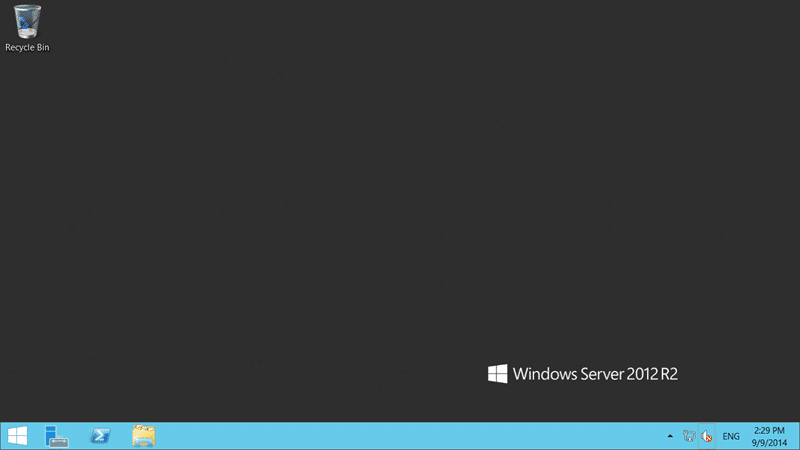
{ .post-img }

In this case I found a preinstalled Windows Server 2008 R2 with SQL 2012 and TFS 2013. So I would have to patch Windows, apply service packs to SQL (and likely reconfigure to get full text search), as well as Patch and reconfigure TFS.

However my first suggestion was to upgrade the OS to Server 2012 R2. Server 2008 R2 is three versions old and mainstream support ends in January. So instead of leaving the customer in the situation of having to upgrade in January I just asked for a new server with Server 2012 R2. They did however install and configure SQL… more on that later.

{ .post-img }

Now internet access in Greece is not particularly fast so downloading fresh bits was out of the question. I often got just 32/64 kbs downloads…. Not fun.. However, like a good TFS consultant I brought all of the bits with me and was ready to go.

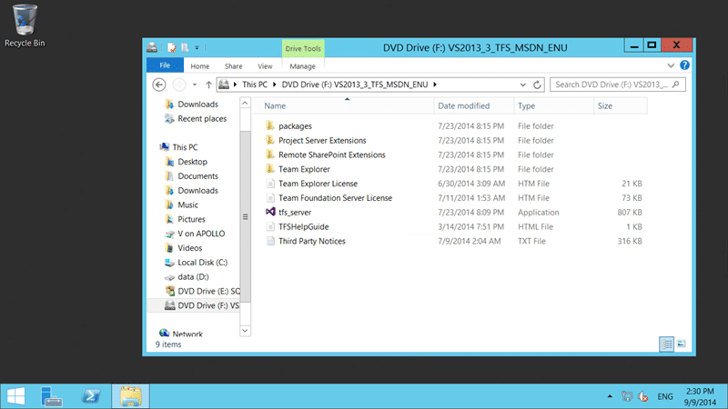
{ .post-img }

I really like that since Windows 8 and Server 2012 you can just double click on an ISO to have it automatically mounted. This was way past time to be out of the box.

{ .post-img }

Update 2013.4 is in CTP so you can't run it in production, but as soon as it comes with a Go-Live I would recommend upgrading for any customer. For now… its Team Foundation Server 2013 Update 3.

{ .post-img }

The default install is a Standard Server and while that should work perfectly I ran into a SharePoint issue and had to go with Advanced.

{ .post-img }

In the advanced configuration wizard you get to pick extras like choosing to not install SharePoint or using a non-standard SQL instance, or even a remote one. I mostly pick the advanced option anyway as I can always just click next if I don’t want to configure that screen.

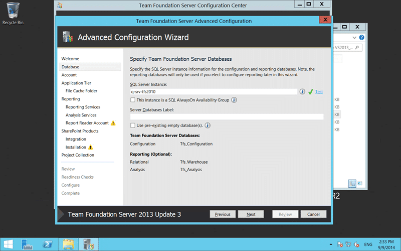
{ .post-img }

When you pick your SQL server you will get options to prefix your databases. This allows you to co-host multiple TFS instances on the same SQL server. You would get "tfs_inst2_Configuration" and so forth. You can also configure 'always-on'. If you don’t know what it is then don’t tick it… but it can give you much better availability by automatically failing over. Its kind of like a cluster, but without the pain and suffering.

{ .post-img }

Why do operations teams always give you tiny primary drives? I want all of my throw away stuff on the primary disc with the OS. If there is a failure then I don’t need it anyway. This goes for Installation, cache, and other volatiles. Microsoft recommends about 50GB for the cache so I had to switch it to the secondary drive that has more room.

{ .post-img }

You can choose to have reporting services integration here. If you are installing Reporting Services and Analysis services you can select this option. You then get both a Data Warehouse and multi-dimensional cube built out of the TFS data. Fantastic for trend analysis of your setup. Cubes make it really easy to pull together reports with Code Coverage plotted with Test Results and Code Churn. There are simpler alternatives for reporting with Excel and in the TFS Team dashboards but if you want it you can have it. This customer already has their own Business Intelligence department so they will be comfortable with MDX (Eeew) and creating reports.

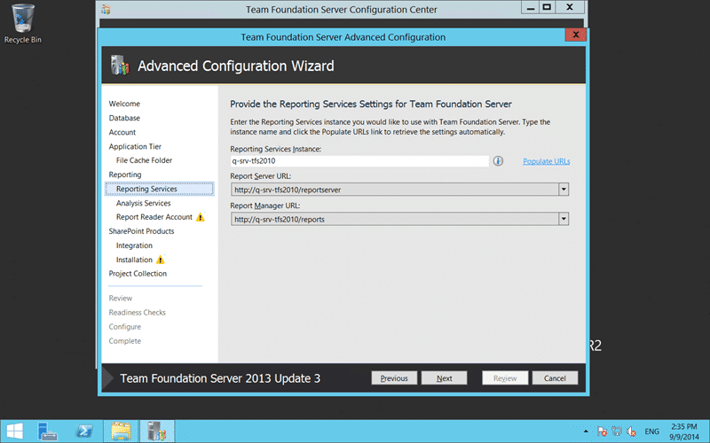
{ .post-img }

If you want your TFS server to be on a friendly URL then you probably also want to select it for reporting too. Beyond the default server name you will need to go to the Reporting Services console and add the additional URL's as host headers.

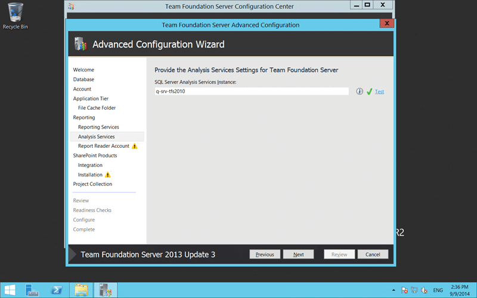
{ .post-img }

The reason the advanced wizard asks you all of these questions is so that you can implement large scale TFS instances. You may choose to have each of the services running on their own instance or even a farm. You can find out from the TFS documentation when you need to scale out but is really beyond 300 users.

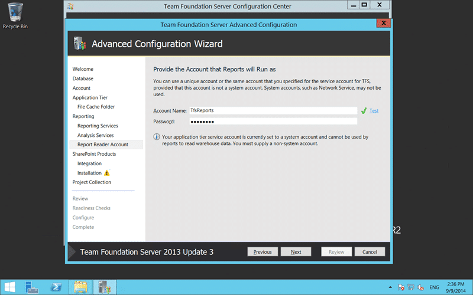
{ .post-img }

For reporting services to function correctly you should have a 'report reader' account. This account is used to execute the reports and to keep things simple, if I am deploying all on one box, I usually setup a local account. That way it has no permission outside of the server.

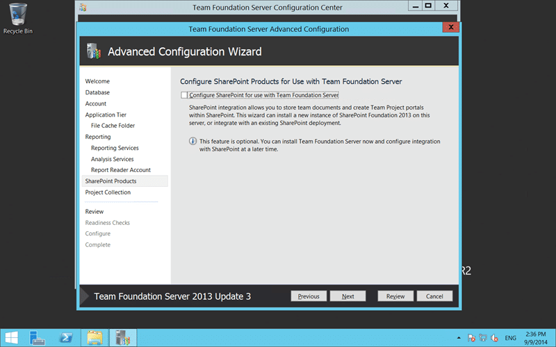
{ .post-img }

Anyone that knows me will know my favourite Scottish proverb.

"First you have a problem, you solve it with SharePoint. Now you have two problems."

However I do love SharePoint as a user, I just don't want to have to administer it. Here with SharePoint Foundation we get some good capabilities with little pain. SharePoint Enterprise is another storey….

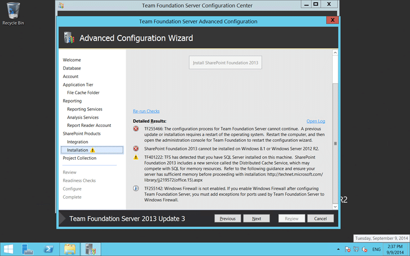
{ .post-img }

It was with the configuration of SharePoint that I ran into my first issue. The version of SharePoint that ships with TFS 2013.3 does not support Server 2012 R2. I had t manually \[download and install SharePoint Foundation 2013 Service Pack 1\] which does support the new OS.

I am fine with installing this separately and would be happy with just a link here to get the latest version of SharePoint and install it manually before proceeding.

As I had to reboot anyway to resolve the TF255466 installed update issue I had to rerun the wizard back to this location anyway. You can however just hit 're-run checks' once you have fixed most issues to allow you to proceed.

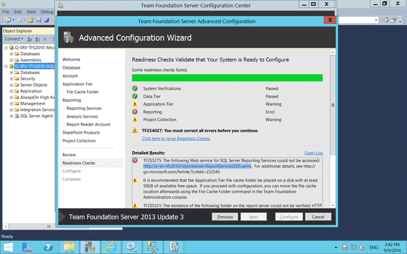
{ .post-img }

My second issue came at the end where TFS runs the Readiness Checks. These checks are awesome and make it a painless (or as painless as you can get) experience to configure TFS. It goes out and checks as many things as it can that could cause a problem with the configuration before you get half way through and have to start again. It’s a time and frustration saver.

And that is how I found out that while the operations team had installed but not configured Reporting Services. Although I don’t have a screenshot they had to also add full text search as this was missing from the SQL install and required by TFS.

{ .post-img }

Configuring reporting services is easy and we really want all default options. As Reporting Services was not configured with the default options we have to go and give it the defaults. Literally you open the Configuration Manager and select "Web Services URL" and then "Apply" to take the defaults.

Note: At this point you can also add your friendly URL

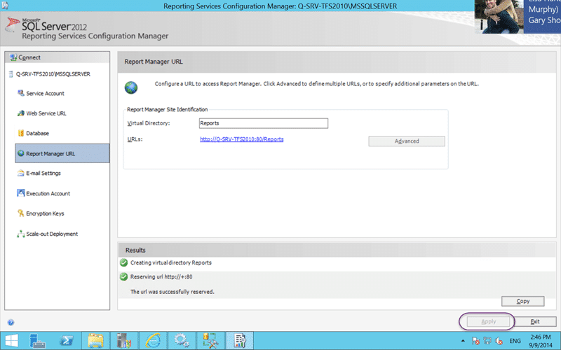
{ .post-img }

Then the same for the "Report Manager URL"… just head on over and click "Apply" to create the default bits.

{ .post-img }

Creating the databases is the only part that has any complexity, however, it is just "Create Databases"…

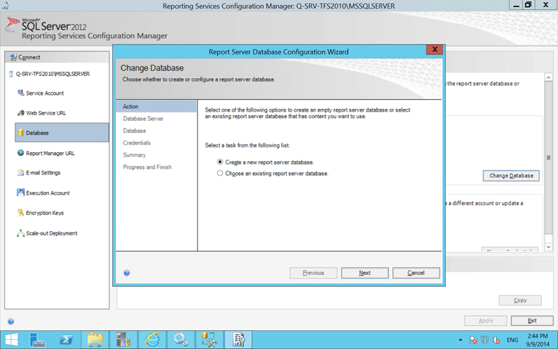
{ .post-img }

…"Next"…

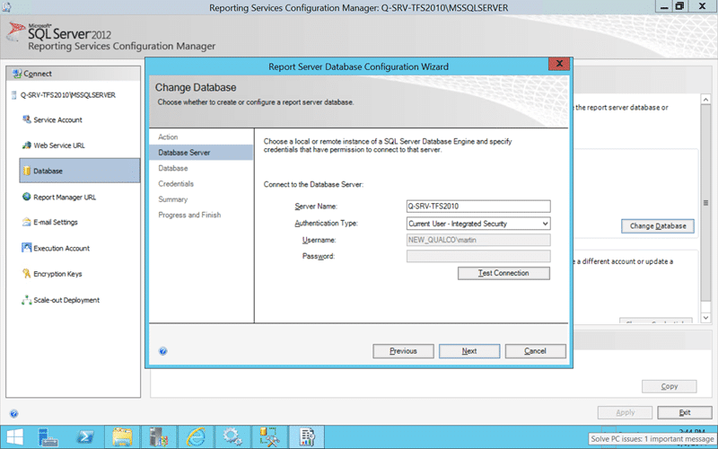
{ .post-img }

…"Next"…

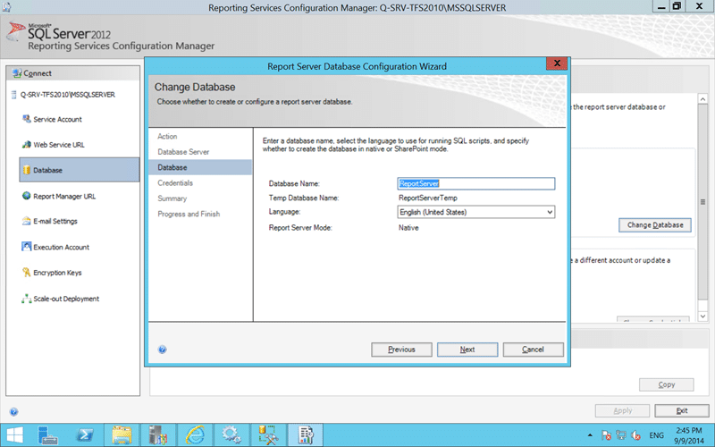
{ .post-img }

…"Next"…

{ .post-img }

…"Next"…

{ .post-img }

…"Next"…

{ .post-img }

…"Finish"…

Remove this hassle and when you install Reporting Services pick the default "Install and configure".

{ .post-img }

Flip back to the TFS configuration wizard and re-run the readiness checks to make all your errors disappear.

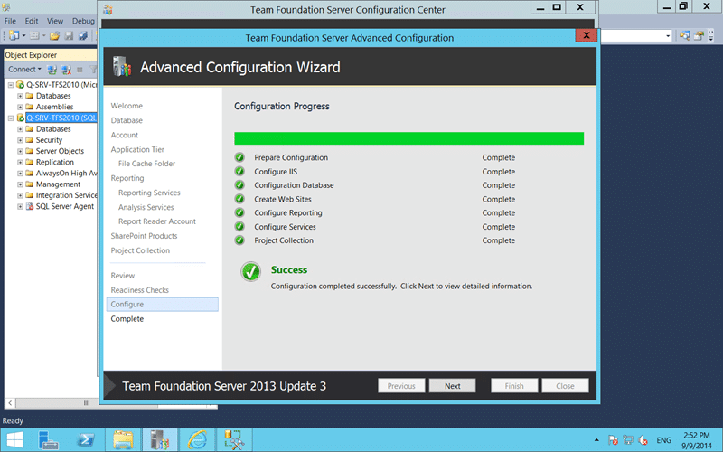
{ .post-img }

And that’s it. When you click "Configure" TFS will go off and create all the bits it needs and setup your default collection. At the end of this process, if you get a green tick, you have a fully operational TFS Instance.

Good luck with your install…
