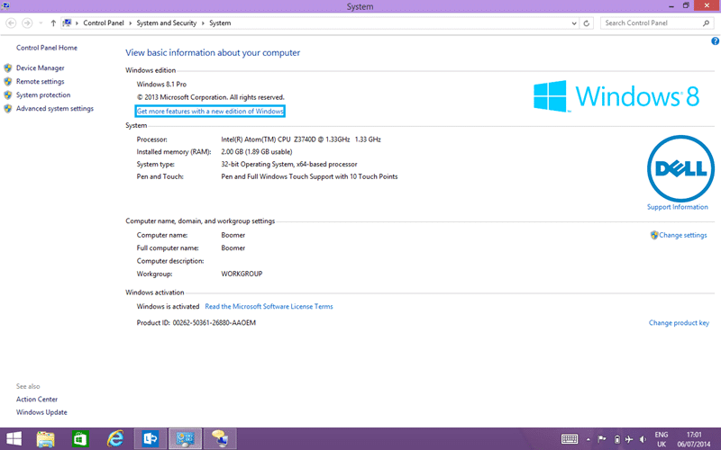
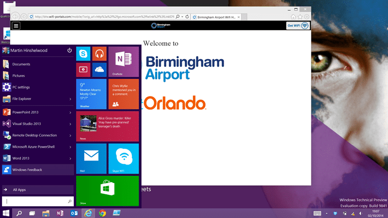
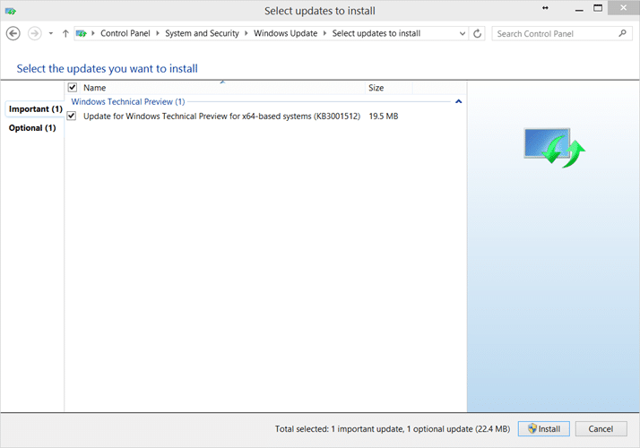
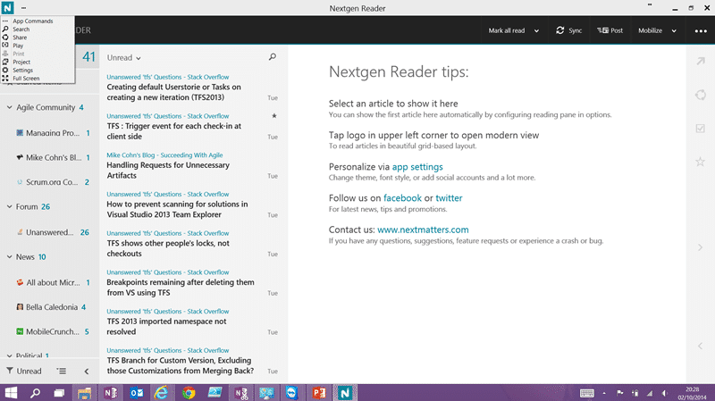
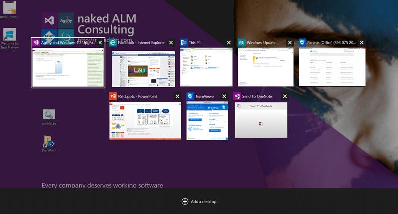

You know me, I am always willing to take a little risk to get some gain. As such I will be upgrading my Surface Pro 2 to Windows 10 Technical Preview on the train on the way back from teaching the Professional Scrum Foundations in Cheltenham.

Yesterday, 1st September 2014, Microsoft released the first Technical Preview for Windows 10 to the general population. Anyone can give it a spin by going to [http://preview.windows.com](http://preview.windows.com). This preview program, and Windows 10, is different from any other Windows release from Microsoft. They are moving to continuous delivery for Windows.

Within any company it can be hard to validate the value of a move towards agility. It's scary, its unknown, and it just will not work here. This is a fiction. It is a fiction created, and maintained, by your organisational culture, and culture is the hardest thing to change. It takes one group to change, and then the change will sweep across your organisation. In the case of Microsoft the group large enough to be a catalyst for that change was the Developer Devision. They have taken Visual Studio and Team Foundation Server from a ship frequency of every two years to one of only three weeks.

If you want to know more about how Microsoft has managed to [scale agile across the enterprise](http://stories.visualstudio.com/scaling-agile-across-the-enterprise/) they have a fantastic case study.

This change however, and the huge success that the team has wrote, both internally and in user interaction, is something that is in envy of every product team at Microsoft. Now the Windows team want a piece of that success. They want to not ever end up in the same position as Windows 8 where they made design decisions that by the time that they got feedback it was too late.

Now Windows is moving to an agile process where they ship new features directly to end users every 4 weeks. Patch Tuesday just became Feature Tuesday.

{ .post-img }

This new model, however, is hard to achieve. There were some spectacular disasters for the TFS team with TFS 2012 Update 1 and Update 2. Those were not fin times, but the teams had the courage to keep going and the transparency to maintain trust with their user base. And at the other end? They have an incredibly vocal user base that is willing and able to take the latest version of the product and give candid feedback.

True continuous delivery is no more hotfixes, no more service packs, just new versions of your platform with the latest features and fixes included. This is what Windows wants a piece of. They need an engaged user base, they need an engaged enterprise community. They need that feedback.

If you want to help them shape Windows 10, the last big Windows release, then you should join the Technical Preview.

{ .post-img }

You do however need to be wary and if you are not comfortable with participating in preview programs or will be unhappy if it all blows up then you should stay away.

> A preview for PC experts
>
> Windows Technical Preview is here today, but it’s a long way from done. We’re going to make it faster, better, more fun at parties...you get the idea. [Join the Windows Insider Program](http://go.microsoft.com/fwlink/?LinkId=507619) to make sure you get all the new features that are on the way. If you’re okay with a moving target and don’t want to miss out on the latest stuff, keep reading. Technical Preview could be just your thing.
>
> Download and install the preview only if you
>
> - Want to try out software that’s still in development and like sharing your opinion about it.
> - Don’t mind lots of updates or a UI design that might change significantly over time.
> - Really know your way around a PC and feel comfortable troubleshooting problems, backing up data, formatting a hard drive, installing an operating system from scratch, or restoring your old one if necessary.
> - Know what an ISO file is and how to use it.
> - Aren't installing it on your everyday computer.
>
> We're not kidding about the expert thing. So if you think BIOS is a new plant-based fuel, Tech Preview may not be right for you.

That said, even my dad loves being part of the early adopter programs and playing with the new bits. He is my sanity test for the non-technical user and has already been part of the Windows 8 Consumer Preview and the Windows Phone 8.1 beta program. If you do want to participate in the program you do need to understand that there is limited ability to go back. However unlike the Windows Phone preview program you can wipe your computer and start over.

{ .post-img }

Once you have signed in and 'joined the insider' program you will get a link to install the Technical Preview. While it would be awesome if we could just click a web installer this is not currently an option and you will need to download the bits. We will likely get a web / update installer from the Consumer preview due in Q1 2015.

{ .post-img }

I downloaded both the UK English ([proper English](http://nkdagility.com/powerpointissue-i-spell-it-as-favourite-and-you-as-favorite/)) versions for x86 and x64. I have a Dell Venue 8 Pro, and a Surface Pro 2 that I will be installing on. First up was the Venue 8 Pro which has a 32 bit OS and only comes with 32 bit drivers (no idea why, it is a 64 bit platform). Once you have downloaded the ISO you can use WinRar or 7Zip to unpack it. If you are installing on Windows 8 you can just double-click it to 'mount' it as a virtual CD drive.

{ .post-img }

As The Dell Venue 8 only has 64GB drive space I opted to for the USB option. I formatted an old USB drive to save space. Just copy the files over to the USB. You can then insert the USB and run the setup.exe in the root.

{ .post-img }

Once the install is running it takes a little while. It took about 30 minutes on my Dell Venue 8 Pro and over 60 minutes on the Surface Pro 2. This is likely as the Surface Pro has a bunch more apps installed and the settings need ported. My Surface is my primary production computer and has Visual Studio among other things installed.

{ .post-img }

Once you have the files copied your system will reboot a bunch of times with prolonged setup in between. I installed on the Venue 8 in the morning at breakfast in the hotel before the second day of the PSF course I was just running, and the Surface on the train on the way to the airport. I am typing this up on the Surface at said airport since my flight has been delayed by 3 hours (always on FlyBe).

{ .post-img }

Surface Pro 2

Once you get installed you will get the new Windows user experience all over again. When it askes to add a new user you can safely skip it and just login with your existing account. With the Dell Venue 8 Pro I got to continue using the Start Screen, which I incidentally like, and with the Surface I got the new Start Menu that is a little more retro.

{ .post-img }

First thing you should always do, even after installing an OS that just came out, is look for updates. There are always last minute bug fixes coming out.

Once in Windows 10 there are a few things that I noticed immediately.

{ .post-img }

You can only open modern apps in window mode and have to deliberately switch to full screen. This while fine on my Surface Pro is a pain on my Venue 8. I understand that the Windows team is still working on optimising the touch experience so I am willing to give them plenty of leeway.

Another painful loss in the inability to close an app when in full screen by swiping down as you would on Windows 8. This is incredibly frustrating as I am really used to this model. However they are building this to entice the folks that don’t like Windows 8 over so, meh…

Note: I did meet someone today that did not know that you could swipe from the top to close an app and was keeping the task manager open so they could close it! So maybe there needs to be a change.

You can swipe from the left to get the task manager below and click the close so maybe all if good. It is two actions where one will do but it may make a comeback.

{ .post-img }

Swipe from Left does not just switch apps any more but instead presents you with the task switcher. This incorporates the new multi-desktop mode as well. Click on the "add desktop" option to add more. We will see how useful this is.

That’s all I got from a first play, except to say that all my day job things worked just fine after the upgrade. The only issue I have hit so far is that SnagIt sometimes crashes when taking a screenshot. As SnagIt is very dependent on the UI integration, and the work they has to do to make it work on Windows 8 in the first place, I am not surprised it is a little confused.

While I take no responsibility for any issues that you may have if you install Windows 10 I would recommend that anyone technically minded does so. And that they run it on their main computer. Take a little risk and provide feedback. The worst that can happen is that you need to reinstall Windows 8 / 7.

Go on… be a kid again…
