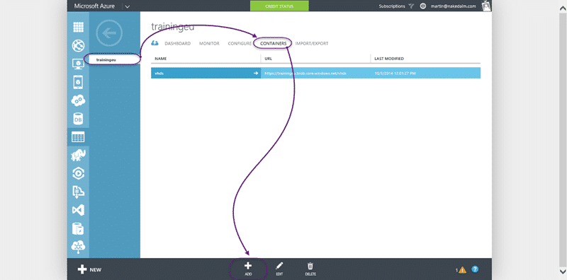
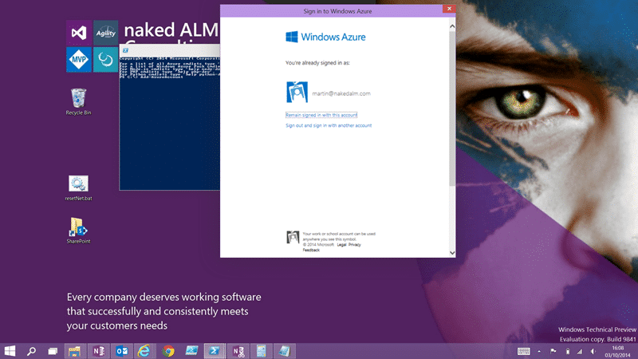
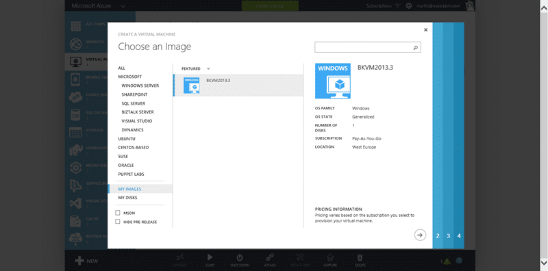
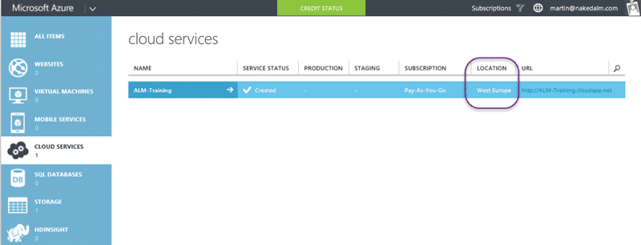

I am teaching the [Managing Projects with Microsoft Visual Studio Team Foundation Server 2013](http://nkdagility.com/training/courses/managing-projects-microsoft-visual-studio-team-foundation-server-2013/) class next week in Cheltenham and for that I need 16 VM's based on the [Visual Studio 2013 Update 3 ALM Virtual Machine](http://aka.ms/vs13almvm). To make life easier I will be creating training virtual machines in Azure.

If you have ever had to teach a training course, especially a technical one, it’s the equipment that is the most painful thing to configure. Azure has matured a lot over the last few years and although I have configured training in Amazon's AWS service I wanted to go all Microsoft.

The kind of tough thing is that the virtual hard disk (VHD) used by the virtual demo machine form Brian Keller is 80GB. And yes, I have to upload that beast to Azure.

## Uploading your Hyper-V virtual machine

The first task is [to download and install the Azure PowerShell](http://go.microsoft.com/fwlink/p/?linkid=320376&clcid=0x409) using the web platform installer. This will get all of the pre-requisites and install them for you.


{ .post-img }

Once you have this installed you will have "Microsoft Azure PowerShell" available on your Start Menu. Run this and wait a bit for it to load all of its gubbens.


{ .post-img }

At this point we need a couple of things to be setup in the Azure Portal. I am sure that you can do this stuff with PowerShell as well, but I usually prefer to only drop to PowerShell for repeatable tasks. We need to configure a container for our VHD.


{ .post-img }

So if you do not already have one head over to the azure portal and create a Storage location. You will need to give it an unchangeable URL so pick carefully. I wish I had picked something other than "trainingeu" but that’s the way the cookie crumbles.

NoteYou can create a new one with the right name and 'copy' the content over before deleting the old one. This, for now, is too much hassle.


{ .post-img }

We then create a 'folder' called a 'container' in there to hold our VHD's. We are now good to go for uploading out 80GB VHD from Microsoft. You will need to download all of the bits from them and unpack it locally to extract the VHD. That will take a while, even on my SSD's it takes about 30 minutes. Once there though you have a nave a clean clean VHD ready to go.


{ .post-img }

The first thing we need to do is authenticate with Azure which is fairly simple. You can automate this but for now the UI approach is best. If you call "Add-AzureAccount" without any parameters it will pop a UI authentication box. This did not work with "two-factor" and I had to turn that off, but that [could be a Windows 10 issue](http://nkdagility.com/agility-windows-10-upgrading-surface-pro-2/) rather than an Azure one.

Once you are all logged in you can run any commands that you have permissions for and in this case we need to send our local VHD file to the VHD folder that we created.


{ .post-img }

```
Add-AzureVhd -Destination "https://trainingeu.blob.core.windows.net/vhds/bkvm-2013-3.vhd" -LocalFilePath "V:ServersBKVM2013.3WMIv2Virtual Hard Disksbkvm-2013-3.vhd"
```

The command completes in three phases. First it creates an MD5 hash to verify the file. This can take a while. Then it looks for empty blocks in the disk. Your VHD may be 780GB on disk, but if it is only 60% full you only need to upload the 60%. Woot… win there.

Then the upload happens. I left it running overnight on my 100mb Virgin Cable connection and it got about 27% through. Then I had to go onsite in Cheltenham to teach the Professional Scrum Foundations course and only had hotel or customer external bandwidth at no more than 0.5Mbps (more like 0.1Mbps at the hotel).

The customer offered to wire me directly into their 100Mb synchronous line, and then pulled out the stops when they found out it was for their training course next week. 80GB done in 3 hours. Problem solved.

NoteThe upload is reusable but only from the same computer. It does need to do the preamble each time though and as long as the file has not changed you can restart the upload.

## Creating an instance of your Virtual Machine

So now I have a really big file on the internet. Time to make it do something useful. First we need to tell Azure that it really is a VHD and we really want to be a template so we can create lots of duplicates. In this case I need 16 on the day.


{ .post-img }

You need to create an 'image' that we will use as that template. If you go to "Virtual Machines | Images | Create" you will get the dialog you need to create the image. You will have to select "I have syspreped the virtual machine" even though you have not. We want duplicates of the same computer as is, rather than something that can be integrated into the network or domain. Sysprep would give us the out-of-box experience of a new install so that we can rename the computer. These VM< 's don’t need to talk to each other and will all have the same SID, name, and users. They are copies.


{ .post-img }

After few minutes our new template will be available in the gallery. Head to "Virtual Machines | Instances | New | From Gallery" to get the dialog above.


{ .post-img }

We can now create, through the UI, as many instances as we like and all we need to pick is the size / cost that we are willing to pay. The BKVM is a beast and has new than just TFS on there; SQL Server, SQL Server Analysis Services, SQL Server Reporting Services, Release Manager, TF Build, SharePoint 2013. So a big fast instance is needed. The local VM recommends 6GB RAM and 1 core.


{ .post-img }

After some experimenting I will be going with D2. D2 gives you the 2 cores and 7GB ram, but also adds SSD disks. This should give the students roughly the same performance that I get running the VM locally on my Surface.

## Creating many instances of your VM

So we are good for creating one or two instances, but what if I need 16 (or 30) instances. I don’t want to have to do it manually so we need a little bit of PowerShell. My first attempt at this was to do:

```
Add-AzureAccount
New-AzureQuickVM -Windows -ServiceName ALM-Training -Name ALMP13-HESA-01 -ImageName 12683aa2-b30f-4cde-8b4a-281faafb7a57__Image__BKVM2013.3 -AdminUsername nakedalm –Password P2ssw0rd -location "West Europe"
```

> But this resulted in a nasty error.
>
> New-AzureQuickVM : CurrentStorageAccountName is not accessible. Ensure the current storage account is accessible and
>
> in the same location or affinity group as your cloud service.
>
> At line:1 char:1
>
> \+ New-AzureQuickVM -Windows -ServiceName ALM-Training -Name ALMP13-HESA ...
>
> \+ ~~~~~~~~~~~~~~~~~~~~~~~~~~~~~~~~~~~~~~~~~~~~~~~~~~~~~~~~~~~~~~~~~~~~~
>
> \+ CategoryInfo : CloseError: (:) \[New-AzureQuickVM\], ArgumentException
>
> \+ FullyQualifiedErrorId : Microsoft.WindowsAzure.Commands.ServiceManagement.IaaS.PersistentVMs.NewQuickVM

This error is a red hearing and confused me for ages as I could not figure out the issue.


{ .post-img }

I first looked to see if I had the cloud service in the right location. Yup… "West Europe".


{ .post-img }

Maybe I put my storage in the wrong location? Nope… "West Europe". Dam, whats the problem…

```
Get-AzureSubscription
```

> SubscriptionId : 12683aa2-b30f-4cde-8b4a-281faafb7a57
>
> SubscriptionName : Pay-As-You-Go
>
> Environment : AzureCloud
>
> SupportedModes : AzureServiceManagement,AzureResourceManager
>
> DefaultAccount : martin@nakedalm.com
>
> Accounts : {martin@nakedalm.com}
>
> IsDefault : True
>
> IsCurrent : True
>
> CurrentStorageAccountName :
>
> SubscriptionId : 011bb48f-345c-4096-be52-d84c0efb7c3c
>
> SubscriptionName : MSDN Dev/Test Pay-As-You-Go
>
> Environment : AzureCloud
>
> SupportedModes : AzureServiceManagement,AzureResourceManager
>
> DefaultAccount : martin@nakedalm.com
>
> Accounts : {martin@nakedalm.com}
>
> IsDefault : False
>
> IsCurrent : False
>
> CurrentStorageAccountName :

…Well after hunting around for a while it turns out that there was no default storage on the subscription. As the VM is added to the subscription, there needs to be a default store. A very misleading error, I would have preferred "Error: no storage specified".

```
Set-AzureSubscription -SubscriptionName "Pay-As-You-Go" -CurrentStorageAccountName trainingeu -PassThru
```

Now we have some storage wired up we can go ahead and create an instance with PowerShell…

```
New-AzureQuickVM -Windows -ServiceName ALM-Training -Name ALMP13-HESA-01 -ImageName 12683aa2-b30f-4cde-8b4a-281faafb7a57__Image__BKVM2013.3 -AdminUsername nakedalm -Password P2ssw0rd -location "West Europe"

```

> VERBOSE: 13:17:07 - Begin Operation: New-AzureQuickVM
>
> VERBOSE: 13:17:08 - Completed Operation: New-AzureQuickVM
>
> New-AzureQuickVM : Service already exists, Location cannot be specified.
>
> At line:1 char:1
>
> \+ New-AzureQuickVM -Windows -ServiceName ALM-Training -Name ALMP13-HESA ...
>
> \+ ~~~~~~~~~~~~~~~~~~~~~~~~~~~~~~~~~~~~~~~~~~~~~~~~~~~~~~~~~~~~~~~~~~~~~
>
> \+ CategoryInfo : CloseError: (:) \[New-AzureQuickVM\], ApplicationException
>
> \+ FullyQualifiedErrorId : Microsoft.WindowsAzure.Commands.ServiceManagement.IaaS.PersistentVMs.NewQuickVM

Baws, what now. Ok… remove the location.

```
New-AzureQuickVM -Windows -ServiceName ALM-Training -Name ALMP13-HESA-01 -ImageName 12683aa2-b30f-4cde-8b4a-281faafb7a57__Image__BKVM2013.3 -AdminUsername nakedalm -Password P2ssw0rd

```

> VERBOSE: 14:41:25 - Begin Operation: New-AzureQuickVM
>
> VERBOSE: 14:41:25 - Completed Operation: New-AzureQuickVM
>
> VERBOSE: 14:41:26 - Begin Operation: New-AzureQuickVM - Create Deployment with VM ALMP13-HESA-01
>
> New-AzureQuickVM : BadRequest: The image name is invalid: Consecutive underscores as image name
>
> 12683aa2-b30f-4cde-8b4a-281faafb7a57\_\_Image\_\_BKVM2013.3 is not allowed.
>
> At line:1 char:1
>
> \+ New-AzureQuickVM -Windows -ServiceName ALM-Training -Name ALMP13-HESA ...
>
> \+ ~~~~~~~~~~~~~~~~~~~~~~~~~~~~~~~~~~~~~~~~~~~~~~~~~~~~~~~~~~~~~~~~~~~~~
>
> \+ CategoryInfo : CloseError: (:) \[New-AzureQuickVM\], CloudException
>
> \+ FullyQualifiedErrorId : Microsoft.WindowsAzure.Commands.ServiceManagement.IaaS.PersistentVMs.NewQuickVM

Auch…pish… ok… so the image name should be the friendly name and not the actual name… that was obvious…

```
New-AzureQuickVM -Windows -ServiceName ALM-Training -Name ALMP13-HESA-01 -ImageName BKVM2013.3 -AdminUsername nakedalm –Password P2ssw0rd
```

> PS C:> New-AzureQuickVM -Windows -ServiceName ALM-Training -Name ALMP13-HESA-01 -ImageName BKVM2013.3 -AdminUsername na
>
> kedalm -Password P2ssw0rd
>
> VERBOSE: 14:42:11 - Begin Operation: New-AzureQuickVM
>
> VERBOSE: 14:42:11 - Completed Operation: New-AzureQuickVM
>
> VERBOSE: 14:42:12 - Begin Operation: New-AzureQuickVM - Create Deployment with VM ALMP13-HESA-01
>
> VERBOSE: 14:43:18 - Completed Operation: New-AzureQuickVM - Create Deployment with VM ALMP13-HESA-01
>
> OperationDescription OperationId OperationStatus
>
> \-------------------- ----------- ---------------
>
> New-AzureQuickVM 12fdcbb0-9f4d-1c96-b321-76983692da6e Succeeded

Woot! I now have a new VM created kinda automated, or at least with the possibility.


{ .post-img }

Poo… its an A1 instance. A piddley wee scrawny server that would have no hope of lifting SharePoint's fat ass, and that will defiantly get beaten up by Analysis Services. In fact the minimum for TFS is 2GB and we do not even meet that.

```
New-AzureQuickVM -Windows -ServiceName ALM-Training -Name ALMP13-HESA-01 -ImageName BKVM2013.3 -InstanceSize D2 -AdminUsername nakedalm -Password P2ssw0rd
```

Now I have more memory, more processor and lovely SSD's underpinning my student box.


{ .post-img }

Phew..

Now I could do all out and automate creating the VM's, as well as the Stop-AzureVM that will be needed at the end of the day and inexorable Start-AzureVM the next. However it may not be worth it. I can copy, paste 16 times and get the same result. If I was doing this a lot I might do a little more PowerShell.

## Conclusion

With all the hassle of setting up and configuring local computers this service is an absolute dream. Now all that matters is the cost. Luckily there is a [handy dandy Azure pricing calculator](http://azure.microsoft.com/en-us/pricing/calculator).

![clip_image010[1]](images/clip-image01011-11-11.png "clip_image010[1]")
{ .post-img }

This is the monthly cost for the fast SSD D-Series virtual machines and for 16 of them (one for each student) it looks like it would be around £2207.60 per month. That’s £2.97 per hour for all 16. The course is 16 hours so if I am careful it will be about £50 for a two day course. Of course if I forget to turn them off in the evening then it could hit £142.56 for 48 hours.

The future is cloud…
