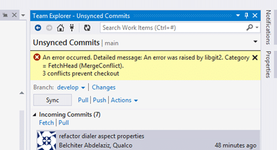

When doing a PULL from Git from an origin\\branch but you have changes locally you may encounter a bug in the Visual Studio Git integration that results in a merge conflict fetching the head of the remote Git repository.

If like me you are new to Git there are a lot of things to learn. This last two weeks I have been onsite in Athens moving source from StarTeam to Git in TFS. As we have just started getting users onto Git we have started hitting workflow issues. In StarTeam they were not really using branching and were doing manual merges. This was for many reasons all of them seemingly perfectly reasonable but it takes up a lot of time. With nearly 50 coders it was well past being manageable and they are currently looking at 100 man-days to do a merge.

I am trying to move them to a much more supportable model and for that I am moving them towards Git. I know this would be a steep learning curve for them but I believe it is the only reasonably way to support the issues that they have in their software strategy.

More on that later, but for now I have been running into an issue with merge conflicts in Git when coders try to Pull from the server. It seems that whatever workflow they are used to when they follow it in Git they get a "libgit2.Catagory = FetchHead (MergeConflict)" message that adds that there are 3 conflicts that prevent a checkout. While my first thought is that they have uncommitted changes locally this is not the case. They maybe have 2-3 local commits and no outstanding uncommitted changes.

{ .post-img }

While this should be able to be handled it is not and I have 50 coders hitting it reputedly. The only way I have found so far to resolve the issue is to move their changes onto a temporary branch and rollback the local copy of the server branch. This allows them to do a Pull and then merge their local branch changes across.

https://twitter.com/ethomson/status/520262367616053248

Note: This is a bug in Visual Studio 2013.3 that has been fixed in 2013.4. You can download and install, as we did, the 2013.4 CTP to resolve the issue.

While not ideal it does work. So in order to mitigate this issue permanently, pending an update from the TFS team, I am changing their workflow. When planning on working on an origin\\branch all developers will:

1. Create a new "feature-\[name\]" or "hotfix-\[name\]" branch locally.
2. They make all changes on this branch
3. Pull regularly from origin\\branch and merge to FEATURE or HOTFIX branch

When they are ready to Push to the server they then:

1. Pull from origin\\branch to bring it up to date
2. Merge into "feature-\[name\]" and get working
3. Merge from "feature-\[name\]" to branch
4. Push to origin\\branch
5. DONE

If they are then done with the feature of hotfix they can delete it, if not they can keep it around for reuse. Simple…and it works for them every time. However sometimes they forget to do the change on the feature or hotfix branch and end up in the position above.

It depends when they figure out what they have done what the solution is. If they have not committed to the branch then they can solve this in a few clicks.

1. Create a new "feature-\[name\]" or "hotfix-\[name\]" unpublished branch
2. Commit to the new unpublished branch

One of the nice features of Git is that I you made a bunch of changes and have not checked in you can just "checkout" another branch and the local changes you have made will be preserved. Simple quick fix.

If they only figure it out after they have committed one or more times to the branch then they have a few extra steps to resolve the committed bits on the published branch.

1. Create a new "feature-\[name\]" or "hotfix-\[name\]" unpublished branch - This will take a copy of the commits that have not yet been pushed to the server. This preserving the changes they have already made.
   1. Checkout the branch you want to rollback
   2. Use "git reset --hard HEAD~\[n\]" where \[n\] is the number of commits you want to back peddle
2. Pull from origin\\branch to bring it up to date

After that they can happily Pull to the published branch and continue to code away on the unpublished local branch. Yes this means that every developer effectively has one or more (they may have more than one set of work on the go) personal branches. While this was a bad practice in a Server Version Control System (SVCS) it is a perfectly good practice for a Distributed Version Control System (DVCS) where merging and branching is cheap and easy.

If you can you should install the Visual Studio 2013.4 CTP that fixes this issue and you can carry on as normal.
