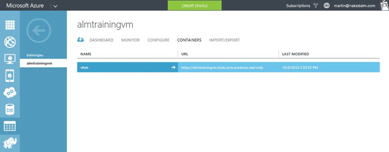

Move an Azure storage blob to another store took a little bit longer than I thought that it would. All I wanted to do was move a VHD from one storage account to another. However this is a little more complicated than it seems on the surface.

I am working on teaching the [Managing Projects with Microsoft Visual Studio Team Foundation Server 2013](http://nkdagility.com/training/courses/managing-projects-microsoft-visual-studio-team-foundation-server-2013/) course in Cheltenham this week and have been [creating training virtual machines in Azure](http://nkdagility.com/creating-training-virtual-machines-azure/). My template is 80GB and it is quite an arduous task to upload it. I now want to move it to a new, less temporary, home.


{ .post-img }

I want to move my training VM from the "trainingeu" storage account to the "almtrainingvm" one. This is really just a refactor now that I have everything working and have thought about a new home. The copy process however is a little bit convoluted, especially as both containers are marked as private.

What I really want to be able to do is just call "Copy-AzureStorageBlob -source [https://trainingeu.blob.core.windows.net/vhds/bkvm-2013-3.vhd](https://trainingeu.blob.core.windows.net/vhds/bkvm-2013-3.vhd) -destination [https://almtrainingvm.blob.core.windows.net/vhds/bkvm-2013-3.vhd](https://almtrainingvm.blob.core.windows.net/vhds/bkvm-2013-3.vhd)" and be done with it. But alas… this is not to be as we need to authenticate to both storage accounts separately even though we are authenticated against the main account.

So… we need a little more PowerShell than I wanted:

```
Select-AzureSubscription "Pay-As-You-Go"

### Source VHD

$sourceUri = "https://trainingeu.blob.core.windows.net/vhds/bkvm-2013-3.vhd"

$sourceStorageAccount = "trainingeu"

$sourceStorageKey = "bla"

$sourceContext = New-AzureStorageContext –StorageAccountName $srcStorageAccount `

-StorageAccountKey $srcStorageKey

### Target VHD

$targetName = "bkvm-2013-3.vhd"

$targetStorageAccount = "almtrainingvm"

$targetStorageKey = "bla"

$targetContainerName = "vhds"

$targetContext = New-AzureStorageContext –StorageAccountName $targetStorageAccount `

-StorageAccountKey $targetStorageKey

$blob1 = Start-AzureStorageBlobCopy -srcUri $sourceUri -SrcContext $sourceContext -DestContainer $targetContainerName -DestBlob $targetName -DestContext $targetContext

```


{ .post-img }

Why we can't do this with URL's and an authenticated account I do not know… but this is what we got and we have to roll with it.


{ .post-img }

Now that I have my VHD over here I can change my default store and create my Virtual Machines from this VHD instead of the other one. Not the easiest task, but now I have some lovely PowerShell I should be able to move VHD's between Azure Storage Accounts any time I like.
