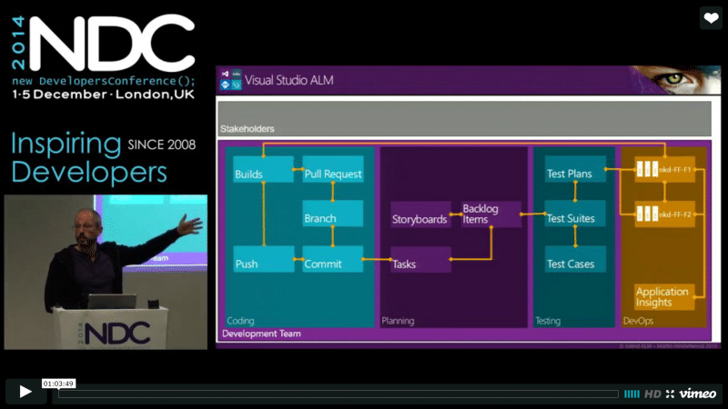
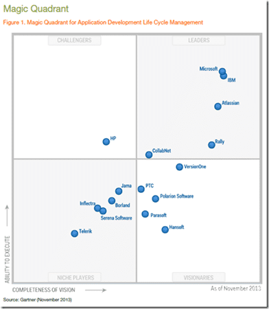
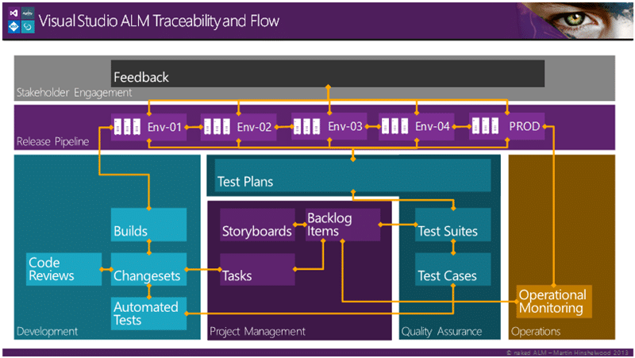

While I have spoken at many events in the USA while I lived there, and even did a few keynotes for the Visual Studio 2012 launch, I have been trying to figure out the scene here in Europe. As such I submitted to a few events and got accepted to speak at NDC London.

{ .post-img }

My session, Second Look, Team Foundation Server & VSO, will be aimed at those folks that have previously tried TFS and found it lacking. Most of those folks previously used a version of TFS prior to TFS 2012 where things started to get really interesting. Indeed if you are building an application using the Microsoft stack there is no better ALM platform.

{ .post-img }

The main reason that IBM scores a little higher on completeness is that they have better support for other platforms but at a loss of features for any specific one. While Visual Studio ALM has good support for any platform, the support for the Microsoft stack is second to none.

With the time constraint and the amount of things I want to show my session will need to be demo heavy. The type of person that I am gearing this session towards are the hard core who tried TFS prior to 2012 and don’t believe the marketing. Do demos it is… but I just looked back at what I submitted:

> You may have looked at Team Foundation Server before and if it was before 2012 then you should have another look. It is not the same product it used to be. Come and see Martin do an end to end walk through from Ideation through Coding, Testing and Release with monitoring and feedback. Martin will cover some of the new advances with Storyboarding, Agile Project Management, and Agile Portfolio Management. He will then delve into the new ALM features added since 2010 for coders like My Work, Code Sense, and Local Workspaces and even Git. With the new Test Management tools in the web complimented with Microsoft Test Manager your testers can easily manage, execute and report on your test plans. All the while we will be using the new Release Management tools to push our application to each environment and ultimately to production. Once there we can monitor our application for usage and performance with rich statistics.
>
> All in all TFS is a world premier ALM solution that provides everything that you need to manage the Application Lifecycle of your application.

Oh my… look what I signed myself up to!

Wana see this session? Sign up for a ticket at: [http://ndc-london.com](http://ndc-london.com)

So it's going to have to be 45+ minutes Demo, and I have two options. I can do everything in my local demo box, and that will be the backup scenario, or I can go Azure crazy. Between now and NDC London I will be blogging on setting up and configuring continuous everything with VSO and Azure. What do I mean by continuous everything?

{ .post-img }

Well, I want the full lifecycle with Azure Active Directory integration driving authentication and collaboration with Azure, Visual Studio Online, and Office 365. This would be a huge demo if I stopped to explain all the features along the way, so I am not going to. The audience at NDC is very smart and this is going to be a level 400 high-speed walkthrough of the core features added to TFS since 2012.

There will however need to be trade-offs so I am looking for your help to see what features to spend the most time on and what to just mention in passing. Are you going to NDC?

[Feedback Request - What Features do you most want to see?](https://www.surveymonkey.com/r/C2FCM79)

I am not yet sure if I will be using green field or brownfield as each have their pros and cons. In my flying time deliberations I have been contemplating three main scenarios:

1. Greenfield  
   Start with an empty team project and build everything up from scratch. That would mean getting the code in, creating a backlog, writing some code, followed by some testing and then an automated build. I would then get a few minutes while the build executes to create a release management pipeline and push to the environments.
2. Greenfield TFS / brownfield project  
   Again, start with an empty team project but import from somewhere else. Maybe pull in a Github project and do the same as above.
3. Brownfield  
   Have an existing end to end setup and just walk through adding a feature or fixing a bug and the interactions involved.

I guess it depends how long my session is with brownfield being the easiest to pull off. A plan then would be to get brownfield working and then, if there is time, look into the other options. So let's see what the scenarios are that I plan on tackling:

### Brownfield Scenario 1 - The new Feature

In this scenario we have a new feature and we are going to implement a single PBI to do with this feature. We need to have a Storyboard to go with the PBI for coder context and Test Cases prior to commencing the work. We then make two passes, the first with build and deploy of the new code. The second with automation of the now passing test case.

1. Create new Feature in TFS
2. Create Storyboard to show feature
3. Create PBI's to reflect feature
4. Create Test Cases for one PBI
5. Code till test cases pass using TDD
6. Push to Repo
7. Build & Test with Team Build
8. Deploy with Release Manager to Feedback01
9. Coder Validation
10. Deploy with Release Manager to Feedback02
11. Tester Validation & Recording
12. Coder Automates Test Case
13. Deploy with Release Manager to Feedback01
14. Coder Validation of Automation
15. Deploy with Release Manager to Feedback02
16. Tester review of Results
17. Deploy with Release Manager to Feedback03
18. Product Owner Validation
19. Review of Application Analytics usage data

### Brownfield Scenario 2 - The Bug

In this scenario we have a user who, is the process of providing feedback, finds an issue. The Product Owner gets this bug verified by a Tester and a relevant test case created to prove that it exists. This is then prioritized and enters the current sprint, maybe with something dropping out the bottom. The coder then fixes it and the tester verifies it before automating the result to prevent regression.

1. User Gets feedback request and actions
2. User Finds and reports bug as part of feedback
3. Product Owner breaks feedback down into PBI's
4. Product Owner reviews feature usage stats and notifies tester of possible important bug
5. Tester validates existence of bug and creates rich bug and Test Case
6. Bug prioritized and added to current sprint
7. Code till test cases pass using TDD
8. Push to Repo
9. Build & Test with Team Build
10. Deploy with Release Manager to Feedback01
11. Coder Validation
12. Deploy with Release Manager to Feedback02
13. Tester Validation & Recording
14. Coder Automates Test Case
15. Deploy with Release Manager to Feedback01
16. Coder Validation of Automation
17. Deploy with Release Manager to Feedback02
18. Tester review of Results
19. Deploy with Release Manager to Feedback03
20. Product Owner Validation and emails User

### Scenario Choice

As well as understanding what features you, as the audience on the day, want to hit I also want to know which scenario is more interesting.

[Feedback Request - Which scenario looks most desirable?](https://www.surveymonkey.com/r/CCN7ZR9)

## Conclusion

I am really looking forward to this session as it will give me a chance to directly target nay-sayers that are not really aware of the capabilities of the product. If you are building for .NET then there is no better platform.

Please provide me with some feedback on the polls above. I am very interested in focusing on what will solve the most problems for attendees. I will also be around for the full 3 days and would be happy to do add-hock demos and problem solving sessions… Unless there is a supper interesting session on the go I would be happy to provide free TFS consulting for any and all attendees of NDC London on the days.

If you are on a tight schedule I would be happy to have you pre-book some time. Email info@nakedalm.com to get some free TFS & VSO consulting at NDC London.
