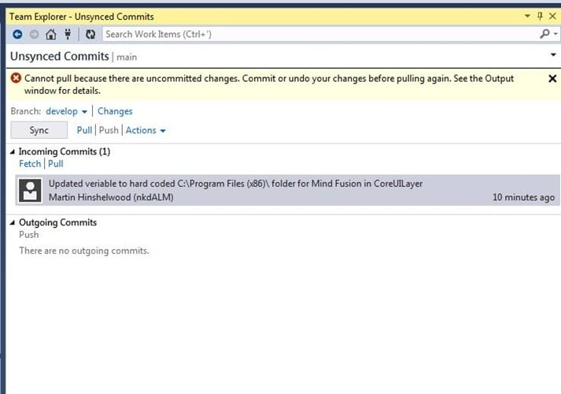

Sometimes when you try to Pull changes from the server to your local repository you get a "cannot pull because there are uncommitted changes". This is uncommitted changes messing up your sync

I have been onsite in Athens working with a customer that is moving from StarTeam to Git. When you are moving from one source control system to another there are always difficulties and a difference in workflow between the systems. A workflow that works well in StarTeam might not in TFVC. However when you add that you are moving from a Server version Control System (SVCS) to a Distributed Version Control System (DVCS) you are going to go through a paradigm shift.

However, it can be the simplest of activities that bite you in the ass. For example, in most server based version control systems when you have made a bunch of changes locally and you want check-in to the server it is always prudent to do a "Get" first in order to verify that your local changes work with the latest version of the server. So you dutifully just do a "Get" and if your files locally conflict with the server you resolve the conflicts using the conflict resolution tools.

{ .post-img }

When you try to do this in Git it complains that you have uncommitted changes that you either need to undo the changes and get rid of them, or you can commit them to the local repository.

In our server based scenario we have no choice but to do a merge from the server directly to our live edited files locally. If we complete the merge, and we messed up…. Well that’s just a little bit tough and you should have chosen better. So we have a lossey (or lousey) merge where we can potentially not end up with what we want and have no way back.

Git blocks this potential loss of code by forcing you to choose wither you want to lose the changes or persist them. Once they are persisted they can't be lost without deliberately resetting the repository or deleting it. Although your workflow is changing it is for the better as you are less likely to have a frustrating issue.

DVCS is just better than SVCS…
