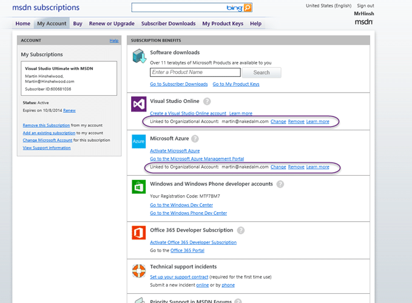
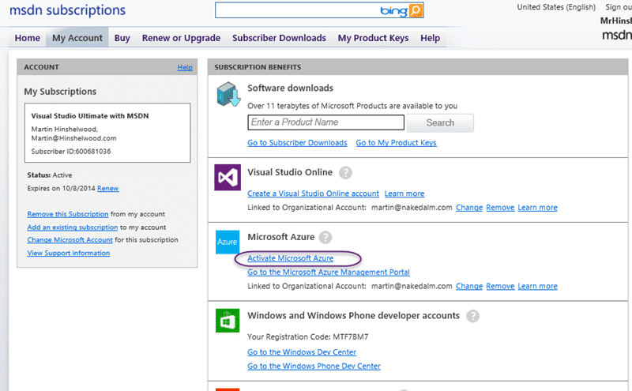

If you are trying to reuse your MSDN benefits with your Org ID but you previously activated against your Microsoft ID then you will need to cancel your subscription to reuse it.

If, like me, you are moving all of your Microsoft ID (was Live ID) corporate stuff over to Organisational Id (Office 365) and you have previously activated your MSDN benefits against your Microsoft ID you have a bit of work to move those benefits over.

{ .post-img }

In [https://msdn.microsoft.com/subscriptions](https://msdn.microsoft.com/subscriptions) you might see your MSDN linked to your Organisational Account or your Microsoft Account. Either way, the only thing that matters is where you see the benefits when you log in. In my case it was on my Microsoft ID. To swap it over we need to remove all of our subscriptions.

{ .post-img }

Using an 'InPrivate' browser tab head over to [http://account.windowsazure.com](http://account.windowsazure.com) and cancel all of your MSDN benefit your subscriptions.

{ .post-img }

Once there you can select the subscription that came from your MSDN benefits, in my case I had three old subscriptions as well. It only takes a few seconds to cancel, but be warned. You will lose all access to anything you created in there.

{ .post-img }

You should get your cancelation email really quickly… mine came in almost as quickly as I clicked the button.

{ .post-img }

Head back to [https://msdn.microsoft.com/subscriptions](https://msdn.microsoft.com/subscriptions) and select "Activate Microsoft Azure" and login with your Organisational Account. If you already have an active subscription it will say that you can't activate your trial. But below you should see a "What can I do?" question and below that an option to use your MSDN allotment.

{ .post-img }

Now on my organisational account I have a nice $150 per month subscription right where I can use it. Single-sign-on and no faffing around with InPrivate or having to log-out all the time.
