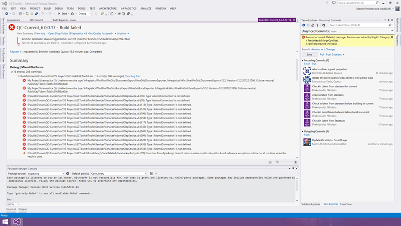
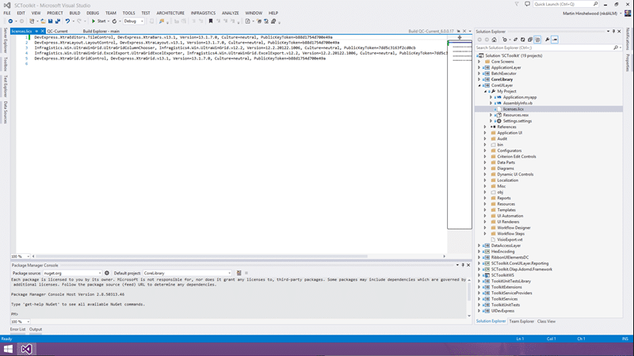

When you do a build you can get an "unable to resolve type" message from the licencies.licx file that you have checked in. This prevents you from having a successful build in Team Build.

I have been working with a team of coders in Athens moving them over from StarTeam to TFS with Git. We are now, for the first time ever, trying to configure a build for their 25k file project on an automated build server. The main solution has 66 projects and currently we need to do two passes to get a successful build locally. This is not the best place to be, but it is where we are. There are many things that they are going to have to do to improve their platform over the coming years, but they really need a CI build to help them stay on the right road.

I configured a build server and got one of their coders to install the 10GB of additional components that we need to get the build working. They have Infragistics and Developer Express, along with a plethora of other tools and components for both WPF, WinForms, and Web. After a few builds we got to a seemingly confusing error. There was a licence.licx file referencing version 12.2 of Infragistics that was causing the build server to throw an error. But it built just fine on the local developer workstations.

{ .post-img }

The error looks fairly strait forward but the referenced components were installed on the server. Because they use a lot of components they have a lovely spreadsheet with all of the versions and what component the developers need with a link to the network share where the installers live. It should be a case of walking the list, installing everything, and we are good to go.

My Project\\licenses.licx (1): Unable to resolve type 'Infragistics.Win.UltraWinGrid.DocumentExport.UltraGridDocumentExporter, Infragistics4.Win.UltraWinGrid.DocumentExport.v12.2, Version=12.2.20122.1006, Culture=neutral, PublicKeyToken=7dd5c3163f2cd0cb'

My Project\\licenses.licx (5): Unable to resolve type 'Infragistics.Win.UltraWinGrid.ExcelExport.UltraGridExcelExporter, Infragistics4.Win.UltraWinGrid.ExcelExport.v12.2, Version=12.2.20122.1006, Culture=neutral, PublicKeyToken=7dd5c3163f2cd0cb'

Now if any of you have tried to get a build working for an existing piece of software, you will know that it is an arduous task of building and fixing that makes your hair gray. A build server tends to be a lot more… unforgiving than local Visual Studio. Not only that there are always hundreds of ' the coders just know how to solve that' errors that you will have to resolve.

I did find one error where a DLL was missing. The coders, it turns out, all knew to get that specific version of the DLL from an attachment to an email in their inbox and put it in a specific location - Solved that one with ProGet and a NuGet package!

In this case after spending some time scratching my head I noticed that the build numbers in the version did not match. The build numbers in the licence file matched the error, but not the version of Infragistics that was installed. Doh… but I thought that there was a handy dandy spreadsheet?

{ .post-img }

At some point a newer version of 2012.2 was downloaded and dropped onto the network share, but since the developers all likely had the previous version installed as well as the new one, the licence.licx file would resolve for them locally. Since the build server was new, any new developer would have the same problem, this issue reared its ugly head. This is a frustrating problem as it means that something is not getting build correctly for everyone that is just slipping on by.

If only it was easy to reimage developer workstations overnight so that they only had the current versions of all the components. These problems would be found quickly and fixed often.

Moral of the story… always either reimage your workstation often, or uninstall components you don’t need any more. Ideally setup and configure an automated build now if you don’t have one. If its hard then suck it up and take the time to get it working.
