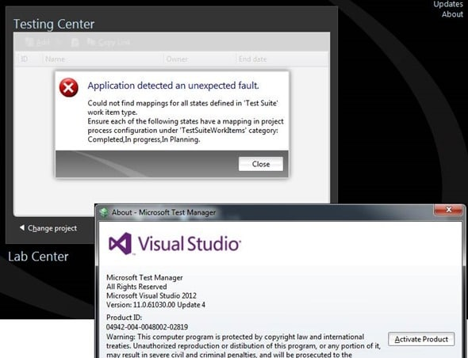
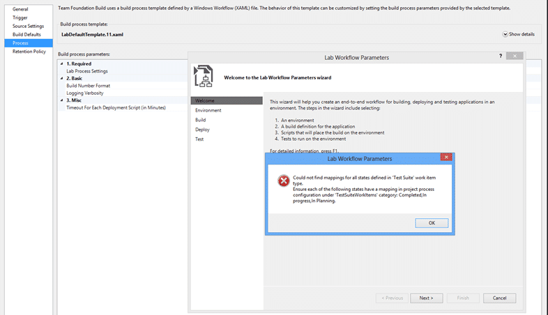

After upgrading to TFS 2013.3 you get some reports of errors in MTM from your users. Specifically they get a "Could not find mappings for all states defined in 'Test Suit' work item type" error when connecting. I have also seen "TF400860: TestManagement: Version 19, MinVersion: 19" in some cases in the web access.


{ .post-img }

This should only happen if you have customised the Test Suit or Test Plan work items but as they have just been created by the upgrade process it is a little confusing as to why it does not work.


{ .post-img }

You might additionally find a similar error when trying to edit a Lab Template as it also queries the Test Data.

In these cases, if you look real closely at the error message you will see that while "Completed" and "In Planning" look good there is an issue with "In progress". The test team in their infinite wisdom decided that if you have not customised anything that the system defaults to a hard coded set of process configuration for Tests. This sounds reasonable unless you factor in organisations that make silly customisations to their process template.

In case you have not figured it out yet, the "In process" state should be "In Process". Yes, that’s a case sensitivity issue. When you are uploading work item types this is case-insensitive and is rationalised across work items. So if you have one work item in there with "In process" set and then you add another work item with "In Process" TFS will fix it for you on import. However the test teams hard coded the process configuration which is case sensitive.

I am pretty sure that the product team will go fix it, but for now you two solutions:

### Solution 1: Fix the configuration of your process

You should be mindful to make sure that you get all of your casing right. In this case I would check all of my work items to make sure that they have the same case and that it is the correct and out-of-the-box "In Process" text.

### Solution 2: Add a custom process configuration override

In your process configuration you need to add a little bit of customisation to continue to use the case you have configured.

```
    <TestSuiteWorkItems category="Microsoft.TaskCategory">
      <States>
        <State type="Proposed" value="In planning" />
        <State type="InProgress" value="In progress" />
        <State type="Complete" value="Completed" />
      </States>
    </TestSuiteWorkItems>

```

Once added you should not have an issue.

### Conclusion

These entries are only required when connecting from older clients. From Visual Studio 2013.3 onwards this is a non-issue so it might be your chance to get all of your users to update to the latest and greatest.

Remember that this issue only affects older clients, and when you have miss typed the casing of the states in your custom process template. Most folks should not run into this and it is a simple fix if you do.
