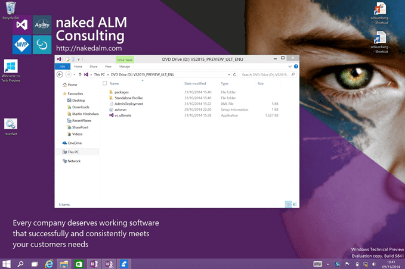
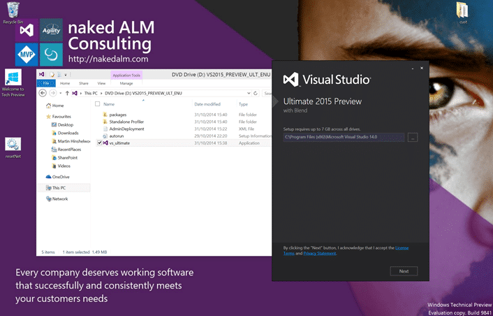
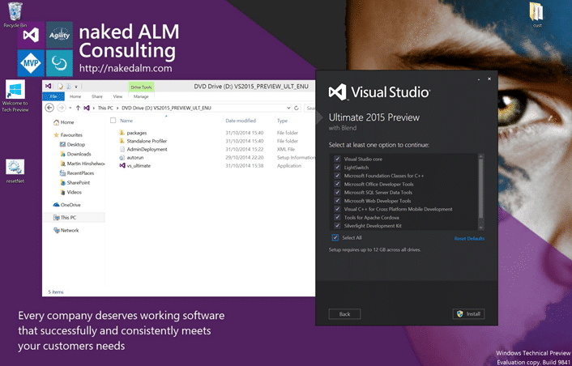
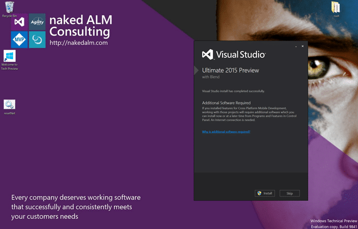
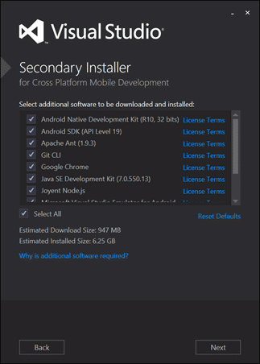
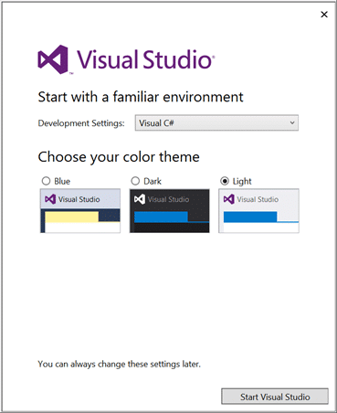
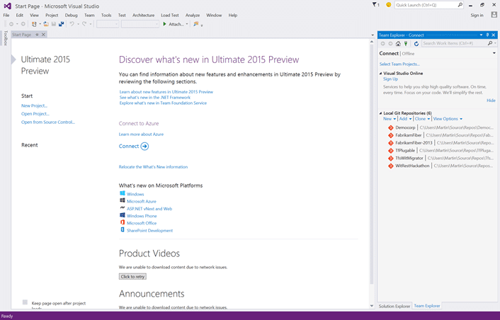

You know that I like nothing better than taking a few risks and I have been very happy in the past running MSFT preview bits on bare metal. As Microsoft has just announced Visual Studio 2015 Ultimate Preview I need to be running it on my local computer for demos.

- [Download Visual Studio 2015 Preview](http://www.visualstudio.com/en-us/downloads/visual-studio-2015-downloads-vs)

If you are running into an error installing Visual Studio and you are pointed at KB2999226 you may struggle to find the issue. There are a few folks in the comments that have has issues, so I escalated it with the Visual Studio team and there is a fix. You should download and install the [Windows 10 Universal C Runtime](http://www.microsoft.com/en-us/download/details.aspx?id=48234) prior to installing Visual Studio 2015. This will grease the wheels.

As you will see it is also just plain better and I prefer codding with the latest tools. Git has been updated to the latest version and this in itself is reason to start using 2015 in production. I do however fully expect to have to reset my machine every now and again but starting with Windows 8 this has become so trivial that it does not even need an iso. Indeed I updated to Windows 10 the day it released (on the train home from Scrum training in Cheltenham) and while I have had to do a couple of resets all is well. I have noticed that I can no longer update to 9860 on my Surface 3 so I am on 9841. I am guessing that 9860 was the reason for my recent blue screen issue in the US.

{ .post-img }

You can download Visual Studio 2015 Preview with a Web Installer or with the ISO and if you have Windows 8 and up you can mount the ISO by simply double-clicking it. This will mount it like a CD and give you access to the files.

{ .post-img }

The installer is fairly strait forward and you have few options. First you get to select where to install the files. I would recommend that you leave this as the default. There is no benefit of installing applications to other drives unless you are installing them to other physical drives for speed. And I don’t know of anyone that has a setup like that in 10 years.

{ .post-img }

Not sure why, but by default none of the options are selected and you need to select at least one to move forward. I find that "Select All" is the best option with development tools. I have never regretted installing everything but I have always, without fail, regretted installing things partially. The feature you want is always in the bit that you did not install.

{ .post-img }

Microsoft is embracing both open source and cross-platform. Out of the box they are installing much goodness that is not them:

- Android Native Development Kit (R10, 32)
- Android SDK (API Level 19)
- Apache Ant (1.9.3)
- Git CLI
- Google Chrome
- Java SE Development Kit (7.0.550.13)
- Joynt Node.js
- Microsoft Visual Studio Emulator for Android
- SQLLite
- WebSocket 4Net

Microsoft has been unhappy with the other Android emulators out there, and if you have used them you will know what I mean. To that end they have provided an emulator based on the fantastic Windows Phone emulator engine. You will still have access to the other emulators installed by the Android SDK but they really are night and day…

{ .post-img }

Again I am choosing everything and want to make sure that I am not missing anything.

#### Note

If like me you are installing on a plane with no internet you can rerun this part of the install by running "SecondaryInstaller.exe" that you can find in "C:\\Program Files (x86)\\Microsoft Visual Studio 14.0\\SecondaryInstaller".

{ .post-img }

Along with signing in (I have no interne on this flight) you get to choose your defaults. The development settings are based on what 'most developers' for that platform like and everything can be customised later.

{ .post-img }

Awesome. I now have both Visual Studio 2013 and Visual Studio 2015 installed side by side on Windows 10. I don’t expect having any issues as many of the product team also work in this configuration. I think it was about 50/50 at the MVP Summit with product team members on Windows 8.1 or Windows 10. This I think is good as hopefully, even beyond testing, they will run into issues before they get to us. As you can imaging they are very proud of the concurrent compatibility so you can expect to be able to continue to open the solution in 2010, 2013 and 2015 at the same time.

- [Download Visual Studio 2015 Preview](http://www.visualstudio.com/en-us/downloads/visual-studio-2015-downloads-vs)

Its presents from Microsoft time. Go on be a kid again and install Visual Studio 2015.

