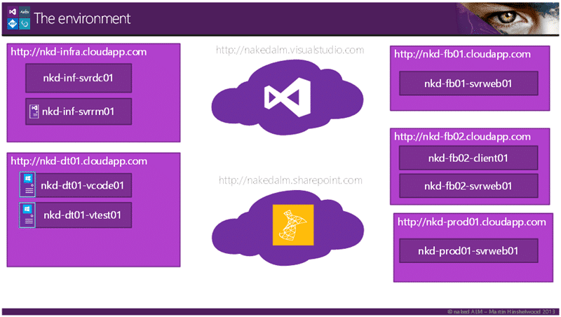
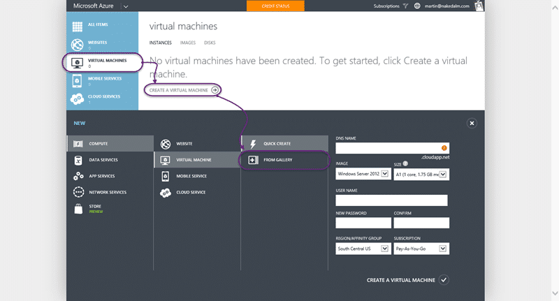
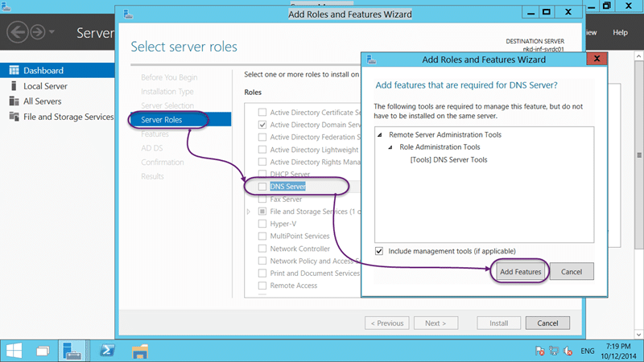
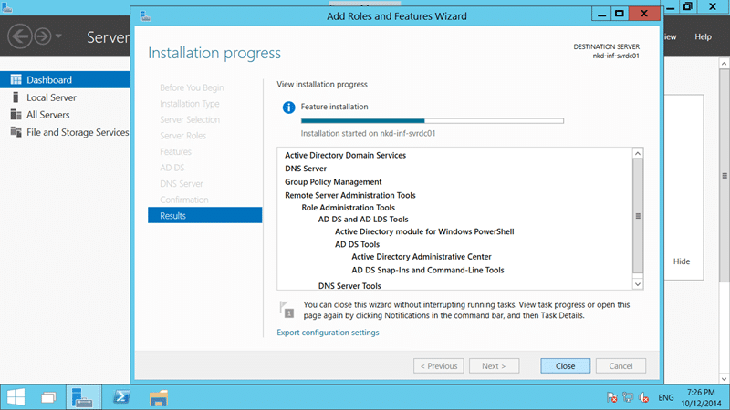
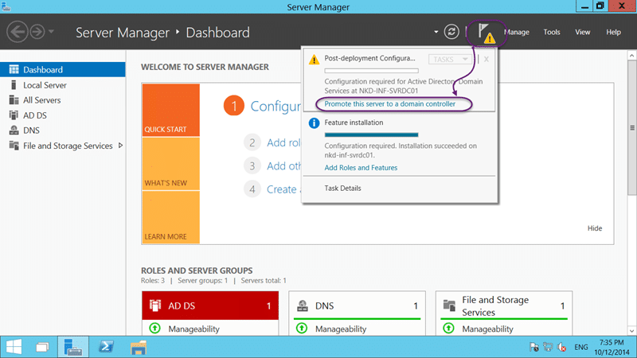
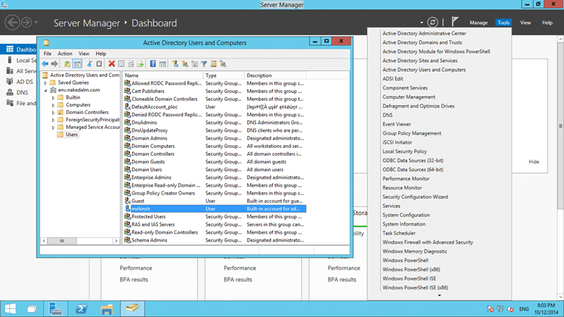
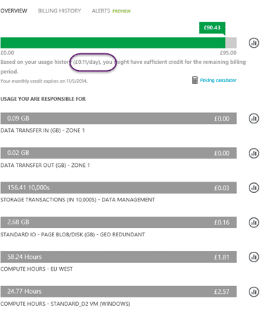

I will be [speaking at NDC London: Second Look, Team Foundation Server & VSO](http://nkdagility.com/ndc-london-second-look-team-foundation-server-vso/) and I am planning to be a little adventurous with the demo. For this I will be configuring a DC in Azure for AAD integrated Release Management so that I can do cloud demos.

While potentially similar to the [Brian Keller VM demos](http://blogs.msdn.com/b/briankel/archive/2013/08/02/visual-studio-2013-application-lifecycle-management-virtual-machine-and-hands-on-labs-demo-scripts.aspx) I wanted a more end to end solution that was a little more real world. I decided to run everything in Azure after the success of [configuring the BKVM in Azure for Training](http://nkdagility.com/creating-training-virtual-machines-azure/). I can make no guarantees that this will end up as the final demo, but it will be fun to build.


{ .post-img }

The first environment that I need is my permanent infrastructure. Top left in the diagram. I need to be able to join a bunch of computers to domain and sync that domain with AAD. All in the cloud.

#### Note

It would be far superior if I was able to just join any machine that I like to an AAD domain. However, currently, there is no support for a direct join. You need to have the traditional static domain for now.

### Creating the virtual machine in Azure for Active Directory

Creating a new machine is almost the bread and butter of Azure. You can create as many machines as you can afford and anything from small, to large, to really enormous. There is the A series machines that are cheap and cheerful. They are the slowest options and good for low demand operations, like active directory.


{ .post-img }

You first need to have a cloud service to add your machine to. This is a little bit like a resource group as each cloud service is limited to a certain number of cores, with that defaulting to 20.

#### Note

You can send a support request to get the number of available cores increased as I did when I was [setting up training VM's](http://nkdagility.com/creating-training-virtual-machines-azure/) for my recent course.

So head from [http://manage.microsoftazure.com](http://manage.microsoftazure.com) to "Cloud Services | New" to pop the menu and select "Quick Create" and fill out your details. You can't move region later so pick the right one now, closest to the consumers. In this case I want "West Europe".


{ .post-img }

We also need a storage location to store the hard disks for our VM's.


{ .post-img }

Now we have our cloud service we can get going creating the first VM that will be the Domain Controller (DC). Select "Virtual Machines | New" to pop the menu and choose "From Gallery".


{ .post-img }

Now, I'm a progressive kinda guy and there is already a listing for Windows Server Technical Preview and that’s what I will be using. This applies to all of my servers that I create and I would only use something else if I encounter a problem with an application. I feel that this is low risk as they are now on a cadence of making smaller changes more frequently. Much more likely to find and fix the issue in the integration the fewer things that you have changed at once.


{ .post-img }

For a domain controller you really don’t need much oomph… however to use the machine interactively you really don’t want it to lag… so for install and configuration I will run an A2 (2 cores and 3GB RAM), and then once I am done I will downgrade it to a A0 (shared core, 0.9GB RAM). That’s plenty for a domain controller. If I need to physically configure the machine later then more power is only a reboot away.


{ .post-img }

You should at this point go off and create a network to add your server to. That will save you having to \[Move your Domain Controller Azure VM to a Virtual Network\] at a later time. Alas I did not know that for now and so I just configured it for the West Europe data centre and all the trappings of storage and cloud service.


{ .post-img }

There are lots of cool options for managing your server and deploying bits to it if you want, but this is going to be a simple light weight DC.


{ .post-img }

Woo… after a few minutes I can then log onto my server and tinker. If you find it to slow you can head to the "Configure" tab and bump up the server. Like I said… I bumped to A2 for interactive configuring.

### Install Active Directory required components

Installing active directory in your VM on Azure is uncannily identical to installing it on any other machine. That’s because it is! So if you know how to do this bit you can skip to the end.


{ .post-img }

Everything in Windows is added using the "add roles and features" wizard. To be honest it just build a little PowerShell and that does all the work… and I use PowerShell… but not when there is a perfectly servable UI.


{ .post-img }

Active Directory is a Server Roll and it’s a simple checkbox away. When you check it the wizard will ask you to add a bunch of other stuff. It’s a bunch of management tools and the PowerShell commandlets. Those might be useful later.


{ .post-img }

You also need to add the DNS role as active directory relies very heavily on dynamic dns for resolutions. The AD wizard will automatically populate this stuff for you so you will not need to configure it separately.


{ .post-img }

Whoh… can you even add a static IP in Azure? For a DNS server to work it needs to have the same IP address. It is the thing that is going to be providing resolution for your other servers and they need to known where to find it. Turns out you can easily [configure a static ip for a dns server in your virtual network](http://nkdagility.com/configure-a-dns-server-for-an-azure-virtual-network/?preview=true).


{ .post-img }

Following the lead of the TFS team it looks like all of Microsoft products are moving to a model where you keep installation and configuration separate. This is a far less error prone model than the traditional all in one model.

Now that we have the bits installed we can move to configuration.

### Promote your Azure VM to be a domain controller

With Active Directory we are doing a lot more than just adding a capability to our server. This is not the same as setting up IIS, we are changing the fundamental way that this server functions.


{ .post-img }

You should see a little triangle after the installation is complete prompting you to "promote this server to domain controller". So lets go ahead and give this server special powers.


{ .post-img }

As we are starting from scratch we need to create a whole new infrastructure. For this we need to "add a new forest" and give it a DNS name. I have been through this a few times and favour "env.mydomain.com" for this. If I was creating a primary production domain I would use the same name as my public domain, and I would never…ever… pick mydomain.local.


{ .post-img }

There are quite a few configuration screens and I am not going to bore you with them all you have to set your NetBIOS name ("nakedalm") and where you want your data to reside but most of the screens are fairly self-explanatory. However the DNS screen will give you an error if you ticked the DNS option, as I did, during the feature selection. The result of that wordy warning is that "no action is required" so we are good.

```
Import-Module ADDSDeployment
Install-ADDSForest `
-CreateDnsDelegation:$false `
-DatabasePath "C:\Windows\NTDS" `
-DomainMode "Win2012R2" `
-DomainName "env.nakedalmweb.wpengine.com" `
-DomainNetbiosName "nkdalm" `
-ForestMode "Win2012R2" `
-InstallDns:$true `
-LogPath "C:\Windows\NTDS" `
-NoRebootOnCompletion:$false `
-SysvolPath "C:\Windows\SYSVOL" `
-Force:$true
```


{ .post-img }

Check the configuration, ignore the warnings and away we go… I do however miss the "this will take some time… or considerably longer" message the old AD installation had, however it was pretty quick…


{ .post-img }

At some point you will be asked to sign out and your server will be restarted to be embowed with the powers of AD.


{ .post-img }

When it comes back up you will no longer be able to log into your server locally and will log into the domain. Your local accounts will have been converted to domains accounts and will be listed in Active Directory Users and Computers.

Now that you have completed the install you can drop the server down to the A0 machine level to save money.


{ .post-img }

We effectively drop down to 11p per day for the server. I am sure that if we started hitting it with loads of domain joined machines then I expect the price to go up, however this minimalist cost can be easily supported with your MSDN benefits…
