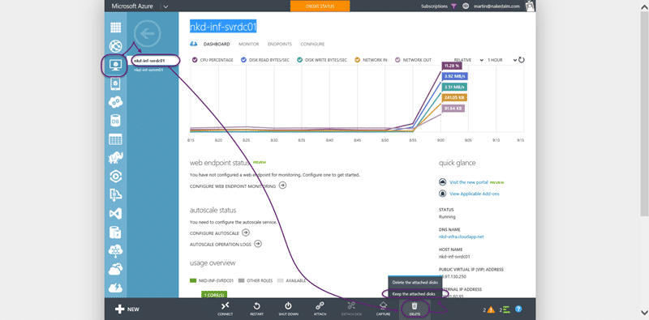
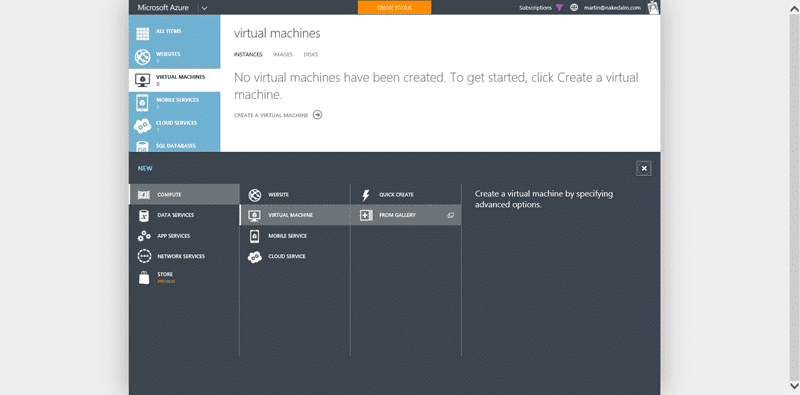
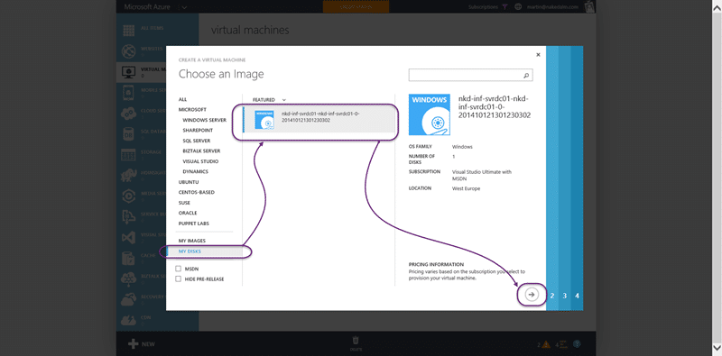
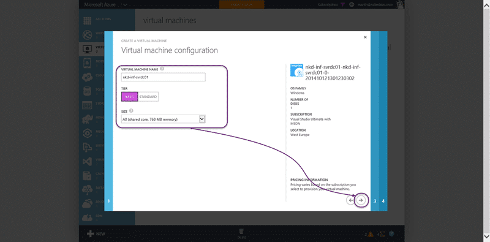
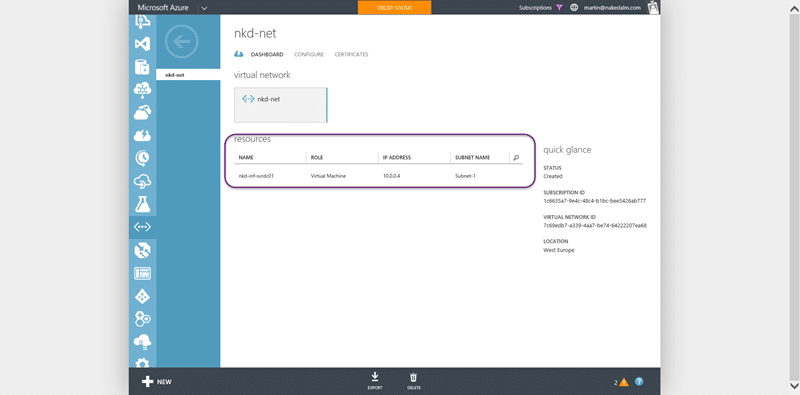

When I first completed [configuring a DC in Azure for AAD integrated Release Management](http://nkdagility.com/configuring-dc-azure-aad-integrated-release-management/) I did not add my virtual machine to a virtual network. And I really should have and in the usual poopyness that is servers you can't move it. You effectively need to delete your VM leaving the disks and create a new machine definition that is correctly configured.

{ .post-img }

First we need to configure the virtual network. Create a new virtual network in the correct region. The region should be the same as the one that you want to create the vm's in, in my case western Europe fits that bill.

{ .post-img }

Then the poopy part, we need to delete the Virtual Server that we created and promoted to be a domain controller. Make sure that you do not delete the disks.

{ .post-img }

We now need to create a new VM in the correct domain. Give it a few minutes to clear the name in the tubes of Azure so that we can reuse it and then create a new VM but select the Gallery.

{ .post-img }

In the gallery you should find a "my disks" section at the very bottom that lists all of your free floating disks that are not attached to a VM. I found that one of my servers did not exist and I had to wait a few more minutes for it to show up. Select your disks and click next…

{ .post-img }

Give the machine the same name and pick the A0 instance size that we wanted before. We should not have to log into the server at this time.

{ .post-img }

On the second screen we need to make sure that we select the virtual network that we just created. This will alter the other options that we can select but it is very simple to configure. On the next screen you need only pick what additional bits that you want and I only really want the VM tools for an AD box, but for other boxes you may want more.

{ .post-img }

You should now see your domain controller as part of your virtual network that we just created. Even if we have many cloud services we can add their containing machines to this network and allow communication between them.

**Useful links:**

- [http://azure.microsoft.com/en-us/documentation/articles/active-directory-new-forest-virtual-machine/#createvnet](http://azure.microsoft.com/en-us/documentation/articles/active-directory-new-forest-virtual-machine/#createvnet)
- [http://msdn.microsoft.com/library/azure/dn630228.aspx](http://msdn.microsoft.com/library/azure/dn630228.aspx)
- [http://blogs.msdn.com/b/walterm/archive/2013/05/29/moving-a-virtual-machine-from-one-virtual-network-to-another.aspx](http://blogs.msdn.com/b/walterm/archive/2013/05/29/moving-a-virtual-machine-from-one-virtual-network-to-another.aspx)

