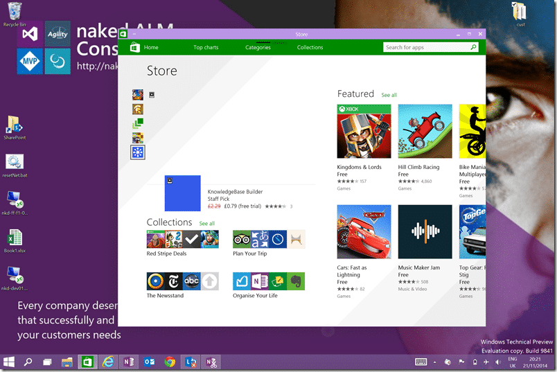

Recently I had a crash of Windows 10 and while usually you can boot into recovery mode, Windows was uncooperative. This was when I found my Microsoft Surface 3 unable to boot from USB!

I ordered a new Surface 3 Pro 512 to be delivered in the USA that I would pick up when I was at the MVP Summit a few weeks ago. I had ordered it more than 2 months ago for it to be delivered to my good friends at Northwest Cadence. While the other parts of my order were delivered, Docking Station and cables, the Surface 3 was marked as "Pending" in the web. Then all of my orders disappeared entirely.

Now, I have orders on both the US and UK site so I just assume that things are a little squirrely and give them a call. The was 2 weeks before I was due to be in the USA for only 8 days so the window was a little tight. Long and short the support desk ended up reissuing the Surface 3 and I got delivery conformation a few days later. Awesome…

I headed out to the Summit and Amanda (from Northwest Cadence) dropped my orders off at me hotel. On arrival I had a wonderful unboxing event and found that the first order had indeed been fulfilled. I had 2 Surface Pro 3's, one will have to go back, but that will have to wait.

So I stuck one in my suitcase to deal with later and opened one for me. First thing I did was install Windows 10, and everything went well for a while until I got a dreaded blue screen.

{ .post-img }

> Recovery
>
> Your PC/Device needs to be repaired
>
> The digital signature for this file could not be verified.
>
> File: \\windows\\system32\\winload.efi
>
> Error Code: 0xc0000428

I was at a session with the product team, and after a few minutes poking at buttons and powering on and off I managed to get the device to boot into Recovery mode and ran a refresh. Simples…

Unfortunately it happened again, the same error, only a few days later and worse, this was on the Saturday a few hours before my flight back to the UK at the end of the Summit. Tis time I could not get it to boot into recovery. Not at all, so I instead a USB to do a full refresh and found that my Microsoft Surface 3 was unable to boot from the USB stick.

Strange… So I fired up my Surface 2 Pro (hey, it was a travel day, I had everything) and tried it there. Sure enough the Surface 2 was able to boot from the same USB.

Not good, but I was in Starbucks at Bellevue Mall and headed into the Microsoft Store and bought a new USB stick to see if it was my stick that was the issue. I used my Surface 2 to create a bootable USB and tested it there. Still no dice. But again, after about 40 minutes of jiggery-pokery (really no other work for it) I ended up in Restore mode and was able to reset Windows.. Phew…

Now, if I was sensible, at this point I really should have done a full wipe and reinstall. This file had messed up twice and the like hood was high that it would happen again. However I was running for a flight to Scotland with a 6 hour layover before flying out onsite to a customer in Norway. Yes, that’s a five country trip: Seattle -> Rekiovik -> Glasgow -> Amsterdam -> Oslo. So I am blaming travel, stress, and jetlag on my lack of judgement.

I was onsite with a customer in Oslo for only 2 days when my Surface 3 flashed the same error. After 2 hours of jiggery-pokery I got absolutely nowhere! Luckily the customer provided me with a Dell brick of a laptop which had the saving grace that it booted. I spent some time each night onsite trying to get the bloody thing to boot and searched the interwebs for results. Microsoft have good documentation for how to boot your Surface from a USB.

> ##### Start from a bootable USB device when Surface is off
>
> **Step 1:** Attach a bootable USB device to the USB port.
>
> **Step 2:** Press and hold the volume-down button.
>
> **Step 3:** Press and release the power button.
>
> **Step 4:** When the Surface logo appears, release the volume-down button.  
> Surface will start the software on your USB device.  
> \-[Boot Surface from a USB device](http://www.microsoft.com/surface/en-gb/support/storage-files-and-folders/boot-surface-pro-from-usb-recovery-device)

When I got home I broke out the second Surface that Microsoft shipped me by accident and took that to my customer. I tend to fly home late on Friday night and then out again on Sunday. This usually gives me Saturday and Sunday morning with the kids, but the Oslo flights are a little suckie. The later in the day I fly the more expensive the flights get. 06:00 flight is half the price of the 15:00, not chump change, and the later flights get filled up first. So this weekend I flew out at 06:00… One day home and back out to the customer. Dam I am glad that MSFT shipped me that extra tablet (Microsoft is still trying to figure out how to ship it back to the USA).

So, this time I did not install Windows 10. I spent all week this week on Windows 8.1 and missing lots of features from 10:

- **Modern in a Window** - On a small tablet this sucks (re Dell Venue 8) but on a desktop replacement that I mostly use with keyboard and mouse.
  
  { .post-img }
- **Mini modern start menu** - This is touch and go. I really like the full screen start menu, but the largest screen I use is my Surface 3. I have seen folks using it on a 32" screen and it is more like a punch in the face.
  
  { .post-img }

At the beginning of the week I reached out to some contacts in MSFT to see if we could not figure out the USB issue. I found that \[Clement\] also had the same issue and while was able to use Recovery Mode was unable to get his surface to boot from USB either. So that’s 3 for 3.

I even tried getting Windows 8.1, on my surface, to create Recovery USB and booting from that. Still no dice.

## Solution: Microsoft Surface 3 unable to boot from USB

After some time I managed to get in touch with someone at MSFT who knew about this part of the system and indeed had an identical one to me. He had no issues booting so we set about diagnosing the issue. I pointed at the documentation and he asked a few questions:

> Do any of the Pro3 systems you are currently using still boot into Windows?  
> If so, what have version of Windows have you got installed at this point?
>
> Do the volume up/down buttons work in the OS?
>
> How did you create the USB key? Is it labelled “BOOTME”?

Wait! What!... "BOOTME"???

I am not sure where this came from but when I renamed my USB to "BOOTME" sure enough, without issue, the Surface 3 booted from it. OMG! That’s two weeks wasted on an undocumented feature that prevents even a Windows created Recovery Image to be unusable. By default there are three ways to create a bootable USB:

1. **Manually** \- Format, Create partition, mark as active, then copy files
2. **Windows 7 USB** - From Microsoft in Windows 7 timeframe came an executable that you give an ISO and it creates a bootable USB
3. **Windows Recovery** - In Windows you can, and should, create a recovery image that you can use to boot your computer and reset it. This boot USB will be named “Recovery” by Windows.

In not a single one of these methods does the USB get named "BOOTME". Ahh, well… never mind… Now we all know.

{ .post-img }

So if you are wanting to boot your Surface Pro 3 from a USB you need to make sure that the device you want to boot from is labelled "BOOTME".
