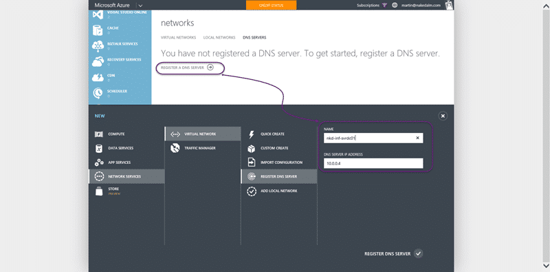

I just got done [configuring a DC in Azure for AAD integrated Release Management](http://nkdagility.com/configuring-dc-azure-aad-integrated-release-management/) and I need to now Configure a DNS server for an Azure Virtual Network. This will tell Azure that any servers that are added to this virtual network should use this DNS server. This should allow any machine added to this virtual network to be able to join the domain that we have configured.

Before we can set a DNS server default we need to have a fixed IP Address for the server. Although DNS provides name resolutions so that we do not need to use IP's all the time you need a place to start. In the big bad internet there are 'name servers' that start the ball rolling that exist at a well known level. Within our virtual network we need to create our own well known starting point.


{ .post-img }

There is a simple command to give your server a fixed IP within your virtual network. You can apply it to any server and it allows the internal virtual network IP to persist even if you turn off the server. This does not affect the external IP.

```
Get-AzureVM -ServiceName nkd-infra -Name nkd-inf-svrdc01 | Set-AzureStaticVNetIP -IPAddress 10.0.0.4 | Update-AzureVM
```

There is also a 'check IP' command that, as I only currently have a single server is a little pointless. I just set the servers current IP as the fixed IP for the future.


{ .post-img }

We first need to create a DNS server definition that we can select later. Here we simply set the name and IP of the DNS server to create a registration of that DNS server.


{ .post-img }

We then need to go to the virtual network that we created and tell it that the DNS server should be the one to use. If we had a large network we may set more than one DNS server, but in this case we are just pottering around with the configuration for demos. Select the network and go to the configuration tab. Here we can select our pre-created DNS server.

If you create new machines, or reboot the existing machines in the virtual network, they will then be given this DNS server when DHCP assigns configuration. In this way you can create quite complicated network configurations and even create backup domains controllers to allow you to extend your local network to the cloud.
