Now that I have [it configured](http://nkdagility.com/create-standard-environment-release-management-azure/) I want to show how to create a Release Management pipeline for Professional Developers and Development Teams.

I was speaking at NDC London 2014 this week and as my talk is all about how [Team Foundation Server does not suck](http://nkdagility.com/ndc-london-second-look-team-foundation-server-vso/) like it used to back before 2012 I need to demonstrate automatic environment deployments as part of my demos with a Release Management pipeline. This session is specifically geared towards users of 2005, 2008, or 2010 that got frustrated with the lack of some features. Specifically hierarchical work item relationships and teams among others. I want to show that the advances since the 2012 release of the product really make it worth considering again.

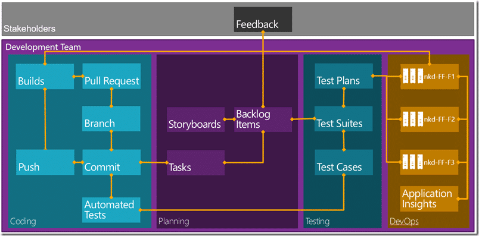
{ .post-img }

In order to show the power of TFS I want to do an end to end walkthrough. Most of the above is something that I demo constantly, but the DevOps part has a new version of Release Management and the addition of Application Insights for monitoring. So along with the rest, I want to show some binary assets flowing through a release pipeline.

### Create the Source and Build for Fabrikam Fibre

Now there is not going to be enough time to dive into every little detail, but I want to give a 1000 foot view of all the features. Even then, this is a 3 hour demo squished into about 45 minutes. My plan is to have as much automated as possible and for this I have a copy of the [Fabrikam Fibre web application](http://fabrikam.codeplex.com/) in a Git repository in my VSO account.

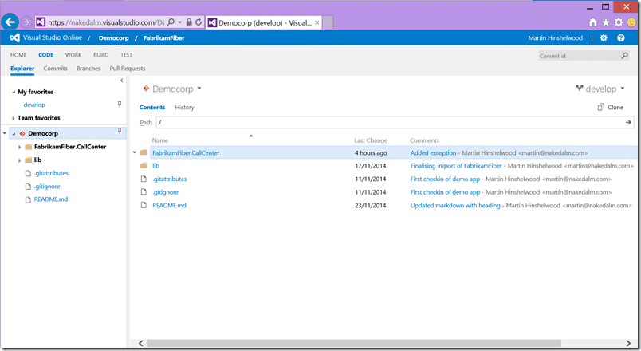
{ .post-img }

This is a fairly simple and well known application, however, key is that it is not an Azure application and is usually deployed locally to your own server. It even uses an old version of .NET and an ancient version of MVC.

You can either create a new Git Repository on an existing Team Project or create a new Team Project to work in. I am a [firm believer in larger team projects](http://nkdagility.com/one-team-project/) and I have a simple rule for when to create a new Team Project:

> If you have resources that interact (with resources defined as Work Items, Code, or People) then they should be in the same Team Project. Otherwise create a new one.

This simple rule means that you don’t get tones of unnecessary team projects and if you are coming from 2010 you will know what I mean.

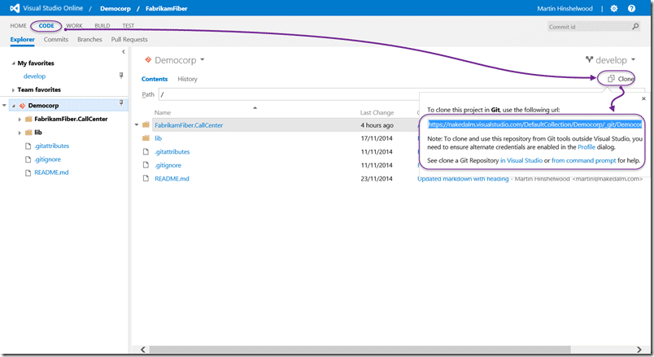
{ .post-img }

The first step is to create a repository for your code. You can use the URL and your favourite tool, or just connect with visual studio.

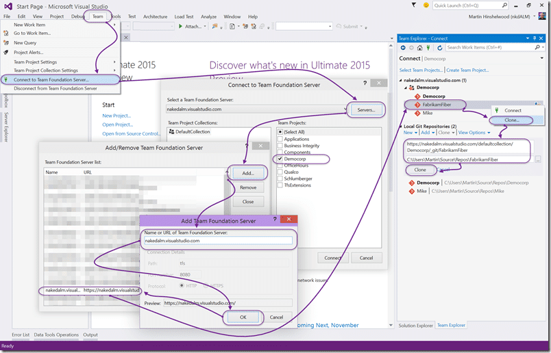
{ .post-img }

Not the simplest of activities if you don’t currently have a connection to TFS, but if you do you can skip to the clone of the repository. The thing to note is that even a single Team Project can have multiple Git repositories that are all accessible.

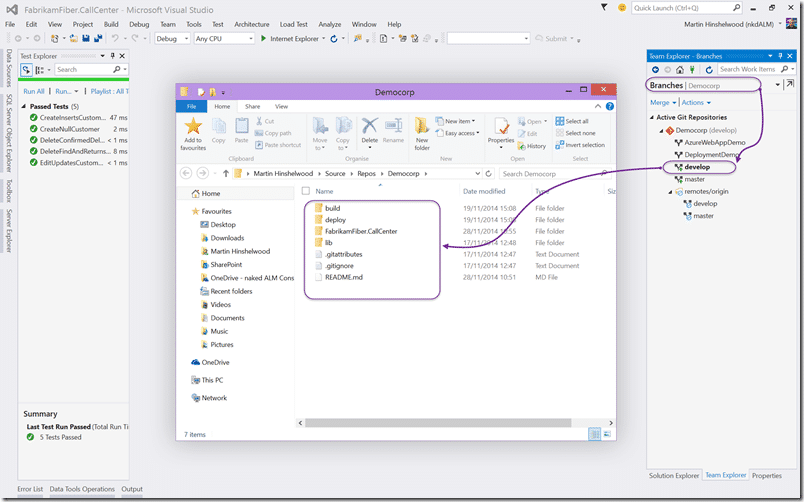
{ .post-img }

Once in you get access to all of the branches in your Git repository and here you can see that I have a bunch already configured. I started with the default "master" branch and committed the new source. After pushing to the server I created a "develop" branch to work on. Many of the things I will be configuring will be done in a quick and dirty manor. Sometimes a little hand waving is necessary when you configure demos as this is not a real application or a real project.

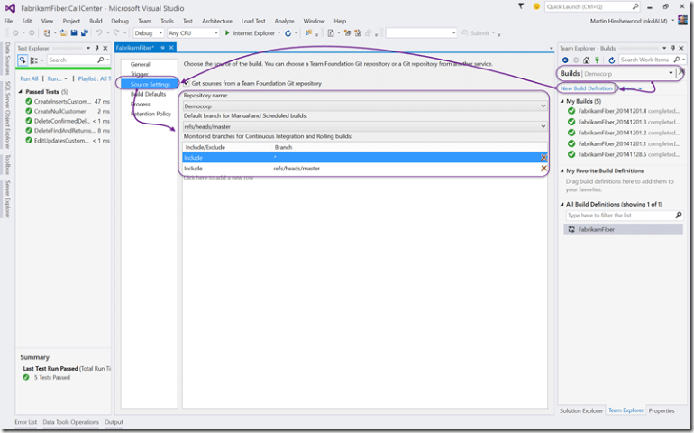
{ .post-img }

Now I have code I need some way to create my binary output. This is very strait forward and can be done in just a few clicks. SO I created a new build definition, gave it a name and set it to build continuously. That means that if I push code to any of the branches listed above it will queue a new build based on this template.

#### Hand Wave #1

I have configured this to do a build for any branch. In the real world you don’t want your minor branches hitting your binary pipeline. You should have a Build configured on MASTER that hits your production pipeline, and a another build for DEVELOP that hits your dev pipeline of feedback servers. If you have feature branches then you may also been feedback pipelines on them as well to create a tight feedback loop.

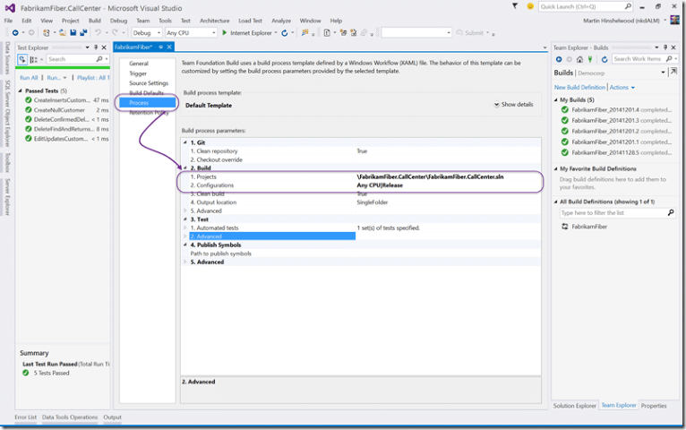
{ .post-img }

The only real configuration here is top select the solution. If you have a single solution in your repo then it will be pre populated and you can create a build without changing anything… now Queue it…

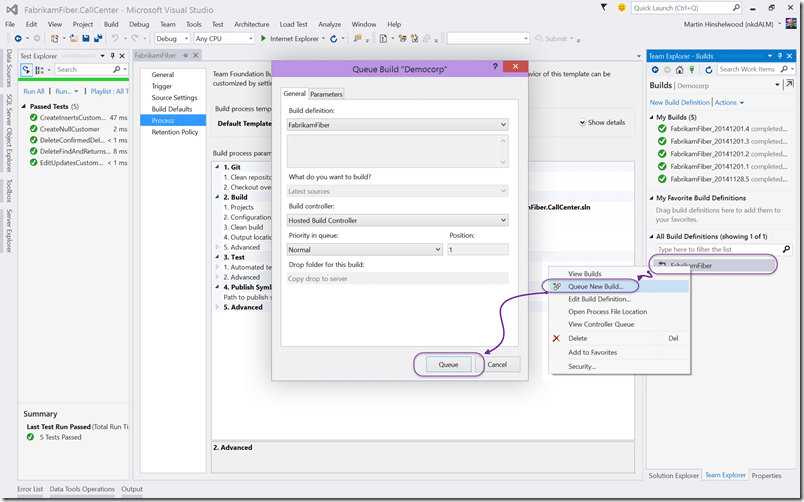
{ .post-img }

No, you don’t need a build controller, VSO is proving it. No, you don’t need a drop location as TFS is providing that as well. Just queue and go…

#### Hand Wave #2

My first builds were partially successful. By default if the compile works and tests fail you get a partially successful build. One of the first things I do is make the build fail if the tests fail. To me, a build with no tests is not a useful thing. A little tweak to the code and the build passes no problem.

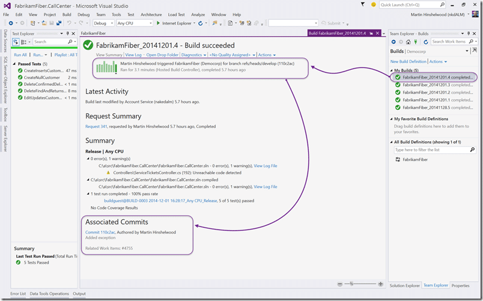
{ .post-img }

If we open the build we get our first piece of awesome. The build knows what work items were associated with the code it just built. Not bad… However we need to check the drop location. At the top you will see an 'open drop location' link.

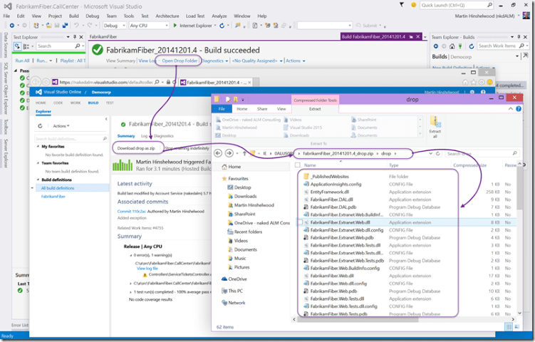
{ .post-img }

Here we get directed to the web access as the drop location for the build is set to save inside the TFS server. This is an un-versioned store inside of TFS that is automatically maintained. It has an advantage over a network share in that it is backed up with your TFS server. Always make sure that you backup your assets, and your build output is an asset of your organisation.

### Create release pipeline for Fabrikam Fibre

So, we have some build output but nowhere to put it…

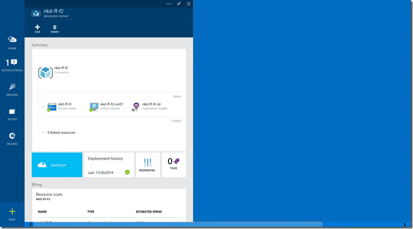
{ .post-img }

wait… I just [created a standard environment in azure for this](http://nkdagility.com/create-standard-environment-release-management-azure/). The idea now is that we need to create a release pipeline to get our stuff from the drop location all the way into this environment.

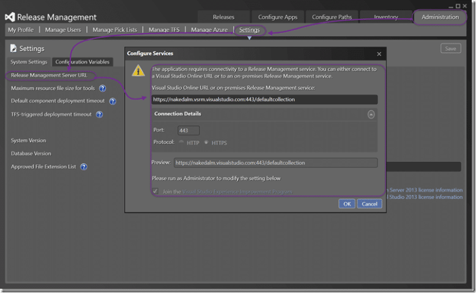
{ .post-img }

Its time to fire up the Release Management Client for Visual Studio 2013. Make sure that you have at least update 4 an you can connect to the Release Management Server that is provided as part of VSO.

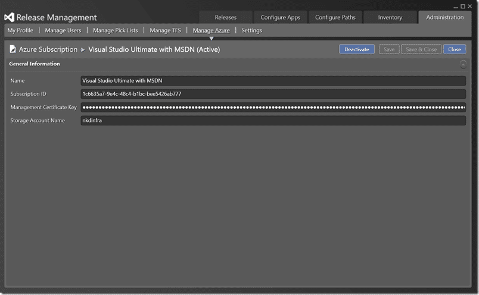
{ .post-img }

We also need to connect everything up to Azure as my environments are being hosted there. If you are using the hosted Release Management server then you can only do Azure right now, but that will expand in time. With a locally deployed Release Management Server you can use agents, DSC, or PowerShell to action deployments.

Here I am restricted to Azure but that’s O)K with me for now. You will need your management certificate key to move forward and RM will stick a bunch of bits into your storage account. It all throw away stuff but for some reason, not sure what, it pushes from the drop folder in TFS to Azure storage before it ends up on you target environment.

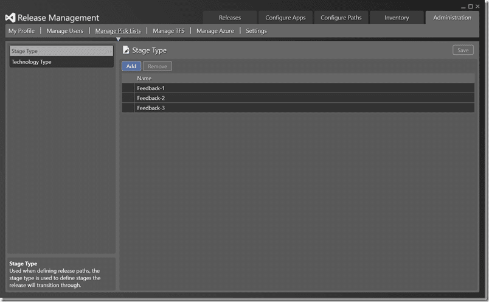
{ .post-img }

Next thing you need to do is specify your stages. I can't reiterate enough how much I hate calling these things Dev / QA / UAT, or any of the other meaningless names in circulation. That my binary output is in "development", or "user acceptance" mode is really merely a state of the output. I can deploy the "uat" output to 10 different environments. So do I call them UAT? What if I deploy a set of "development" bits to that same environment for another set of testing? Do they all have to be renamed to be "dev" environments. We need a name that conveys purpose rather than state or quality. I tend to use the word "feedback". It's really what we are always doing with the environment regardless of the quality of the bits that are deployed to it. So I have Feedback1-3 for my stages…

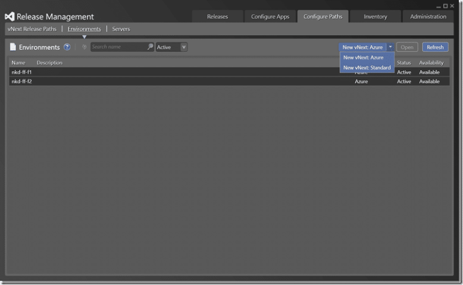
{ .post-img }

Now we get down to the actual configuration. If you head over to the "Configure Paths" tab and then click on the "environments" link you should see a list of your currently configured environments. To configure a new one you can either create a local standard environment by using an existing server that you have on your network, or you can use an Azure environment.

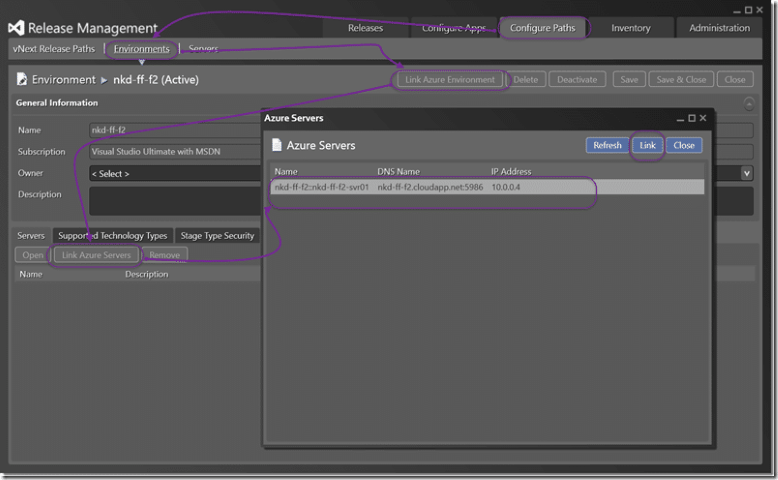
{ .post-img }

In this case I am linking to my brand new "nkd-ff-f2" environment that we created above. Click "Link Azure Environment" and then select the one you want. Then link one or more servers to the definition. This will be where we deploy our bits and you can have as many as you like.

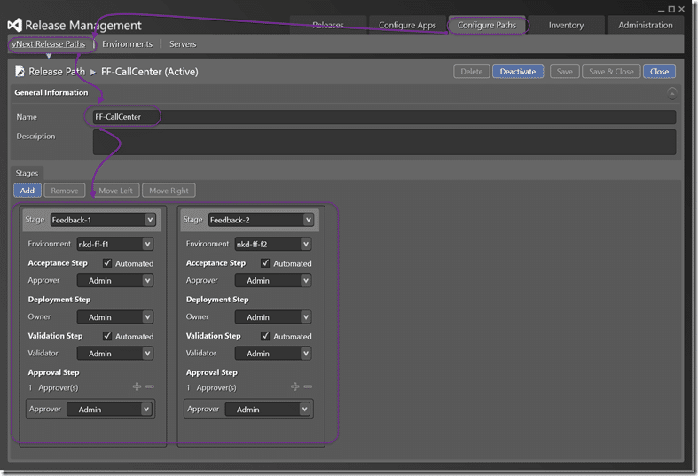
{ .post-img }

Next head to the "vNext Release Paths". In a local RM instance you will have "Release Paths" as well for the previous version of the release process. All of the setups I am showing is part of the preview of vNext that is in the product. Here I am configuring two stages using the names that we previously created. Then I am aligning my Environments with the stages. So that the "Feedabck-1" stage uses the "nkd-ff-f1" environment.

You should see from the setup above that while these bits are deployed automatically there is a post-moderation stage where someone needs to approve the bits for moving forward. This is the Development Teams feedback environment and both the coders and testers (the Development Team) need to be happy to move forward.

"Feedback-2" is owned by the Product Owner and is used as his preview environment for Stakeholders. He will be soliciting feedback here as this is the official working version. While Feedback-1 is updated for every check-in, Feedback-2 should be updated less frequently. We still need to tell Stakeholders that it can be unavailable and set other expectations, but that’s a stakeholder training issue and not a technical one.

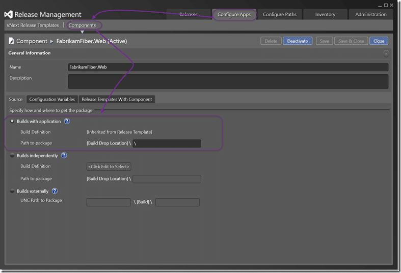
{ .post-img }

Now that we have our continuous deployment pipeline created we need something to deploy to it. This is where we tell Release Management where to find the bits that we want to have deployed. In this case we have a web application that is output to the drop location and I am specifying to get the whole drop.

#### Hand Wave #3

I really should spend a little more time on this and figure out how to scope the drop to only a single web application. If I had time I would specify only the web application from the \_PublishedWebsites folder and have the "deploy" folder (later) in there but excluded from the copy.

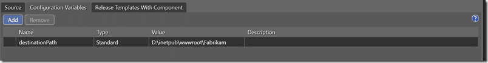
{ .post-img }

We can also specify variables that we will use for the deployment. For now the only thing I care about is where the bits get deployed on the target server. I am going to have my servers pre-configured and just xcopy the new bits. This parameter just tells me where.

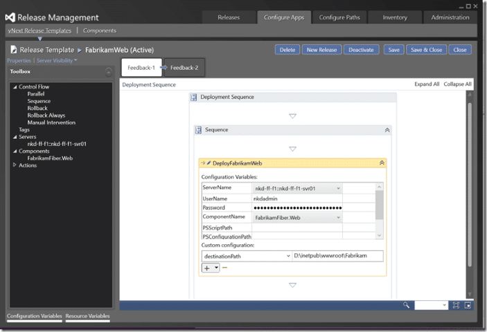
{ .post-img }

Now that we have a saved component we can create a "vNext Release Template". This is where we specify the workflow for deployment at each stage. This has been vastly simplified from previous versions.

I first dragged on a "sequence" and then dropped on a "DSC\\PowerShell" deployment activity. You no longer select tools or drag components on, instead you select the component from the "ComponentName" pick-list above. You also select the server that you want the activity to be executed on. In order to execute a remote PowerShell you need to enter an account with the privileges necessary.

#### Hand Wave #4

In the real world you would take the time to scope the permissions for this account down to only what is necessary. I am using the administrator account because its… well… easier.

Here we also need add our parameter. Technically we already specified a default but what the heck. Click the plus and then select the property name from the pick-list. Enter the value that you want passed. And now we are stuck. I have a configured component, and passed variables, but no execution.

### Create a deployment script for Fabrikam Fibre

In previous versions this would be taken care of for you with a pre-configured custom component. No longer… we need to create a PowerShell.

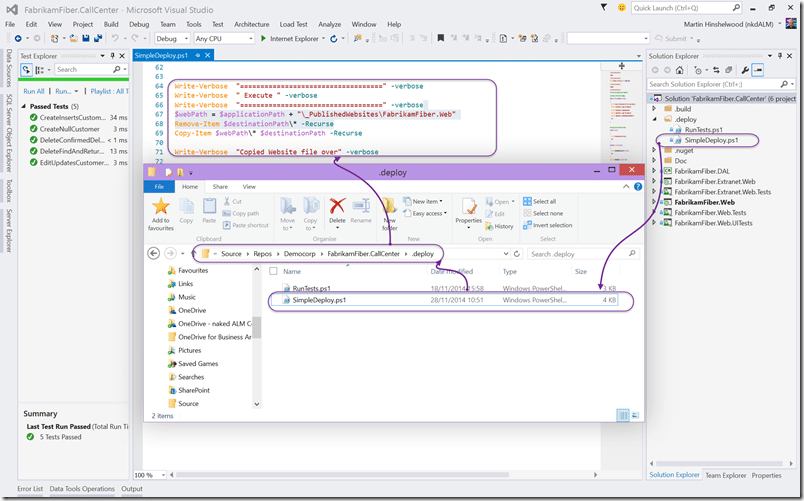
{ .post-img }

In the root of my Git repository I have added a ".deploy" folder and in there I have put a "SimpleDeploy.ps1" that clears out the passed destination folder and then copies the new version of the site over.

#### Hand Wave #5

If I was doing this for real I might do a 'take offline' file and then remove it after the update. Simple to do but takes a little time to get it right.

But how do we get this stuff over there. I need for the script to be in the bin folder when the drop folder is uploaded so that it is available in the bits that are downloaded and pushed to the server.

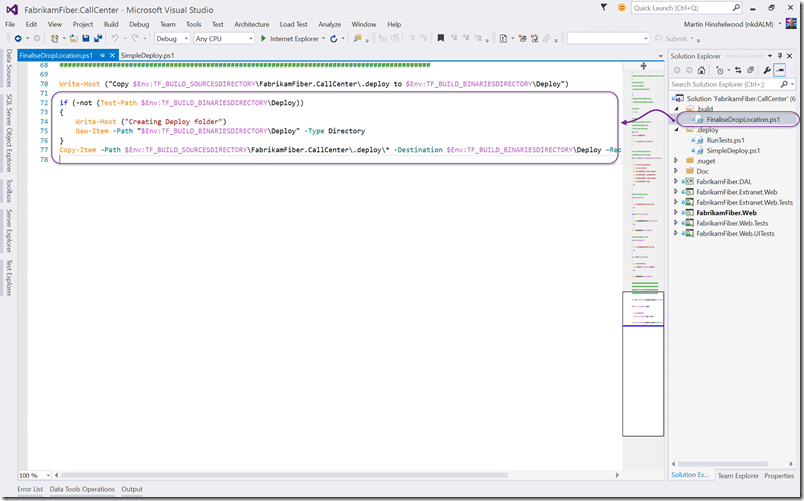
{ .post-img }

If I was fixing Hand Wave #3 I would likely want to put the script in the website folder and customise the deployment to copy everything except that file. To get the deployment script into the right place we need to get the build to do it for us. So we need another PowerShell that executes as part of the build and moves the bits over. I have saved this script in the ".build" folder.

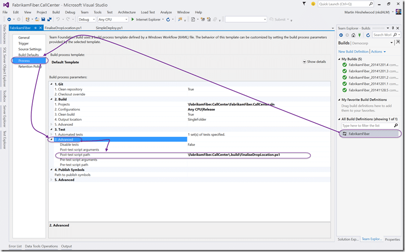
{ .post-img }

We can then customise the build definition to call that script after the tests have been executed. This ensures that we have a good build before we "finalise" the drop location. We can do any other manipulation we want here, but this is good enough.

We now have the SimpleDeploy.ps1 file in the drop location where we can get at it as part of the deployment.

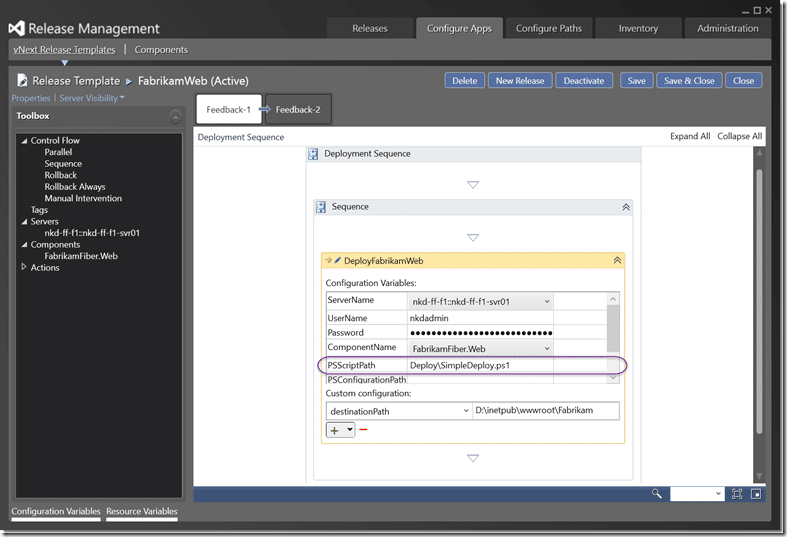
{ .post-img }

If we then add the script location, relative to the component we can call it and pass all of the variables that we have configured. If we execute a release and select a build we will then get our bits deployed to the correct folder on our server.

### Configure Azure Environment for Fabrikam Fibre

So let's hit that server… goto [http://nkd-ff-f2.cloudapp.net/](http://nkd-ff-f2.cloudapp.net/) and you will get…

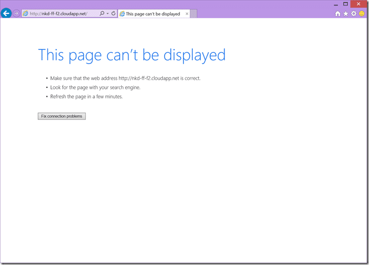
{ .post-img }

Woops… we need to configure ports and IIS… n'stuff…

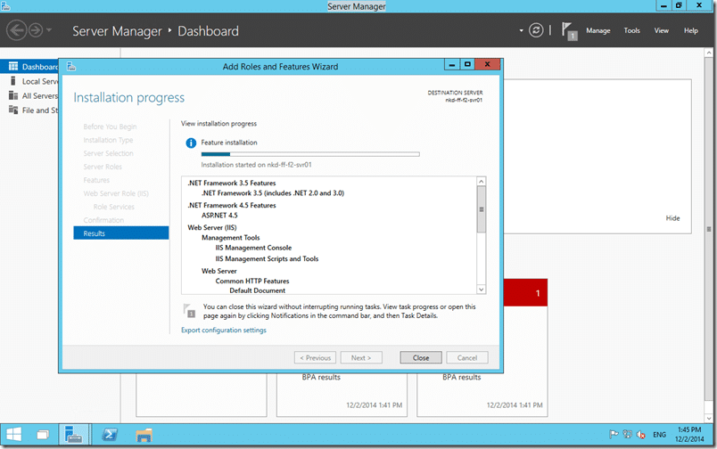
{ .post-img }

I need to install and configure IIS and Fabrikam Fiber comes with a MSI to do a basic install. After running both of those I also need to map a port. Fabrikam Fibre runs by default on port 1337…

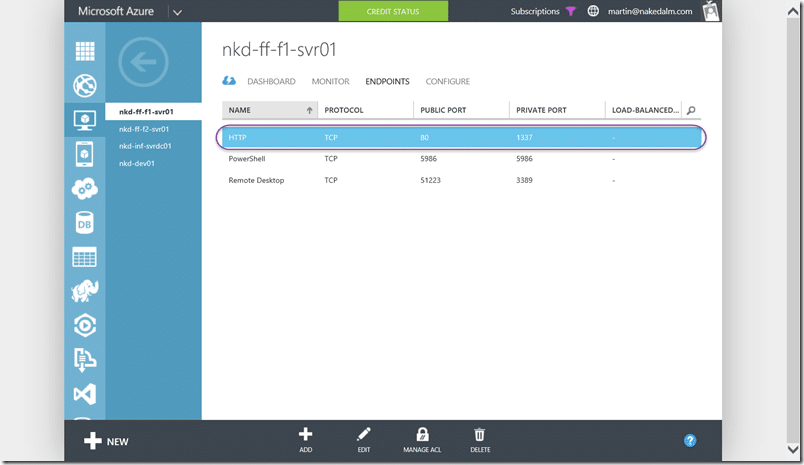
{ .post-img }

Configuring a port is easy and since we already have a domain name I just mapped an external port 80 to 1337 on the server. Simples…

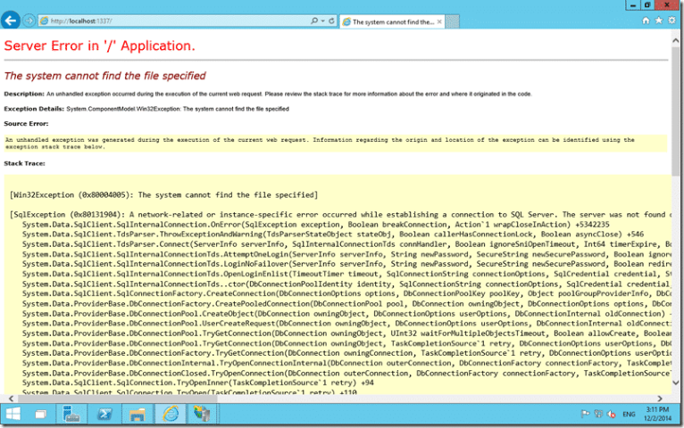
{ .post-img }

So after installing SQL Server Express, SQL Management Studio, IIS, and the Fabrikam Fibre MSI The site is up… wohoo… but this is currently a static version of the application… time for the pipeline to go to work. The error being thrown above is due to the connection string not being right and we need to have parameters configured per environment… to include both the connection string, and the application insights key… these parameters will definitely be different between environments.

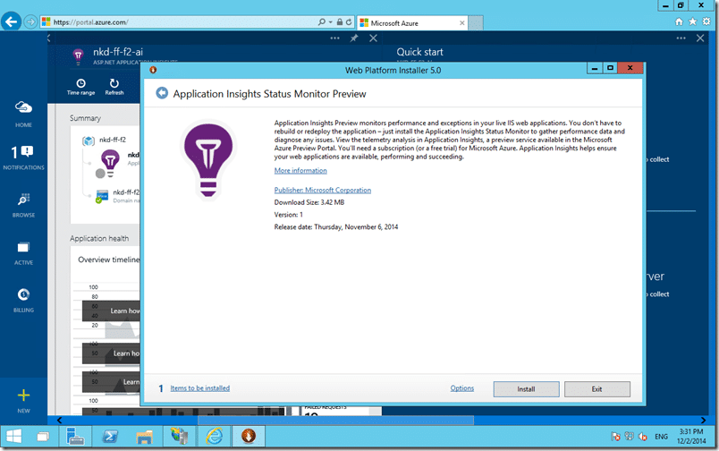
{ .post-img }

Speaking of Application Insights, since I am on the server I am going to go ahead and install the status monitor. This monitor will augment the data collected in JavaScript with server performance as well.

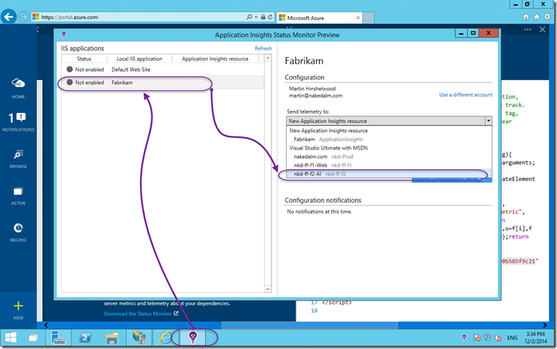
{ .post-img }

Configuring is easy… just launch the configuration tool, select your application pool, and pick the collector to send the telemetry to. After a restart of IIS your telemetry should be winging its way to AI in just a few seconds.

### Pass parameters to the deployment scripts for Fabrikam Fibre

Now all we need is a working deployment…and from our pipeline so that we have the right parameters…

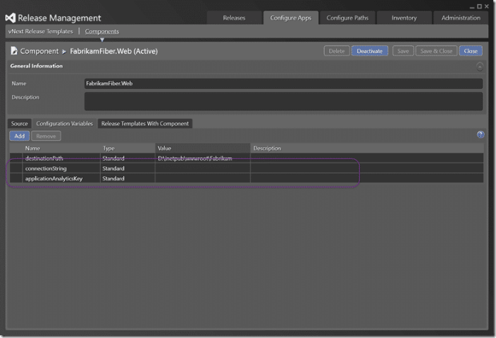
{ .post-img }

So if we head back to the Component in Release Management we can go ahead and add a connectionString parameter. As I know we will also need an applicationAnalyticsKey for Application Insights I am going to add that now as well.

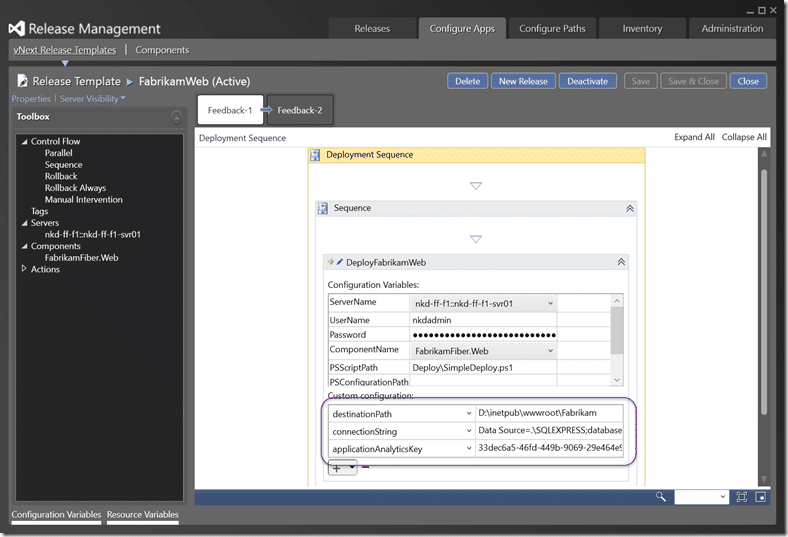
{ .post-img }

Then we head on over to the release template and add the parameters and defaults to both the new values. Here I I changing the SQL database name to be "nkd-ff-f2-db" to match the environment and to make sure there is no possibility of cross talk.

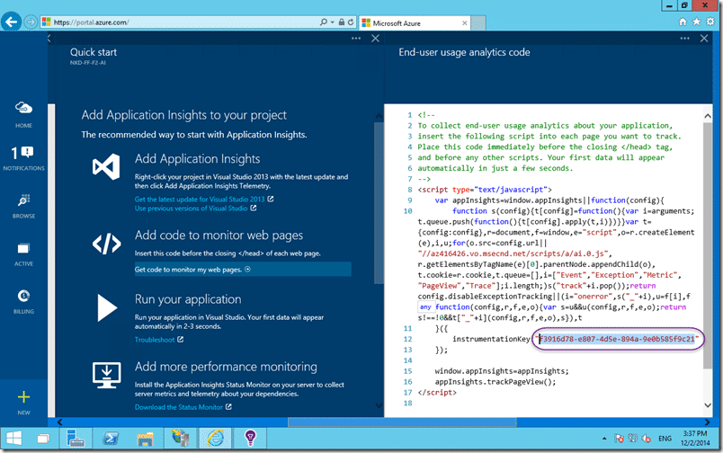
{ .post-img }

You get the application insights key from the code above. Just select "Get code to monitor my web application" and look for the instrumentation key entry.

### Configure Fabrikam Fibre to accept dynamic parameters

We need to parameterise both the application analytics key and the connection string. Once done the deployment should update the values for each environment when it is actioned.

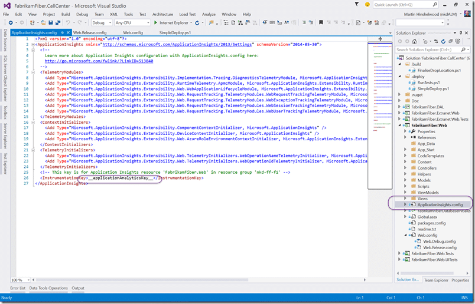
{ .post-img }

If you right-click on your web application in Visual Studio you should get the option to "Add Application Insights", once done you can open your ApplicationInsights.config and replace the key with "\_\_applicationAnalyticsKey\_\_". This matches the parameter that we configured and will be using to do the replacement.

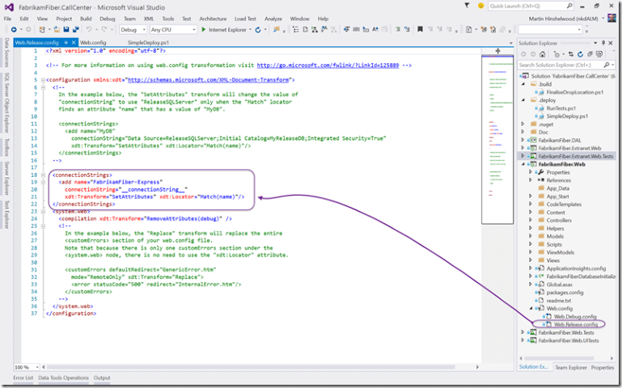
{ .post-img }

The web.config is a little more complicated. We need to be able to debug locally and update dynamically on deployment. The trick is to use the built in dynamic web.config transformation engine. You should fill out the debug connection string as the default in the web.config. This will allow debug easily locally.

Then you need to update the web.release.config to transform the config to what we need for deployment. I am using the "release" config as… well… that seems to make some semblance of sense. With the transformation in place you need to make a couple of updates to the build configuration and away we go…

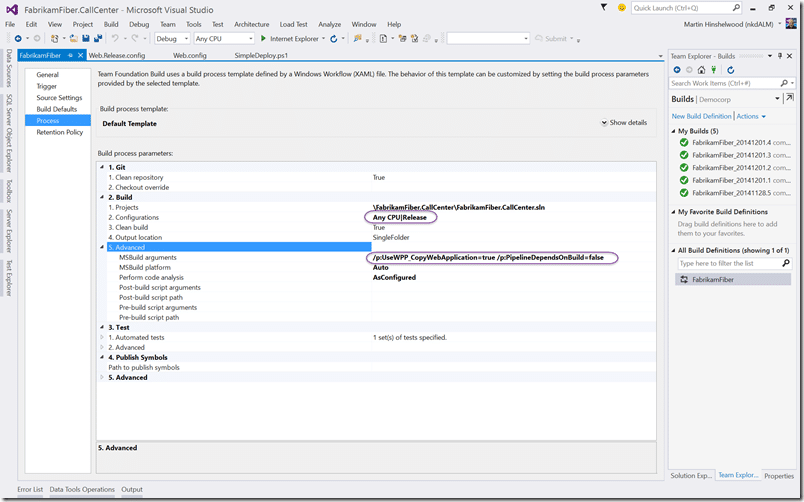
{ .post-img }

I have changes the configuration to build to be that "release" type build. If you have created a custom configuration type then you can just type it in here and the build server will build it. But it will not by default do the transformation. This is usually only done when you use the "publish" button in Visual Studio.

You know, there is really nothing more dangerous than a publish button in Visual Studio. Yes, lets give every single member of the team the ability to shove any old crap directly to production. I wish the product team would give the ability to forcibly disable that option. I only want build assets deployed, not crappy, untested, and un secured local builds.

Anyhoo… if we also add "/p:UseWPP_CopyWebApplication=true /p:PipelineDependsOnBuild=false" to the MS Build argument the transformation specified in the configuration will be done and the output will only have one config.

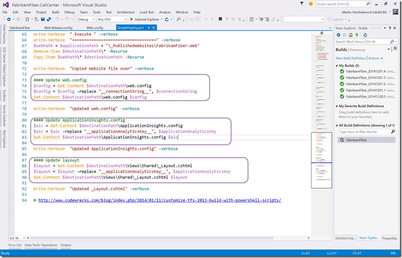
{ .post-img }

The last piece for the parameters is to have the values replaced. We have a bunch of places that have the "\_\_parameterName\_\_" entry that we need to update. Above you can see that I am just opening and replacing the parameter in specific files… this is the easy way out and I am sure you should do something even more awesome with a HashTable and a loop. This does however work…

### Triggering a Release from a Build

All our ducks are in a row and we now need to make sure that a build triggers a release.

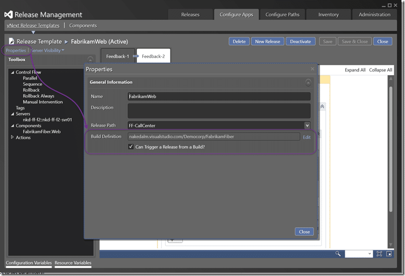
{ .post-img }

We can edit the vNext Release Template and go to the properties. Here we can select a build, and if that build can trigger a release. In the previous version you had to use a special template on the other end for the build to call the release. With the new version (vNext) this requirement is gone and Release Management now subscribes to the build events. When a build completes it triggers auto-magically.

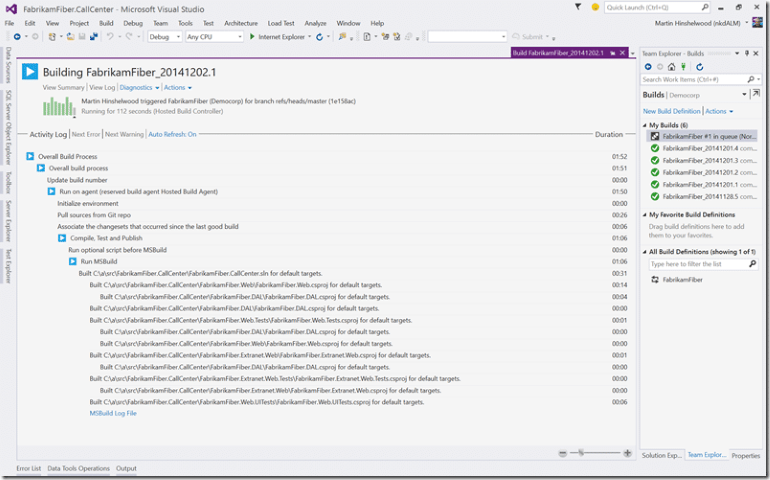
{ .post-img }

So let's kick of a build and see where we get to. I already have the first environment working so I now need to make sure that the second is up and running. I only really need two environments for my demos as they centre around the development team, but I am sure that you can see how you can build quite substantial pipelines with ease.

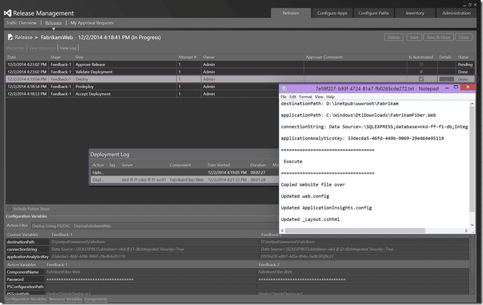
{ .post-img }

Well, the deployment triggered and successfully deployed to "nkd-ff-f1" as expected.

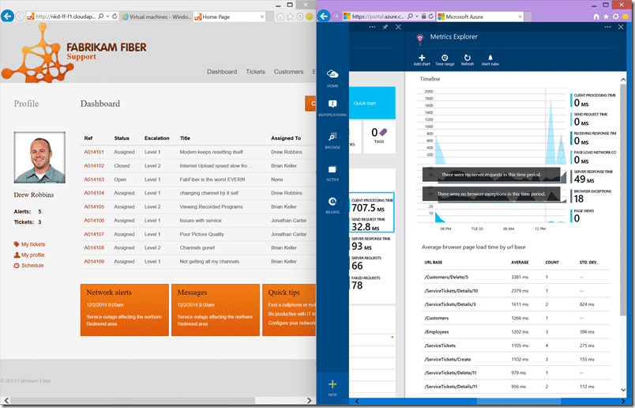
{ .post-img }

Not only that but it works and we get data… now to approve the feedback1 version and get the build pushed to the feedback2 environment.

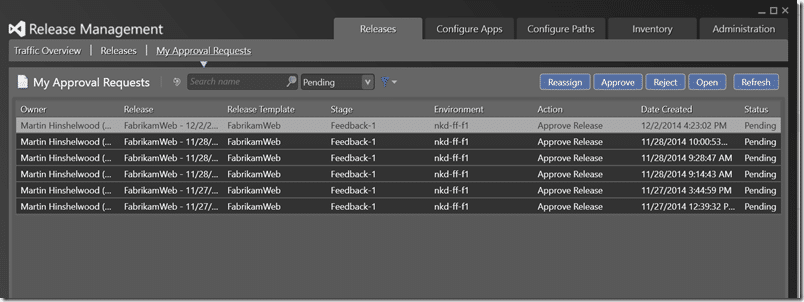
{ .post-img }

Head over to the "My Approval Requests" tab of the Release Management Client tool and approve the latest push to feedback2. Just approve the one you want to push through, in this case the one with the latest date.

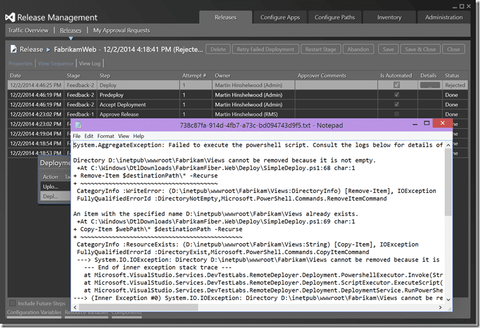
{ .post-img }

Dam it… now I have to go debug… For some reason the script was unable to remove the "views" folder. What I would try is just to remove it completely and have the tool stick it back… so … I got the same error locally, but managed to retry until is deleted. Let's run another release.

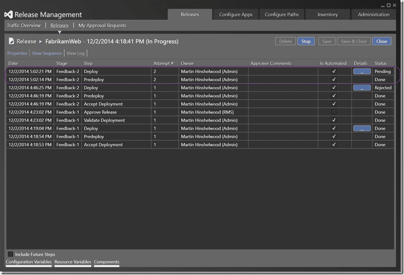
{ .post-img }

If you just want to re-run a release without creating a new build you can just create a release manually and select the build. However you also get a "Retry failed deployment button", but remember that you have to use the same bits. Its for cases like this where it was a server configuration and you don’t want to go through the while rigmarole.

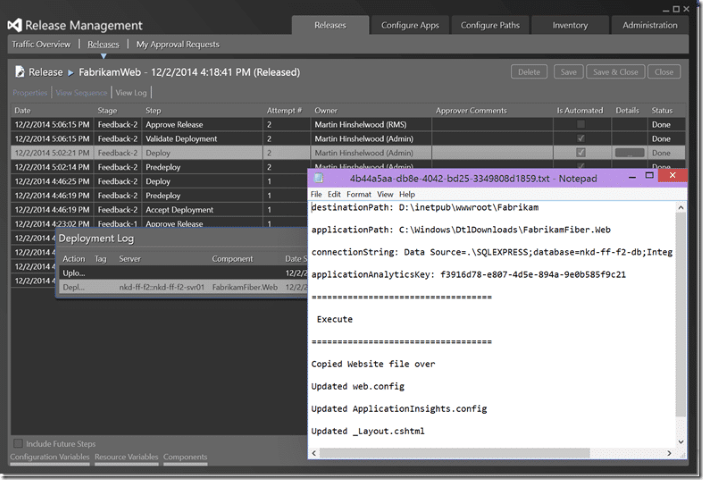
{ .post-img }

Awesome… End to end deployment of Fabrikam Fibre to two consecutive feedback environments… DONE!

### Conclusion

Although it took me about 6-12 hours to get this all configured much of it was waiting around for infrastructure tasks to complete. Getting the first build and then the first release are also time consuming as you just have to keep running it and working through the errors and mistakes. A typo can cost you 20 minutes of time.

Once you are done, however, there is a great sense of achievement of getting your application to deploy end to end. For my demo I plan to do a local change, test, and commit that triggers a release to feedback1. Then the tester verifies that what I have done is correct before the development team approve the release to feedback2. At this point the Product Owner solicits feedback from his stakeholders.

I am looking forward to the demo and hope all goes well… my backup is the Brian Keller VM that can do end to end Fabrikam Fibre all built in… but not as much fun as VSO and RMO…
