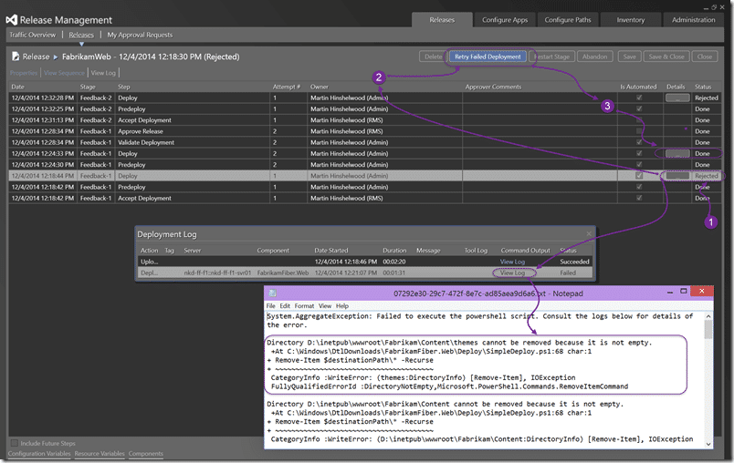

I was in London last week to do a talk on why TFS no longer sucks entitled “[Second Look, Team Foundation Server & VSO](http://nkdagility.com/ndc-london-second-look-team-foundation-server-vso/)”. I had a tone of preparatory work to do too make the demos smooth. The great god Murphy was however not smiling, but he was not angry. Some errors occurred, but no blue screens.

There are many folks that have used older versions of TFS and dismissed future versions on that basis. However I wanted to do an end to end demonstration (soup to nuts) to show what TFS can bring to the table since it was updated in 2012. TFS prior to 2010 was a cumbersome, enterprise only endeavour and now it really is not. I have done demos before with install and configure of a local TFS server in under 30 minutes, so that part is easy. With the launch of Visual Studio Online (VSO) which is effectively Team Foundation Server (TFS) on steroids in the cloud most of the issues are gone while the stigma remains.

\[embed\]https://vimeo.com/113604455\[/embed\]

All of my demos were in VSO so that I could leverage the latest and greatest features, and everything I did could also be done on a local network.

https://twitter.com/ebrucucen/status/540480195363602432

I opted to follow the bug workflow story and I managed to get through almost everything I wanted. I skipped the Agile Planning walkthrough and a bug prevented me from getting through the bug workflow. Irony at its best. Also, note that I am playing four parts during the demo. I really should have had three hats or some other indicator of identity, but I think it Here are my actual notes for the demo above:

**Part 1**

1. PO sends Feedback Request to Stakeholder\[PO\]
2. Customer provides feedback and reports bug as part of review \[STAKEHOLDER\]
3. Product Owner breaks feedback down into new Backlog Items \[PO\]
4. \[WALKTHROUGH: Agile Planning\]
5. Product Owner assigns Feedback Response to Tester and request that they verify bug \[PO\]

**Part 2**

1. Tester uses exploratory testing and creates bug and test case \[TEST\]
2. \[WALKTHROUGH: Microsoft Test Manager\]
3. Product Owner approves the bug and requests that the Development Team expedite \[PO\]

**Part 3**

1. Development Team agrees to expedite bug if Sprint commitment reduced \[Coder+Tester\]
2. Coder finds and fixes the bug \[Coder\]
3. \[WALKTHROUGH: Code Lens and Git\]
4. Coder uses the Test Case to verify that they have fixed the bug \[Coder\]
5. \[WALKTHROUGH: Test Management\]
6. Automated deployment to “nkd-ff-f1” environment \[TFS\]
7. Tester verifies fix in “nkd-ff-f1” environment \[TEST\]
8. \[WALKTHROUGH: Action Recording\]

**Part 4**

1. Development Team agrees that the bug is DONE
2. Automated deployment to “nkd-ff-f2” environment \[TFS\]
3. Product Owner verifies bug and asks customer to check.

While almost everything went well I had two SNAFU’s during the demos that I did a little follow up on later.

{ .post-img }

First was that the Action Recording data collector in Microsoft Test Manager failed to start. It looks like while Windows 10 9860 was in sync the new update that got pushed out broke MTM. In Windows 10 9879 the version of .NET is slightly older than a bugfix that shipped just as Visual Studio 2015 Preview did. Unfortunately as .NET is bound to the OS and especially in a Preview OS I am stuck with MTM not working for now. I have also tested and verified in Visual Studio 2013 that the same issue occurs, but meh… preview bits on preview bits… can’t complain.

{ .post-img }

The second error cam in the flavour of a release failure. As it turned out the simple deployment script that I created was a little too simple. IIS was hanging onto a file handle and this resulted in the first command not being able to delete all of the files. Even when logging onto the server I was unable to manually delete and someone, thanks by the way, shouted out to do an IIS Reset. Well that let me remove the lock and empty the folder. After doing a retry on the failed deployment all went as expected… So your simple deployment should really stop IIS, then update, before enabling it.

As part of prepping for this demo I did a bunch of work around release management and creating the release pipeline:

- [Create a Release Management pipeline for Professional Developers](http://nkdagility.com/create-release-management-pipeline-professional-developers/)
- [Create a Standard Environment for Release Management in Azure](http://nkdagility.com/create-standard-environment-release-management-azure/)
- [Configure a DNS server for an Azure Virtual Network](http://nkdagility.com/configure-a-dns-server-for-an-azure-virtual-network/)
- [Move your Azure VM to a Virtual Network](http://nkdagility.com/move-azure-vm-virtual-network/)
- [Configuring a DC in Azure for AAD integrated Release Management](http://nkdagility.com/configuring-dc-azure-aad-integrated-release-management/)
- [Create log entries in Release Management](http://nkdagility.com/create-log-entries-release-management/) (coming 2014/12/12)
- [Join a machine to your azure hosted domain controller](http://nkdagility.com/join-machine-azure-hosted-domain-controller/) (coming 2014/12/17)

Most of which became irrelevant when Release Management for VSO became available and I no longer had to configure a release management server myself. With the new release cadence from the TFS team, things can only get better…

My slides are available on Slide Share: [http://www.slideshare.net/MrHinsh/ndclondon2014](http://www.slideshare.net/MrHinsh/ndclondon2014)
