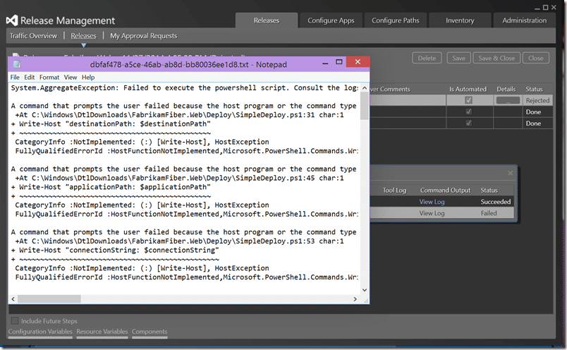
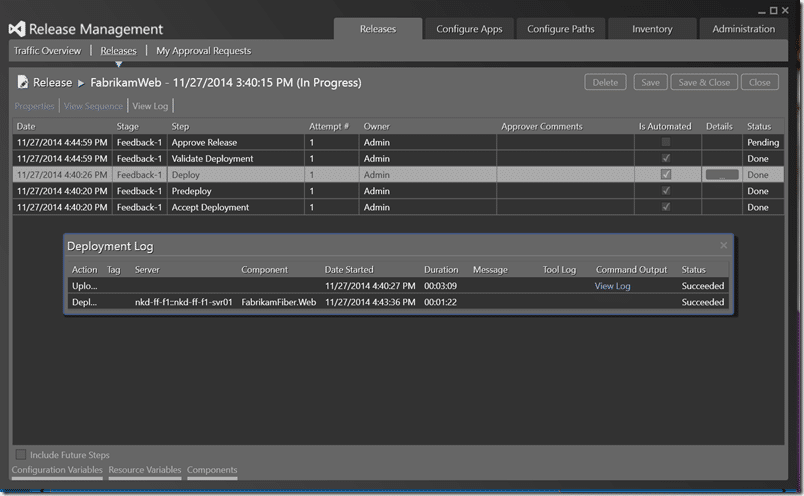
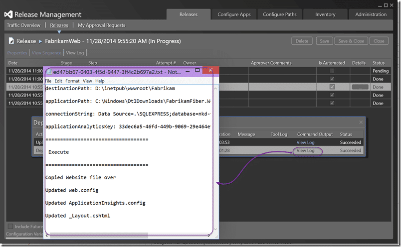

I have been working through my demos for NDC London next week. And I found it almost impossible to create log entries in Release Management where I wanted.

While in London for NDC 2014 I was in the same building as the filming of Mission Impossible 5. I worked on a TV show for my work experience at school and ended up with an [IMDB profile](http://www.imdb.com/name/nm4402255/) and what always struck me was how much time was spent getting one a few minutes or even seconds of footage. If you ever get a chance to even be in the audience for a 30 minute comedy show, be warned… you will be there for at least 6 hours to get only 25 minutes of air time.

Sometimes the same thing happens for demos. My demo for NDC was an end to end presentation of Visual Studio ALM with VSO. For that I needed to have a full release pipeline for my application and as I just downloaded Fabirkam Fibre I had to [create that release pipeline](http://nkdagility.com/create-release-management-pipeline-professional-developers/) from scratch. While I was building this out I ran into a few issues and one that was kind of annoying was an inability to get a log to output so I could review what happened during the deployment.

If you have a deployment script it is really easy to fail it out. All you need to do is have an error occur, or deliberately call a "Write-Error" command. Simples. But what about having a log of the good things that happened?


{ .post-img }

If everything goes swimmingly then you get an empty space where the log should be. So how do I get an output. Well if I was creating a build script I could just have "Write-Host" and the build system would capture and log all the output.

```
#### Update Web.config
$config = Get-Content $destinationPathweb.config
$config = $config -replace "__connectionString__", $connectionString
Set-Content $destinationPathweb.config $config
Write-Host "Updated web.config"
```

Well lets try "Write-Host"…


{ .post-img }

Well, that’s not good. Looks like the Release Management team forgot to pipe the output that is intended for the "host" to the file. While "host" in the normal context is normally the "command prompt", a script should not just fail because you are running it differently. You should always make sure that you pipe the output to the correct location for your context.

A command that prompts the user failed because the host program or the command type does not support user interaction. Try a host program that supports user interaction, such as the Windows PowerShell Console or Windows PowerShell ISE, and remove prompt-related commands from command types that do not support user interaction, such as Windows PowerShell workflows.

```
+At C:WindowsDtlDownloadsFabrikamFiber.WebDeploySimpleDeploy.ps1:31 char:1
+ Write-Host "destinationPath: $destinationPath"
+ ~~~~~~~~~~~~~~~~~~~~~~~~~~~~~~~~~~~~~~~~~~~~~~
CategoryInfo :NotImplemented: (:) [Write-Host], HostException
FullyQualifiedErrorId :HostFunctionNotImplemented,Microsoft.PowerShell.Commands.WriteHostCommand
Moo.. That’s just a nasty error that should never happen. SO lets try a simple "Write-Output" shall we.
Write-Output "applicationAnalyticsKey: $applicationAnalyticsKey"
```


{ .post-img }

Dam… "Write-Output" just disappears into the ether. It really should end up in the output but… well… it does not.. And "Write-Verbose" also end up nowhere, but that is a little more expected. At this point I am at a loss and ping the product team. Really, if I write something to the output and I would see it if running from the command line I want to see it in the log file. However for RM you need to explicitly declare output by using the "-verbose" command to tell PowerShell to actually write the verbose statements.

```
Write-Verbose "applicationAnalyticsKey: $applicationAnalyticsKey" -verbose
```


{ .post-img }

Well… now I get some output and a lovely log to view for later. While I may not ever look, when I do need something it will be there. Success logs are just as important as failure ones…
