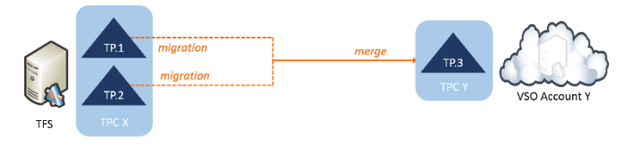
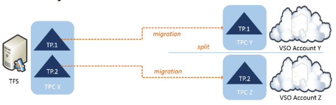

I have recently been doing a lot of migrations and [Willy](http://blogs.msdn.com/b/willy-peter_schaub/) asked me to write a white-paper about understanding TFS migrations from on-premise to Visual Studio Online.

{ .post-img }

On writing and understanding TFS migrations from on-premise to Visual Studio Online we found that the story was so poor that we broke it into two parts. The first part is ready and focuses on what the options are and the stories for migrating. Its interesting as many people believe that it is Microsoft's job to provide tools to migrate from any other product into their own product. While I would love to agree there are just way to many products out there to make that a realistic situation.

- PDF: [Understanding TFS migrations from on-premise to Visual Studio Online](https://vsarguidance.codeplex.com/releases/view/178488)

We kind of looked at a number of scenarios:

- **Team Project to Team Project** – While not common it is the simplest situation.  
   
  { .post-img }
- **Consolidating Team Projects** – With the move to 2012+ this is the most common ask I have from customers. Wither on-premises or while moving to VSO, many folks are taking the time to pay back the technical cruft that has built up over the years.  
   
  { .post-img }
- **Splitting Team Projects** – While not as common I have seen this as well. Splitting your data is an interesting situation and can be the result of selling parts of your portfolio or just some teams moving on or changing process. Maybe you use it as a staged migration to VSO.  
   
  { .post-img }
- **Consolidating Platforms on VSO** - Many customers have Perforce, Git, TFS, SVN, or any of 50 different systems. I have customer that have one of everything.

Like I said the story is not currently that good but you can read about each of the scenarios and see what the main issues are. We have also mapped tools to scenarios so that you can try to get started solving whatever your problems are:

- PDF: [Understanding TFS migrations from on-premise to Visual Studio Online](https://vsarguidance.codeplex.com/releases/view/178488)

The ALM Rangers will also be releasing a walk-through for the simplest of migrations which is to use Excel for work items and do a tip migration of code. That will be coming real soon.
