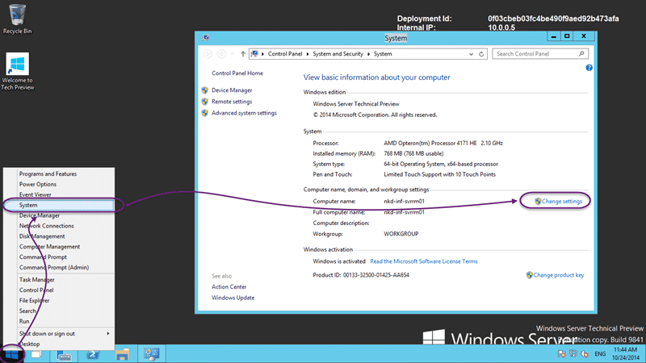

Now that you have finished [moving your Domain Controller Azure VM to a Virtual Network](http://nkdagility.com/move-azure-vm-virtual-network/)\] you need to be able to join a machine to your azure hosted domain controller.

{ .post-img }

You need to make sure that you have your machine within the correct virtual network, and [move your Azure VM to a Virtual Network](http://nkdagility.com/move-azure-vm-virtual-network/) if necessary. On top of that you need to have the your [domains DNS server configured for your virtual network](http://nkdagility.com/configure-a-dns-server-for-an-azure-virtual-network/) so that the guest machine knows where to look for the domain.

{ .post-img }

If everything is in order you should connect to the VM you want to join to the domain that you have created. On the Dashboard tab of the VM you should see a 'connect' button at the bottom of the screen. Clicking it will launch Remote Desktop and connect it to the server.

{ .post-img }

Once on the server the DBS setting should be correctly configured automatically as part of the DHCP for the Virtual Network that we configured before. This should make it fairly simple to join the machine to the domain. This is no different from local domains.

Note What I really want is to be able to join these machines to AAD so that I do not have to maintain a separate set of local domain controllers for this purpose. For me it gets a little more complex as I have no physical servers, only Azure and Office 365.

{ .post-img }

If you right-click on the start button and select "System" you will see the current machine name and domain affiliation. Most likely it will be "Workshop". To make the change we need to click "Change Settings" to open the dialogs.

{ .post-img }

Set the radio-button to "Domain" and enter the name of the domain that you want to join. As I setup "env.nakedalmweb.wpengine.com" that is what I need to enter. Once you click "OK" you will be asked for a domain administrator account to join the machine.

After that a simple reboot will allow you to login to the domain with any of the domain accounts that you have configured.

