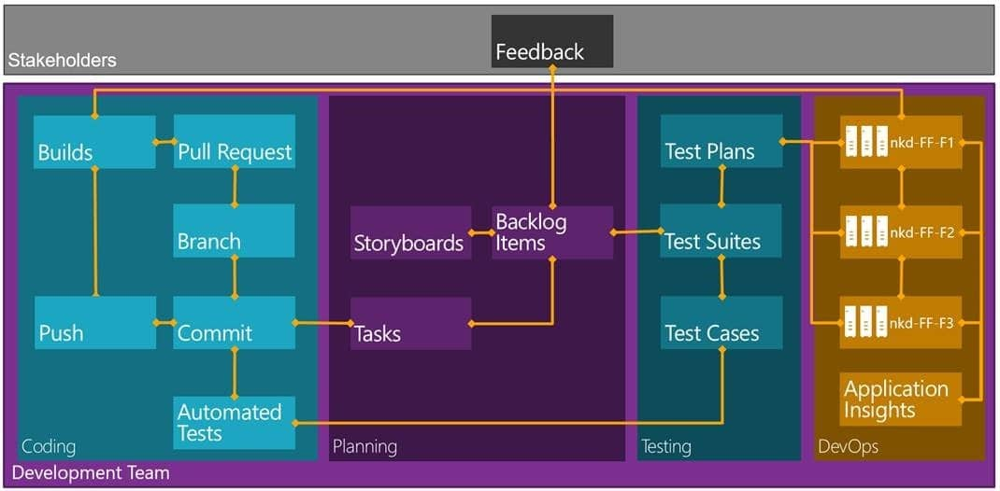

I see many organisations looking at TFS and trying to make the decision on why should I use Visual Studio ALM. Often you already have some tools and you want to move to TFS, or you have TFS and you are evaluating other tools as part of a reorganisation.

I was contacted yesterday by a customer that, as part of a reorganisation, is looking to replace Visual Studio ALM with Git and Jenkins. This is very confusing to me as Visual Studio ALM does not equal Git and Jenkins. First, a Git and Jenkins combination provides only a small part of the platform that is Visual Studio ALM. Second, Visual Studio ALM provides Git as part of its platform. So in this case, with a move from Visual Studio ALM to Git and Jenkins we are removing over 90% of our available functionality for only getting whatever the difference between TF Build and Jenkins is. That does not seem like a good comparison, let alone a good decision…

So what are the considerations when looking at a change to your tooling. There are three key questions that you need to answer:

- **What am I replacing?** - if you are replacing Visual Studio ALM, HP ALM, or Rational with a simple source and build tool you are not looking at the right comparison.
- **What am I getting?** - This is less about core functionality but about the difference. What additional features to I get from the new tooling that I do not have now. It's also important to understand when the current tooling has features that are 'good enough' but the new tooling is better.
- **What am I loosing?** - Its critically important to look at what functionality you will lose by moving to new tooling. Consider in that loss what parts of the tool that you are currently using, and also the strategic intent of your organisation. While you may not currently be using some piece of functionality it may be strategically important to the future direction.

There is a lot more to an ALM tool than simple source and compilation. So let's look at what we mean by Application Lifecycle Management tooling. This is a long list so bear with me:

- **Requirements management** - This is your work items, there may be Requirements, User Stories, Features, or PBI's but they are all types of requirement.
- **Project management** - You may do a work breakdown or need agile planning tools, however you work you need to manage the project/product so that you know what's going on.
- **Change management** - Whatever sort of requirements and project management you need to understand how those things change over time. Sometimes this is just because you want to, at others you have a regulatory requirement. Whatever the reason you want to maintain every value of every field on your data so that you can see, for any point in time, what the state of that field was.
- **Task management** - When you are doing software development the critical thing to monitor is effort. How much effort is required to deliver each item so that I know, for future items, how much effort might be required. Each individual should be able to monitor their effort within your delivery.
- **Code management** - If you are building software this is a critical quantity. You need to be sure that you have a secure and versioned asset. While features may vary between tools, they all solve the same critical problem.
- **Quality management** - Wither you need to just record the acceptance criteria or you have a top down specification you need to represent this as test cases that you can record status and results against. Some of your test cases may be automated and others will be a little more manual.
- **Feedback management** - Customers tell you things. These things need triaged into something that the development team can deal with, but you need somewhere to capture it. I call it feedback, but you might call it a ticket or a support request. Whatever it is, you need to have it somewhere.
- **Defect management** - When you do find failures of your tests you may need to raise a defect and monitor it to completion. Your cope of defect may vary wildly… I like "a bug is the result of a failing test case" while others say something is a bug if the UI is out a single pixel or there is a spelling mistake.
- **Build management** - Build is about compilation and non-instance unit tests. You need to compile your code and test the output. Then store the output somewhere secure as a potential asset of your organisation.
- **Release management** - You need to manage the deployment of your assets through a pipeline of ever increasing quality that eventually results in production. Maybe you need authorisation and approval, maybe you need continuous release… I tend to believe that you need a bit of both depending on the environment that you are deploying to.
- **Lab management** - If you are deploying to a non-production environment you may want to execute tests in a managed context in that environment. You effectively want to be able to collect data from all of your servers within an environment and provide that data to those that fix the problems so that they can understand them better.
- **Analytics management** - If you are deploying to non-production environments then you likely need some way to collect operational statistics and data on things like memory and CPU from the servers as well as number of users in your application and how users interact with it.

These are the key areas that you have to decide what your plan is for each one. Regardless of wither you will be using Excel for requirements management, or Trello, you need to make that decision. So here, if we are going to replace TFS with Git and Jenkins we need to decide what we are going to do with Analytics, Lab, Release, Defects, Feedback, Quality, Tasks, Change, Projects, and Requirements. What have you missed?

So now that we have identified what is part of an ALM system what are the comparable choices? Luckily there are organisations out there that do the analysis and have come up with an independent comparison.

{ .post-img }

At this point you might be asking where Git and Jenkins are in this picture. Well they are so far to the left bottom of this graph that they do not even register. Git + Jenkins is only a tiny part of that Visual Studio ALM story. Indeed with TFS 2013 Microsoft has baked Git into the platform and with TFS 2015 we are getting cross-platform build agents as well as an end-to-end ALM story for Android and iOS.

At this time, according to Gartner, there is not better ALM platform than Visual Studio ALM.

{ .post-img }

One potentially valuable exercise is to script out your organisational workflow at a high level from the perspective of tool support. The workflow above is what I teach companies to use and it maps pretty well with Visual Studio ALM. You then have a choice to make. You can either build your own custom ALM solution or choose one that already exists. You can check out my [end-to-end demo from NDC London](http://nkdagility.com/ndc-london-2014-why-tfs-no-longer-sucks-and-vso-is-awesome/), while not everything went perfectly you can see the story.

I imagine that you can think of your favourite tool for each of the ALM capability areas. Think about your favourite tool for a moment for each of those capabilities. Have you picked one for requirements management? How about build and source?

OK, Now think about how you might want to join that together.

- **Scenario 1:** You want your builds to know what work that they include. Is it good enough to just know what code changes are included? Or do you need to know which requirements, or parts of your requirements are included.
- **Scenario 2:** Where so you store your test cases, and test plans. How do you know which ones have been executed against your application. Against which version? What sort and how many defects did you find?

I could go on creating scenarios all day, but let's focus on just these two. Think about your favourite tools for requirements and test management that we added to the list. How will they be integrated? Do you know how to integrate Excel for my test results and the build that the tests were executed against? Do you know which parts of your codebase produces the most bugs so that you can understand your complexity?

There are tools out there to help you knit your custom home groan ALM solution together. One such is TaskTop which is an awesome tool, but you then need to licence many tools and have them work together. Now think about who you go to for support?

### Conclusion

In my experience it is best to start small and grow, however migrating toolsets is next to impossible and causes infinite frustration. You need an ALM tool that you can use only part of and that will grow with you adding new functionality as you go. You want an ALM tool that figures out what data goes together itself so that I don’t have to do all of the work in knitting it together. In my experience the only tool that works at that level is Visual Studio ALM.

You can even start as small as a single project in Visual Studio Online (TFS in the cloud) and then scale to an entire enterprise. [Scott Gu](http://weblogs.asp.net/scottgu) recently talked about the trial and tribulations of moving the Windows teams at Microsoft to Visual Studio Online so you can even start big.

Do you want to maintain your own hybrid solution? Coz it’s a lot of work to get what Visual Studio ALM provides out of the box to hand together effectively. For me, I am happy to use TFS and VSO for both small simple solutions, and for large complicated ones.

**What is your ALM story?**
