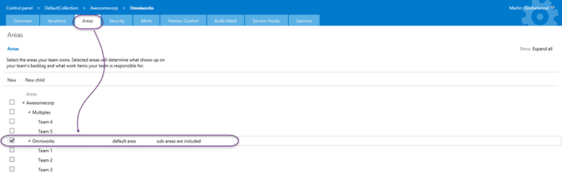
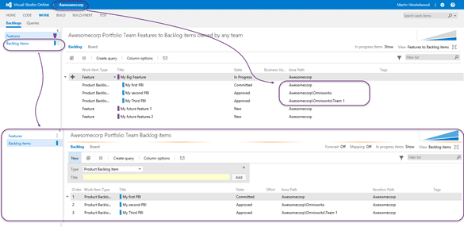
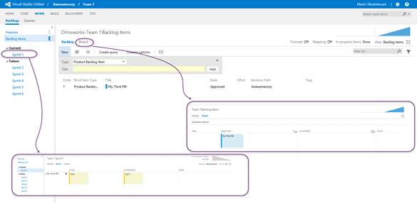

I just got a question on [Teams without areas using Team Field in TFS](http://nkdagility.com/team-foundation-server-2012-teams-without-areas/) and I decided that it warranted a bigger answer. The question was around creating nested teams and how to achieve it. Now, this applies to both Visual Studio Online and Team Foundation Server if you are using area path, and only TFS if you are using Team Field.

With TFS 2012 the product team introduced the concept of Team. Team is kina like a glorified security group, so it has members which are your team. However we often have some sort of hierarchical, or nested, team structure within our organisation. So let's paint a hypothetical.

I have a company, Awesomecorp, that is currently working on two major products. They have Omniworks, which is a custom source control solution. And they have Multiplex, which is a document management solution. Each product has a vice president of development and they each have their own development teams working to deliver software.

{ .post-img }

They often have organisation level initiatives and goals that span the entire organisation and do kanban at the executive and portfolio level. Because they did some investigation and understood the issues around multiple team projects they ended up with [one team project to rule them all](http://nkdagility.com/one-team-project/) called "Awesomecorp". They still want to have some way to represent their nested team and product structure so that and want to have a way to segment each of their teams and reporting.

Lets take the out-of-the-box Area Path approach to the problem… I will augment with notes where the solution differs for Team Field.

{ .post-img }

If we were starting from scratch your first job is to create a new team project for Awesomecorp. They will be having only one team project as they are a small-ish company with only two products and five teams. If you had products with many tens of teams then you may want to use the isolation of a Team Project for each. In this case you should create a Team Project Collection for each product, each with a single Team Project. This will give you independent backup and restore, as well as the ability to sell a product and the collection goes with it.

{ .post-img }

Your new virgin team project is bereft of all configuration. Head to the Admin, the cog in the top right, to get started.

{ .post-img }

When you create a team project you always get a single team that is configured as the default. The default team is kina hidden from lists as you select only the team project to select it by default. While this confuses some users it is way less confusing for others who are not interested in teams.

{ .post-img }

Head on over to the Area tab and create your hierarchy for your nested teams. If you want to have a team at a level then you should create a node for that level. Here we have only three levels of teams as per our diagram. Things to note here is that for this team, remember that we are on the default team, there is two key configurations.

There is a column of check boxes at the start of the area path. If you check a box then you are saying that, for this team, this is the content that is shown in your teams scope. In this case the scope for the default team, which will become the Portfolio team, is everything.

The second key option here is the "sub-areas are included" option. If you experiment with it you will find that if you say "sub-areas are excluded" then only items that have the exact matching area path will be included. If you say, assigned a PBI to Team 1, it will not be shown if you exclude sub-areas. However, here, we want to include everything for our portfolio kanban boards to flow.

If you have your Team Project configured for Team Field you will not be able to "include sub-areas" as the list of teams is flat. You can however configure a Team to 'own' multiple values from the team dropdown allowing you to simulate hierarchy and maintain nested teams there.

{ .post-img }

We now need our teams. Here I am creating a Team for each level that I want to manage independently. Make sure that you uncheck the "create an area path with the same name as the team" as I have already created all the Area Paths that we need.

Once you have all of the teams created we need to look at mapping each of the teams to the respective bit of the hierarchy that they care about. This will give us our virtual nested teams so that we can get the views that we are looking for.

{ .post-img }

This, to be honest is the hard part to understand. The concept of relating this flat team list to the hierarchy that is the Area Path can be a little confusing.

It gets worse conceptually in that a single team can actually own two nodes! Let's say that we had Team 5 doing work on both Omniworks and Multiplex. We could have two "Team 5" nodes, one under each of the parent node and the team could "own" them both. That team would see a combined backlog and boards that contained all of the items within that scope. And yes, while you have to have a single 'default' you can set "sub-areas are included" differently. It can get a little strange… simple is better.

If you have Team Field configured the Multiplex team must own "Multiplex", "Team 4", and "Team 5, values in order to simulate the "sub-areas are included" functionality you get with Area Path… this gets old quick if you have a complicated structure.

{ .post-img }

The goal now is to configure each of the teams with the area paths that they own. To do that you need to first select the team that you want to configure.

{ .post-img }

Once selected you will get thrown out to the Overview tab for the Team configuration and at the top of the screen you will see "\[team project\] > \[team\]" displayed to signify we are not looking at the teams configuration.

Head over to the "Area" or "Team Field" tabs to do the configuration.

{ .post-img }

On the Area tab you should check the box beside the level that you want that team to own. In this case we are owning the "Omniworks" level. Then go and do this for each of the teams in turn… and we are done… Area Path now controls out nested team structure and what our dashboards show.

{ .post-img }

Above I am selected on the root team which I have named "Awesomecorp Portfolio Team" and that will show the entire body of work for Awesomecorp. This will be the case for all of the boards as well, so you will see all the work underway in a sprint. At the Portfolio level we are probably only concerned with Features and generally how the PBI's ar3e getting on to achieve them.

You can have additional levels above Feature, and I have seen Epic, or Goal, Or Imitative. Portfolios concern is above the backlog.

{ .post-img }

On the "Omniworks Product Owner" backlog you will see everything from the Omniworks product but none of the Multiplex product work. This lets the owner of the Omniworks backlog focus on prioritising only what they care about. They can view Features that are assigned to them, however in this case none of the features have been assigned to the product, however if I use the "View" option to "look-up" at features the tool will bring in the features that we care about.

{ .post-img }

If we select "Omniworks Team 1" we get only the work that has been assigned to that team. With custom boards as well as Sprint Planning and all the other trimmings of managing a team.

### Conclusion

This format gives us a huge amount of flexibility to create and manage work within any agile process as well as supporting non-agile processes as well. If you know your way around the configuration there are many ways to organise and visualise the work that you are doing and still work predominantly within the bounds of the tools.

This is an fantastically flexible system and I encourage you to play around and figure out what the best configuration for you is.
