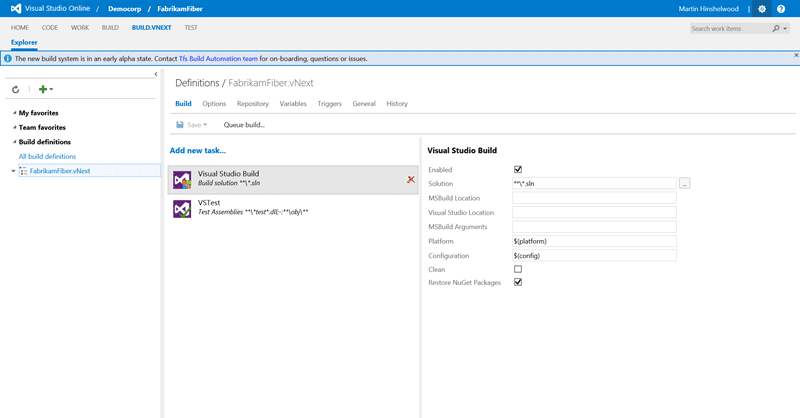
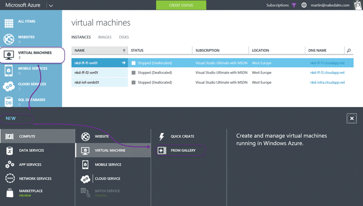
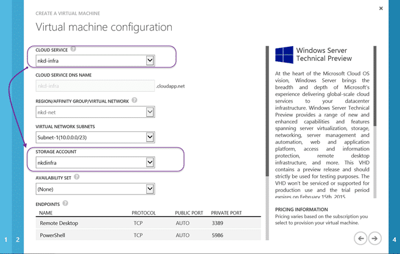
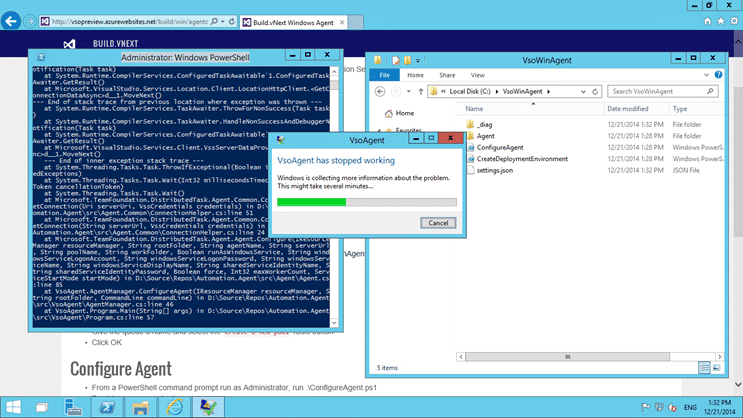
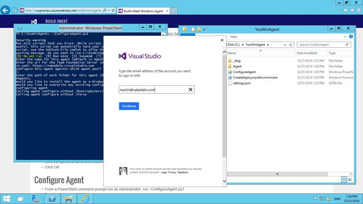

I am going to show how to configure a Build vNext Agent on VSO. Microsoft recently announced the creation of a brand new build system for TFS and VSO at the Connect event last year. This new build system will eventually replace the current one and be much more modular and friendly. Happily I am in the early adopter program and the product team just made an early alpha of the service available for that program and I have been giving it a spin.

#### Download Team Foundation Server 2015 today

Microsoft has released a CTP of TFS 2015 that includes the vNext build system. You can [download TFS 2015](https://www.visualstudio.com/en-us/downloads/visual-studio-2015-ctp-vs) and try it out today. Remember that this is _not_ a go-live version and you should _not_ install it in production.

In order to configure one of the vNext Build Agents on your Visual Studio Online (VSO) account you will need to create and configure your own build server. In its current preview state it is not part of the Hosted Build scenario and you have to manage it yourself. Luckily, with your MSDN you get £95 ($150) of VM time on Azure. So spinning up your own machine is free.

[](http://nkdagility.com/wp-content/uploads/2014/12/clip_image0014-2-2.png)
{ .post-img }

The new model in the VSO vNext Build system is not based on the same collection/controller model but instead is based on a "pool" model. You can add an agent to a pool and share a pool across many collections. This removed the old need to have completely separate sets of agents for each collection. Each collection does however get its own queue, which is how it gets access to the agents that belong to a pool. Each of these entities can also be secured… so no more fafing around with controllers and collections.

[](http://nkdagility.com/wp-content/uploads/2014/12/clip_image0023-4-4.png)
{ .post-img }

If you are lucky enough to have access to the new bits (you need to be in the early adopter program for now) then you get an extra tab in the administration of your account that gives you access to the queues and pools. At the moment you get to create new pools that can only be the same name as the first queue that you add to it. You can also add additional queues to an existing pool.

You can imagine that you would be able to throttle and prioritise queues and also restrict permissions. That way you might be able to have a "release" queue that has restricted permissions on who can push builds to it as well as a priority in the Pool… your release build will get serviced first. We used to have to create all separate controllers and agents to make these sorts of guarantees.

> Controllers never really gave any guarantee around permissions or even priority due to the way agent reservation worked within the build workflow.Chris Patterson, TFS Build Team

### Creating a VM for the VSO vNext Build Agent

At this time there is no hosted agent option so I will be spinning up a Windows Server in Azure.

[](http://nkdagility.com/wp-content/uploads/2014/12/clip_image0033-6-6.png)
{ .post-img }

I almost never use the "Quick create" for VM's as there are far too many backed defaults that I do not like.

[](http://nkdagility.com/wp-content/uploads/2014/12/clip_image0043-8-8.png)
{ .post-img }

I have been building everything out in Windows Technical Preview of late as I always like to use the latest of everything. While there might be additional risks in using a preview OS I get to know what all of the ins and outs of the new bits will be. Happy to take my lumps for preview bits on preview bits.

[](http://nkdagility.com/wp-content/uploads/2014/12/clip_image0051-10-10.png)
{ .post-img }

As the old agent had a minimum ram of 2GB I thought I should at least have that. I have not seen any documented restrictions for the new agent, but preview documented is always a little loose.

[](http://nkdagility.com/wp-content/uploads/2014/12/clip_image0061-12-12.png)
{ .post-img }

As usual I like to keep thins neat and I am sticking to the single cloud service (resource group) for my infrastructure needs and a build agent fits that perfectly.

[](http://nkdagility.com/wp-content/uploads/2014/12/clip_image0071-14-14.png)
{ .post-img }

No need to install any extensions at this time as we have some manual work to do. Hopefully we can have these bits completed with Chocolatey or OneGet at a later time.

### Pre-requisits for VSO vNext Build Agent

The only required pre-requisite is to have Visual Studio 2013 or 2015 installed which I missed the first time through and ended up with a nasty error.

[](http://nkdagility.com/wp-content/uploads/2014/12/clip_image0081-16-16.png)
{ .post-img }

So If you get a "BrowserFlowException: SP324095: Our service was unable to complete the request" error you need to go back and install Visual Studio 2013 or Visual Studio 2015. This should not be required on the final version but this is an early alpha.

[](http://nkdagility.com/wp-content/uploads/2014/12/clip_image0091-18-18.png)
{ .post-img }

In this case I have installed 2015 as I am primeralily using it now. If your build process needs other custom components then you may want to go ahead and install them yourself. For me I only need VS 2015.

### Installing the VSO vNext Build Agent

We now need to download and configure the agent on the new VM and add it to our default pool on VSO.

[](http://nkdagility.com/wp-content/uploads/2014/12/clip_image0101-20-20.png)
{ .post-img }

Installing is a bit or an over-statement at the moment. It currently involves downloading a zip and running a PowerShell that it contains. To be honest I much prefer the PowerShell option to an MSI one. MSI is dead and we should not encourage its use. PowerShell is the Windows deployment tool of choice.

[](http://nkdagility.com/wp-content/uploads/2014/12/clip_image0111-22-22.png)
{ .post-img }

```
PS C:\VsoWinAgent> .\ConfigureAgent.ps1
Security warning
Run only scripts that you trust. While scripts from the internet can be
useful, this script can potentially harm your computer. If you trust this
script, use the Unblock-File cmdlet to allow the script to run without this warning message. Do you want to run C:\VsoWinAgent\ConfigureAgent.ps1?
[D] Do not run [R] Run once [S] Suspend [?] Help (default is "D"): r
Enter the name for this agent (default is Agent-NKD-INFRA-BLD02):
Enter the url for the Team Foundation Server (ex. https://myaccount.visualstudio.com): https://nakedalm.visualstudio.com
Configure this agent against which agent pool? (default pool name is 'default'):
Enter the path of work folder for this agent (default is the Root Folder of VSOAgent):
Would you like to install the agent as a Windows Service (Y/N): y
Enter the name of the user account to use for the service (default: NT AUTHORITY\LocalService):
Would you like to overwrite any existing configuration (Y/N): y
Configuring agent
Calling agent configure with /RunningAsService
Calling agent configure without /Force
Installing service vsoagent.nakedalm.Agent-NKD-INFRA-BLD02...
Service vsoagent.nakedalm.Agent-NKD-INFRA-BLD02 has been successfully installed.
Creating EventLog source vsoagent.nakedalm.Agent-NKD-INFRA-BLD02 in log Application...
Object reference not set to an instance of an object.
Configure agent succeeded.
Agent is now running as a Windows Service.
PS C:\VsoWinAgent>

```

At this point we then have the agent configured as a service and it should start automatically with the server.

[](http://nkdagility.com/wp-content/uploads/2014/12/clip_image0121-24-24.png)
{ .post-img }

Once the agent is started it will show up in your web access administration tab. From here you can configure the capabilities of the server and see a bunch of system detected ones…

### Conclusion

The new build system promises to be both versatile and much simpler than its predecessor. I for one am happy with the new capabilities of the TFS build vnext and this early Christmas present form Chris Patterson is a welcome one…

[](http://nkdagility.com/wp-content/uploads/2014/12/clip_image0131-26-26.png)
{ .post-img }

…thanks Chris!
