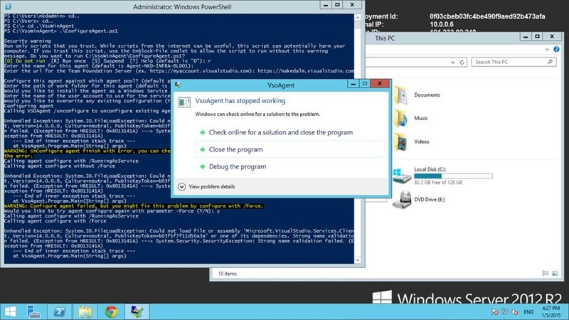

If you are using Windows Server 2012 R2 to test out the new vNext build agent then you may run into an error where it could not load file or assembly while configuring Build vNext Agent.

#### Download Team Foundation Server 2015 today

Microsoft has released a CTP of TFS 2015 that includes the vNext build system. You can [download TFS 2015](https://www.visualstudio.com/en-us/downloads/visual-studio-2015-ctp-vs) and try it out today. Remember that this is _not_ a go-live version and you should _not_ install it in production.

I have been playing around with the new Build vNext Agent that Microsoft has been developing and I found that I was not able to register the Agent on Windows Server 2012 R2 when I had Visual Studio 2015 Preview installed. Before I installed Visual Studio I had no issues, but once on I got a "Could not load file or assembly" when trying to run the registration.


{ .post-img }

It looks like there is a version mismatch on the DLL.

```
Unhandled Exception: System.IO.FileLoadException: Could not load file or assembly 'Microsoft.VisualStudio.Services.Client, Version=14.0.0.0, Culture=neutral, PublicKeyToken=b03f5f7f11d50a3a' or one of its dependencies. Strong name validation failed. (Exception from HRESULT: 0x8013141A) ---> System.Security.SecurityException: Strong name validation failed. (Exception from HRESULT: 0x8013141A)

--- End of inner exception stack trace ---

at VsoAgent.Program.Main(String[] args)

WARNING: UnConfigure agent finish with Error, you can check logs under _diag folder, determine whether you can ignore the error.

```

I am fairly sure that this is a time limited error and once VS 2015 comes out of Preview, or the DLL versions settle down this will not be an issue, however to fix it for now we need to turn of Strong Naming for .NET at the command prompt.


{ .post-img }

You need to run "sn -Vr \*,\*" on the server to disable strong signing. This should only be the case as part of the current preview program. I would expect this issue to go away with the next release, at least on Server 2012 R2.

This is only required when you are running Visual Studio 2015 Preview on the Build vNext Agent.
