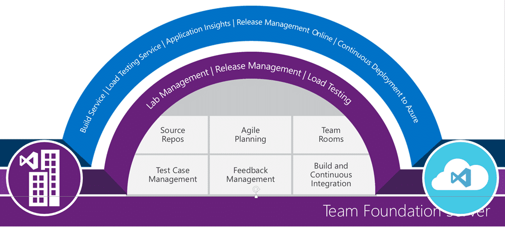
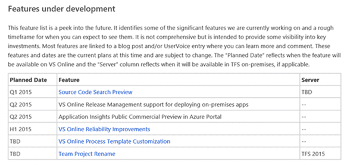

I last posted on [why you should use Visual Studio ALM](http://nkdagility.com/why-should-i-use-visual-studio-alm-whether-tfs-or-vso/) due to a customer ask, and now I have been asked to justify a move to Visual Studio Online for a company looking to use it for about 5,000 people.

I had been concerned of late by the number of organisations implementing solutions without really understanding the benefits of what they have and what they will lose in the move. I used to do a bunch of Developer Tools Deployment Planning Services (DTDPS) engagements for Microsoft (you need to go through a Gold ALM Partner) and I would do the analysis for organisations. As you need at least 3 people to be an ALM Gold partner I have been working through 'proxies' to deliver these benefits in Europe.

At my current customer I have been asked to do a presentation on "Why they should move to VSO?". Now, this is not a small company, with over 2000 programmers, not to mention testers, managers, and all the other folks involved in software development. They are currently mid-way through moving to TFS 2013, and are interested in the cloud. There are a number of benefits, as well as some missing features, when you look at VSO compared to TFS, so let's take a look.

### Overview of VSO features

Visual Studio Online provides a number of benefits in addition to all of the bits that you get out of the box with TFS. You get an integrated Build Service, where Microsoft provide a dynamic build just for you. What they effectively do is provide a pool of pre-configured build agents. These agents have all of the Microsoft, as well as some third party, tools installed. When you queue a build one of the ready agents is attached to your account and the build executed. After your build has completed it is scrubbed and a new agent added to the pool. Safe, scalable builds.

Note: You can also setup your own Azure, AWS, or local VM's to run your build agents and connect them to VSO. This mode will likely suit enterprises better as you get to install whatever you like on the agents.

{ .post-img }

The next two services can be used with TFS as well, but the systems are only available in the cloud. The Load Testing Service allows you to use azure infrastructure to execute massive amounts of load tests from around the world with little or no setup. Just create a load test in the normal way in Visual Studio, there is also a new web-based experience, a give it to Azure. You can simulate up to 2.5 million simultaneous users from around the world.

Application Insights is an analytics application that you can use to monitor usage and performance of your applications. On your client application you can monitor it with a simple SDK, and add features and paths through your application. On the web there is JavaScript to monitor clicks and usage there. The real power, however, is that you can also install a monitoring agent onto your server and monitor the server for load and performance. Since you have all this data in one system, and it's from the TFS team, it will correlate all of the data so you could look at CPU usage on your server by feature usage in your application. Let's run a load test and see how our application performs.

This is invaluable, and helps you answer that very important question:

"What percentage of my features are my customers using, and what features should I not continue to invest in."

We also get hosted Release Management to allow us to [build a release pipeline](http://nkdagility.com/create-release-management-pipeline-professional-developers/) and deploy the output of our builds. This will allow us to manage which builds end up where, and to track what is in our builds. RM will build a report of which features have been delivered to which environment so that we always know what is going on.

You can also use a local Release Management server and connect it to VSO. This would allow you to also use the old, but still supported, Agent based deployments.

Release Management has the capability to permission who can deploy to what environments and also to solicit approvals from the appropriate person for the appropriate stage.

Due to the way the current version of the agent communicates the VSO version of RM only currently supports agent-less deployment.

If you are partial to continuous delivery you also get access to a new build template that lets you do Continuous Deployment to Azure for all of your azure applications. This should speed up your ability to get constant feedback as each and every build gets pushed and made available.

### Benefits of VSO

Those are features, but features are not the immediate value of being on VSO over a standard TFS server. These benefits should allow you to be a lot more agile and progressive in your rollout of new features and now that both the TFS team themselves, and more recently the Windows team, have moved to VSO there is no dough that it can support the scale that is within the context of this post.

{ .post-img }

VSO is always kept up to date. The reality of the modern application lifecycle is that we all need to adapt more frequently. In the past organisations moving towards a greater degree of business agility have run into something of a glass ceiling where tools, especially enterprise tools, are concerned. As the majority of enterprises are only just waking up to the need for greater agility, most tool vendors have nowhere near the level of flexibility to keep up with what is a small minority of their customers. This gap has widened significantly over the last decade as those already at business agility are totally out-pacing those without. Subsequently tool vendors have started to loose relevance and customers as they fail to meet the new business needs.

If you read their [engineering story](http://stories.visualstudio.com/) you can see, at the realisation of their continued progress towards irrelevance, the TFS team turned it all around and moved to a ship cycle where they are delivering new features to production every singe 3 week Sprint. This is an incredible turnaround and the journey to get there was littered with dead ends and mistakes, however the team have risen to the challenge and evolved their processes and practices to move into a modern application lifecycle rather than the multi-year cycle they had previously been under. So successful have they been that Microsoft is rolling out these changes to their other products as well.

It's not all sweetness and light. Your organisation will need a substantial cultural change to be able to get to the level of [business agility](http://nkdagility.com/experts/business-agility/) described here. This is hard and generally disruptive in the short term. Most enterprises fail because they lack the courage to continue with the changes in the face of overwhelming resistance within the organisation. "that’s not the way we do thing here" will start to fill you with the same horror that has plagued process consultants since time began.

There is however, depending on the end user use, a difficulty in getting users to accept delivery on the newer cadence. I like what the Windows team are trying to do with Windows 10, they just don’t 'get it' yet. So TFS moved from an on-premises only product to Visual Studio Online where they can ship new features every three weeks and get feedback from over a million users instantly.

The value that an enterprise gets is flexibility. They now have access to a product that they no longer have to worry about getting behind on versions, nor wither the product has the right features. If the customers are continuously shaping the product at the other end of the adoption curve, then by the time the enterprise starts using it wholesale it is just there, and ready to use. No waiting. No deployment costs… just there.

As you will always have the latest version you will see features that you use be incrementally improved or even dropped as feedback and usage data is acted upon. You become a stakeholder in the overall product and as such you should provide as much feedback at as many levels as possible to make sure that VSO meets you needs. This is the trade-off. You no longer have to support servers or low level product management. You don’t lose time to

And for the more troublesome teams within an enterprise, you know… the ones that want to use continuous delivery or

Git now, the features that they need are there already. So not only do you have a single unified product that supports the majority of your teams, even the more progressive teams get what they want. Indeed with the integrations of Azure into the mix even the dream of self-service development teams, and thus the ultimate DevOps experience is attainable for those teams that are ready.

Accessing VSO from anywhere is a key feature of the SAAS (Software as a Service) experience. You also gain full access, with no VPN getting in the way, from anywhere in the world. You can easily secure VSO so that only Active Directory users can access your work and [integrate that with your on-premises AD through Azure Active Directory](http://nkdagility.com/use-corporate-identities-existing-vso-accounts/). You can configure seamless single-sign on so users don’t even have to enter their credentials and, if you so choose, you can add external users as external entities (foreign principals) rather than having an additional account to create and maintain.

There have been two major outages of VSO in the last 2 years and a few smaller ones. Each outage was under 8 hours and still within the three nines service level agreement that Microsoft provides. However the instant it happens the very best people, those that actually developed the components are on the case.

- [Explanation of July 18th outage](http://blogs.msdn.com/b/bharry/archive/2014/07/31/explanation-of-july-18th-outage.aspx)
- [Retrospective on the Aug 14th VS Online outage](http://blogs.msdn.com/b/bharry/archive/2014/08/22/retrospective-on-the-aug-14th-vs-online-outage.aspx)
- [Outage on Monday Nov-24](http://blogs.msdn.com/b/bharry/archive/2014/12/03/outage-on-monday-nov-24.aspx)

All of this allows you to focus on using the tool and not supporting it. Support of the platform is handled by Microsoft and this lets you focus on learning the capabilities of the tool and implementing them. With over a million users on VSO, and at least two major applications within Microsoft already using it in production the likelihood of you finding an issue that they have not is a little like winning the lottery.

There is also a new monthly subscription model, in addition to the MSDN you already have, available for users that are either periodic, or non-technical. Why should you have to buy an MSDN licence for your project managers or portfolio managers. Now you don’t have to, you can buy a monthly advanced licence for them. With this you can even give access to the testing tools to record the efforts of sustained user acceptance testing as well.

### Missing features in VSO

There are still a number of features that are available in TFS that are not currently available on VSO. This is due to technological and scale limitations and Microsoft is working to negate them. Each sprint they deliver gets us closer to a more unified experience there. There are however many features of VSO, described above, that will never come to TFS.

{ .post-img }

The most prevalent feature for enterprises that is missing is the ability to customise the process template. This is not available in VSO as the current implementation under the covers is not really scalable or compatible at that level. Work is underway to resolve this and, as you can see above, is on the backlog as a big rock.

Although I have no special insight into the dates I know that Process Template Customisation in VSO is very high on the Product Teams backlog.

Counter to that I tend to recommend to customers, especially those with very complex customisations, that this is a good thing. A complex set of customisations implies too much process, or even dysfunctional behaviour in most cases that I have seen. Microsoft is working to build in some choices into VSO to mitigate the issue and Tagging and the Bug on Backlog features are targeted at this very issue.

#### Mitigate lack of Customisation

Most teams are using Tags heavily to mitigate for the lack of customisation and are being very successful with this. Outwith that the product team is moving to fill gaps with web based customisation for perticular purposes, like being able to switch between "bug as a task" and "bug on the backlog".

There is also no data warehouse and cube plugged into VSO and it is currently not possible to do that manually. The team have already delivered features to mitigate this in the form of Charts associated to Queries that can be pinned to the homepage. I would expect to see more in this space.

#### Tabular Data model

There is work ongoing to create a Tabular data model that would give you all of the capabilities of the current reporting model and more. This tabular model currently works on TFS and is being updated to work against the REST API for Visual Studio Online and TFS. You would install an analysis services server locally and set VSO as the data source.

There is no SharePoint integration as there is with TFS. So you get no Documents tab in Team Explorer with direct access to documents and no dynamically configured SharePoint portal associated with your Team Project. For most enterprises this is a non-feature as both of those capabilities are unattainable with their enterprise SharePoint farm. The farm administrators would more likely move to protect their instance rather than integrated with TFS. You can however manually configure Excel Services to connect to the Tabular data model.

### Data Security in VSO

The big issue, particularly in light of the scope of the US Patriot Act, is that of data security. There are a number of recent happening that have moved to mitigate these issues.

If you have a devision or section of your company registered to trade in the USA then everything is unfortunately mute as the US Security Services can request any data that you have in any data center and you would be required to comply.

The TFS team have been working on two important things help. The first is the implementation of VSO in the European data centres. You can now choose to have all of your VSO data stored in Europe rather than the USA. A simple solution to the problem of data protection.

{ .post-img }

The second is a move towards industry recognised certification. Initially VSO has [certified for ISO 27001](http://aka.ms/vsosecurity) which will give most customers the warm fuzziness that they need to accept cloud, at least technically.

Ultimately the only reason not to embrace cloud services and platforms is unsubstantiated fear of change. Again we get bac to "we can't do that here".

### Support in VSO

If you do have issues when using VSO Microsoft offers [99.9% uptime under their SLA](http://www.microsoft.com/en-us/download/details.aspx?id=42290) and you can, as with all of their products, pay for really fast support.

{ .post-img }

These options and support levels allow you to be sure that if you have an issue it will be resolved quickly. Can you make those guarantees with your own infrastructure and your teams supporting TFS?

### Conclusion

If you can get over the cultural issues to moving towards the cloud then there is really no substantiative reason not to be moving towards VSO no matter how large your organisation is. You will save money on licencing and support and drastically reduce the complexity of connecting and keeping the product up to date.

Take the plunge today and get your [\[company\].visualstudio.com](http://tfs.visualstudio.com) URL today…
