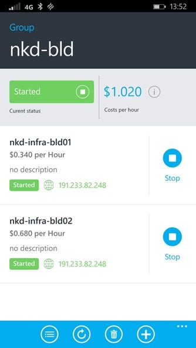

I have been doing quite a bit of [ALM Training](http://nkdagility.com/training/) recently and have been trying to figure out how best to manage my training VM's.

[Download Mobile Azure Manager from US Store](http://www.windowsphone.com/en-us/store/app/mobile-azure-manager/5fa3d0e0-181c-4d0b-ad2c-e5b08d4658b6)

[Download Mobile Azure Manager from UK store](http://www.windowsphone.com/en-gb/store/app/mobile-azure-manager/5fa3d0e0-181c-4d0b-ad2c-e5b08d4658b6)

In the last few months I have taught both the [Managing Projects with Microsoft Visual Studio Team Foundation Server 2013](http://nkdagility.com/training/courses/managing-projects-microsoft-visual-studio-team-foundation-server-2013/) and [TFS 2013 Developer Fundamentals](http://nkdagility.com/training/courses/tfs-2013-developer-fundamentals/) a number of times and this week was no exception. I was in Luton with an awesome customer getting their coders up to speed with the features in TFS 2013. For all of the ALM courses I [create training machines in Azure](http://nkdagility.com/creating-training-virtual-machines-azure/) based on the Microsoft provided all in one demo box. I have a number of PowerShell scripts for setting up, shutting down and starting up the VM's.

However, at the end of my course I am usually heading to the airport and don’t sometimes have time to run the PowerShell required. You can only execute one command at a time and shutting down each VM takes a few minutes… with 7-14 VM's to shutdown, that can take some time.

{ .post-img }

Managing your virtual machines and cloud services now becomes a piece of cake using the Mobile Azure Manager! Easily start and stop your Virtual Machines on the go and keep track of the virtual machines core information. Reducing your cloud services costs has never been easier before!

{ .post-img }

I went searching for a solution and found the Mobile Azure Manager in the store. This is a fantastic app that does exactly what I need. You can manage individual virtual machines as well as whole Cloud Services. Indeed, you can create a groups. You start by adding a subscription, here is my default one above, and it shows some nice overview information for it. You can see that I had my default 20 cores increased to 64, which is for spinning up fast demo machines.

{ .post-img }

If you hit Virtual Machines then you get a simple flat list of all of your VM's within that subscription. You can quickly, depending on your internet speed, head down that list and stop or start any one of your VM's. If you stop one it will be de-allocated, so you will get a new IP when they are started. The app also tries to have a go at calculating the cost. However I have found it to be inaccurate and have fed that back to the support team.

The support team are awesome. I have had every one of my questions and issues dealt with quickly and efficiently.

{ .post-img }

Your Cloud Services list is similar to your VM list, however each entry may represent more than one entity. When you start and stop at this level you need to be aware that you are stopping the whole thing. Fantastic if you have large groups of machines configured for training as I have.

{ .post-img }

My favourite feature is the Groups. I had been creating multiple VM's in a single Cloud Service for training but I found that this makes it difficult to RDP to the machines. You effectively need to know the auto generated RDP port for each VM. This is because a single Cloud Service gets a single URL ( mycloudservice.cloudservice.com ) which means that you need to map ports to machines. Azure takes care of this complexity, but now you need to know the port for each VM rather than just the name of the Cloud Service.

But if we create separate Cloud Services, and add a 3389 mapping, we now loose the single entity for stopping or deleting all of the VM's later. Groups to the rescue.

{ .post-img }

They will even try to figure out what the machines contained within the group will cost you per hour. I believe that this figure is an order of magnitude out as these machines should cost me a $1 per day, not per hour. A small bug that I have reported.

### Conclusion

This application is just perfect for what I am doing and I think if you have any azure assets it can be of use to you. If you are regularly stopping and starting machines or cloud services you can.

I was able to turn all my D2 VM's that I used for a training session (7 machines) off on the way to the airport and saved more than the cost of the application.
