I am going to show how to create a Build vNext build definition on VSO. Microsoft recently announced the creation of a brand new build system for TFS and VSO at the Connect event last year. This new build system will eventually replace the current one and be much more modular and friendly. Happily I am in the early adopter program and the product team just made an early alfa of the service available for that program and I have been giving it a spin.

#### Download Team Foundation Server 2015 today

Microsoft has released a CTP of TFS 2015 that includes the vNext build system. You can [download TFS 2015](https://www.visualstudio.com/en-us/downloads/visual-studio-2015-ctp-vs) and try it out today. Remember that this is _not_ a go-live version and you should _not_ install it in production.

Now that we have [configured a Build vNext agent](http://nkdagility.com/configure-a-build-vnext-agent-on-vso/) we can get on with the job of creating a build. I had hoped that for my [demo at NDC London last month](http://nkdagility.com/ndc-london-2014-why-tfs-no-longer-sucks-and-vso-is-awesome/) that I would have been able to use this but it took an extra month for the product team to get the Alfa ready. This is really just part of the realities of software development that we can't know how long something will take until its done.

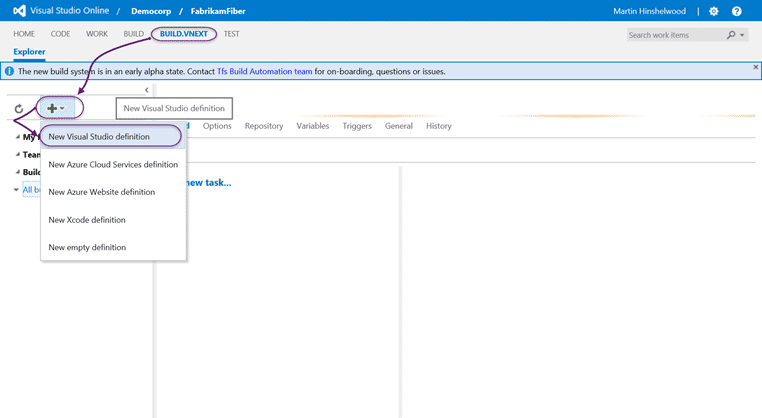
{ .post-img }

There are a number of out-of-the-box templates available and I believe that there will be more by launch. For my FabirikamFiber site I will be using the standard "Visual Studio" definition.

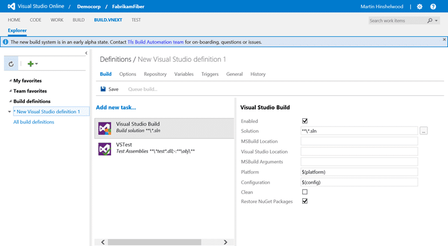
{ .post-img }

You will get dropped out at Build tab of the "New Visual Studio definition 1" definition that has been created for you. Here you can add new tasks and configure them, which we will discuss in a moment.

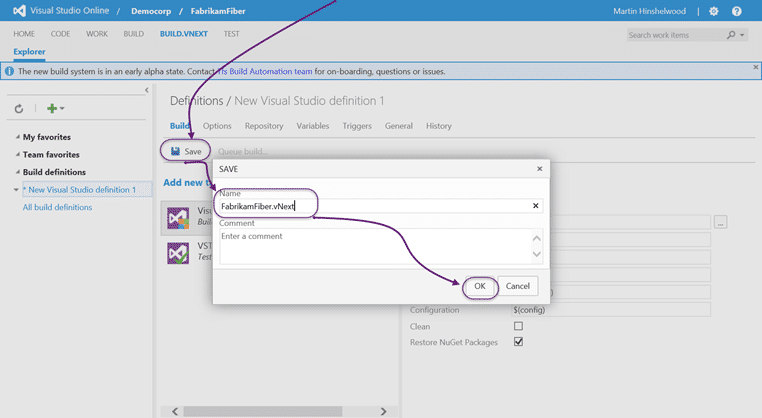
{ .post-img }

This has not yet been saved, so the first thing I am going to do is save my detention with a little more memorable name.

{ .post-img }

Back at the "Task" list you can click "Add new task" to get a list of all of the available tasks. This is probably pretty close to the list of tasks that we will see initially when the preview becomes more generally available and it is extensive:

- **Android Build** - Run an Android build using Gradle and optionally start the emulator for unit tests.
  
  { .post-img }
- **CMake** - Cross platform build system. I have never used it but it really does sound handy.
  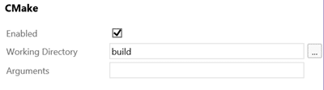
  { .post-img }
- **Cmd Script** - Run a Windows cmd or batch script and optionally allow it to change the environment
  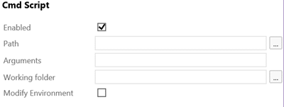
  { .post-img }
- **Jake** - Javascript build tool, similar to Make or Rake. Built to work with Node.js
  
  { .post-img }
- **MSBuild** - Build with MSBuild; In the pre-2010 builds everything was done in MSBuild and in 2010+ (XAML Builds) these build types were only supported in the legacy build template, "UpgradeTemnplate.xaml". You do not need Visual Studio installed to execute this, but your compilation might.
  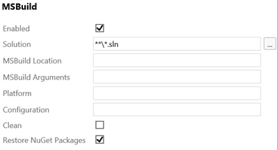
  { .post-img }
- **Visual Studio Build** - This build is executed through Visual Studio and should run in the same way that it would locally.
  
  { .post-img }
- **VSTest** - You can run tests using the Visual Studio Test Runner. This runner will load tests from any framework that has a test adapter so it supports; MS Test, jUnit, xUnit, mbUnit, and others.
  
  { .post-img }
- **Xcode Build** - This task allows you to build an Xcode project with the xcodebuild tool. Microsoft has had a new strategy for a while to support everyone else's stuff and as they release new versions of their products is it becoming more and more obvious that this is no longer a case of lip service.
  
  { .post-img }
- **PowerShell** - Need to run a PowerShell? In TFS 2013 the build workflows were simplified to allow PowerShell both post and pre build as well as post and pre-test. Now you can insert a task any place you like in the build process. PowerShell will let you do anything from moving files around to manipulating the build numbers.
  
  { .post-img }
- **Process Runner** - Is the logic that you need to run wrapped up in an executable? Use the Process Runner to execute any executable process.
  
  { .post-img }
- **Azure Cloud Service Deployment via PowerShell** – Just like the old Xaml templates to do the same job here is a pre-configured PowerShell command to do the deployment. You can always create a customer PowerShell is you need it, but this is a helper.
  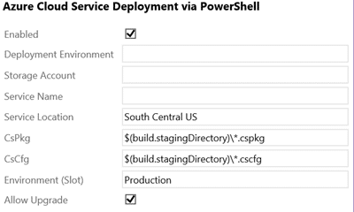
  { .post-img }
- **Azure PowerShell** – Do you ever feel the need to run some PowerShell on one of your servers as part of a build? I don't, as I use Release Management for environmental bits, but if you have an immature build process you may need this.
  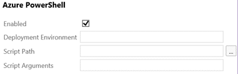
  { .post-img }
- **Azure Web Site Deployment via PowerShell** – I just want to deploy my website to azure! Well here you you go.
  
  { .post-img }

This is just the list that is available in the preview, which is alfa. The plan, as I currently understand it, is to make this extensible so that you can create any sort of tasks that you like and have them listed in the system. At the moment however there is no way to do this and I am not sure when this will happen.

{ .post-img }

The second tab is the "Options" tab. This is a list of general options that applicable to any build that you would run. Here we can select:

- **MultiConfiguration** - This allows us to build more than one configuration as part of the same pass. You can even elect to run them in parallel. You just enter the same name that you have in the configuration pick-list in Visual Studio to either build more than one, or something other than the default. I have used this before to have websites built locally use different parameters than those built on the server. That way I can have my local developer setting built by default, and then have things like the connection string replaced at compilation time with a generic "\_\_connectionStrong\_\_" value for Release management.
- **Copy to Staging Folder** - In previous versions of Team Build this was more or less a non-optional step as the VS Test platform needed all of the files copied to the staging location for testing. Now you can control both what files are picked up and where to. This will be very useful for output that is not the traditional "bin" output.
- **Create Build Drop** - You might ask why you would not want to have a build drop created but I have seen this for teams with large output and many CI's. I may not need all the output. The traditional option here is to drop everything onto a network share with a UNC path. However TFS 2012 introduced the concept of a "Server drop". This is where the build output is stored as a zip files inside TFS. The advantage to this is that you have one location to backup as the build output is an organisational asset. I prefer server drops every time.

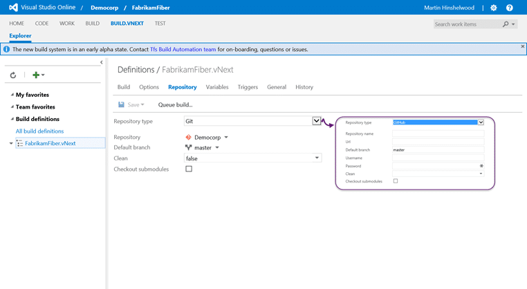
{ .post-img }

Currently the new Team Build vNext system only support Git as the source repository, but you can also select Github and point to any repository that you like. Although I have not tried it I believe that it will support any Git repository that uses the same protocols as GitHub. Nice…

Info: VSO Build vNext has built in support for GitHub builds

{ .post-img }

In addition to where to get the source code from you may need to create some custom variables that will be available as part of the build. These would be available in your scripts and any other location. There are some enforced variables and most are configurable.

You may use this to inject an option like "HardenPlatfrorm" that takes a Boolean option and you can then use that in your scripts and commands to choose wither you apply your application hardening techniques for piracy protection. Allows you to easily turn it off and on per build...

{ .post-img }

At the moment the only trigger available is "Continuous Integration" or CI. I would expect in the future to maintain the ability to Schedule builds as well and I really like the fact that you select it with a check-box rather than a radio-button. That bodes well for the future.

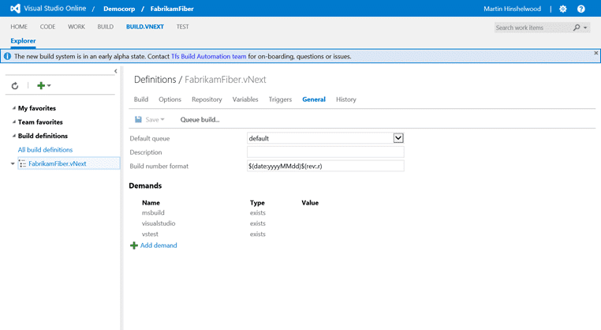
{ .post-img }

"General" configuration contains the last few nuggets of usefulness. First is the pre-defined default queue and maybe a description for the build. I am hoping that we can dynamically update the build number from within the tasks as this is what the majority of my customers want. It just makes sense, to me, to be able to have the build number reflect the version of the code that is being built.

For TFVC I normally change the build number to be something like "1.3.$(YY)$(DayofYear)$(rev:.r)" which would produce something like "1.3.15001.1" as the build number. I would then have a PowerShell that stripped that build number and used it for the DLL's and the Nuget packages that are produced as part of the build. This works great when we have a single build definition per branch.

However, for Git we need something a little different. With Git builds we build all branches (potentially) with the same build definition. So here we want to have a file checked into the branch that has the filter above so that it can be different per branch. That means that the first thing that we need to do as part of the build is to have a PowerShell execute that reads that file and changes the build name in TFS to match. We will see if that is possible in the new build system as it was hard, but not impossible, in the old one.

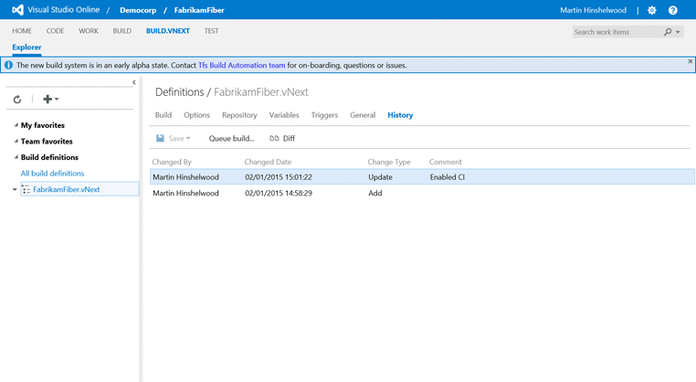
{ .post-img }

Finally, a much requested feature. Most folks want to do a little bit of audit on their build configuration as from some reason folks go in there and change stuff. Now you will know not only who did the change but what they changed. Just above the entry is a little "Diff" button…

{ .post-img }

…Where you get a full diff of the configuration changes that were made between edits. This makes it really easy to see what was changed and the comment should give you an idea of why. Here you can see that I added a trigger of type 2 (CI).

{ .post-img }

You now have a build definition configured and you can queue a new build. You can see the Associated commits and other information coming in immediately and there is a new real-time (kinda) command window where it shows the status of the build as it executes.

### Conclusion

All in all I am very impressed with the current system. My only issue, as you see the build failed above, is that I get a PowerShell version miss match during execution. This may be due to me using Windows Server Technical Preview as by build platform and I have reached out to the awesome build guys to find out what the issue is. In the mean time I will likely build out a Server 2012 R2 to do more testing…
