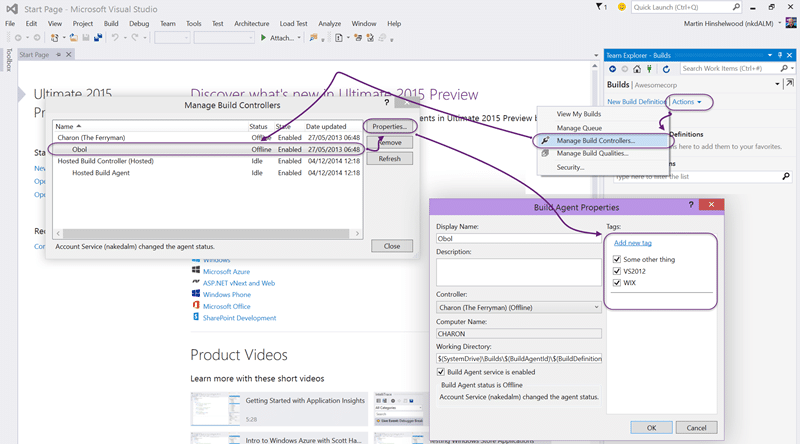
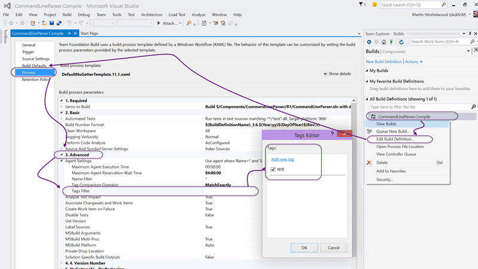
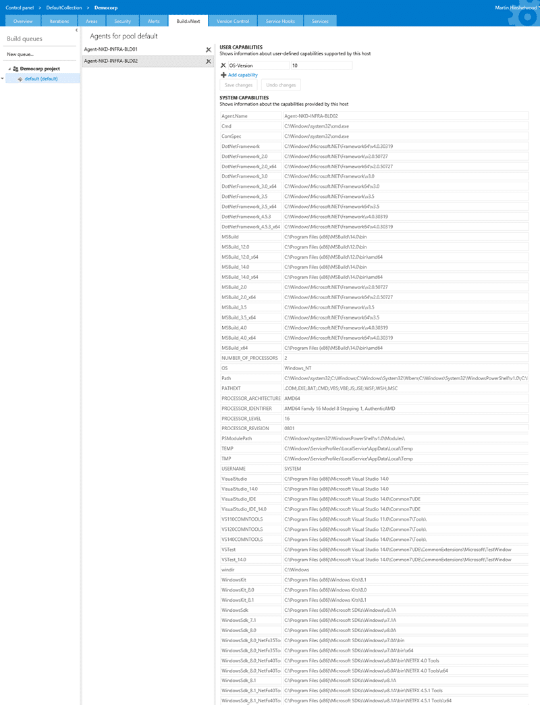
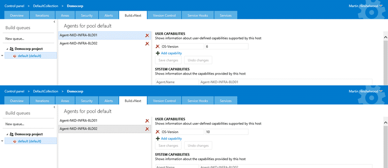
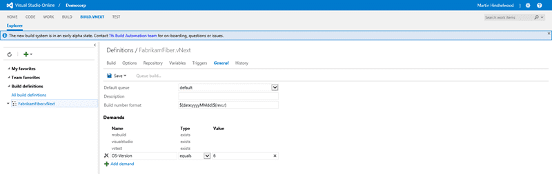
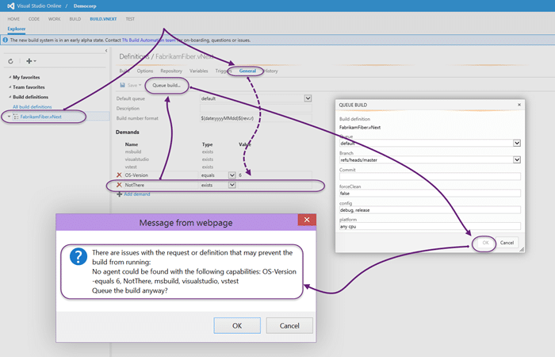

Using the Build vNext capabilities and demands in VSO is one of the new cool features of the vNext build system being developed by Microsoft on VSO.

#### Download Team Foundation Server 2015 today

Microsoft has released a CTP of TFS 2015 that includes the vNext build system. You can [download TFS 2015](https://www.visualstudio.com/en-us/downloads/visual-studio-2015-ctp-vs) and try it out today. Remember that this is _not_ a go-live version and you should _not_ install it in production.

The current build system that shipped in TFS 2005 and has continued through to TFS 2013 and VSO has a tagging system for build agents. You have a Controller that can have many agents attached.

{ .post-img }

Each agent can be 'tagged' with a set of… well… tags…

{ .post-img }

You could then open your build definition and add tags that would match the server. You had a "match exactly" or "match any" option.

With Build vNext we get a new system where we add Capabilities to the build agent in the administration section and then add Demands to the build definition that need to match those capabilities. I think that this terminology is a little more specific to the task and make a lot more sense in the context.

{ .post-img }

So what do we get. Well, when you register a build agent you don’t get to configure any of that stuff. You need to go to the Build vNext tab in the administration section of your server and select an agent. You can see the list of System Capabilities listed above. These capabilities are the ones that the build system has automatically detected. It automatically detects things like Visual Studio version and all the paths where stuff from Microsoft is installed. I am sure that there will be more capabilities added dynamically later, and when a cross-platform agent becomes available you can imagine it detecting things like OSX version or Java folder paths.

I have two agents above and only one of them works. I had a problem with the BLD02 which has Windows Server Technical Preview installed that I have been unable to rectify. It is likely due to the only version of the preview that is available on Azure being 9841 and most testing likely happening on 9871 which is the latest build. But why am I telling you this?

Well I decided to add the OS version as a capability. I would have liked for the agent to detect this but it is not currently listed. BLD01 is Server 2012 R2 and I want to be able to target builds only to that, or other working, agents.

{ .post-img }

So for each Build vNext Agent I have added a user capability of "OS-Version". On BLD01 I am setting this to "6" to signify 2012 R2, and on BLD02 I am setting it to 10 to signify the technical preview. Now I could be a lot more specific, but this is good enough for now.

Capabilities added I can now focus on the build definition and how we configure it to use the capabilities.

{ .post-img }

With the current incarnation of Build vNext only available on VSO and at the moment only for early adopters you may see the tab in VSO or you may not. If you don’t, then hang tight and it will be along in a bit.

You can now [create a Build vNext build definition](http://nkdagility.com/create-a-build-vnext-build-definition-on-vso/) and configure the capabilities as you see above. On the General tab there is a list of Demands for this particular build and the system has added a few for itself. Because we have used the Visual Studio Build and VSTest tasks we get demands for both Visual Studio and VSTest to at least exist. Note that this does not specify the version of the tool, just the tool itself.

If you click the "Add demand" button you will get a new editable blank row where you can enter your own. Here I am adding my "OS-Version" with an "equals" operator and a 6 as the value. That six should make sure that only Build Agents that have a Capability of Server 2012 R2 are used for this build.

{ .post-img }

If there is no matching build agent then you will be warned when you try to queue the build.

### Conclusion

The new capabilities and demands system in Build vNext gives us the same features as the old tagging system but makes a lot more sense in context. Additionally with the new web interface and the auto detection on the agent of many of the needed values the whole process gets a lot simpler.

I am looking forward to more cool features in Build vNext.

