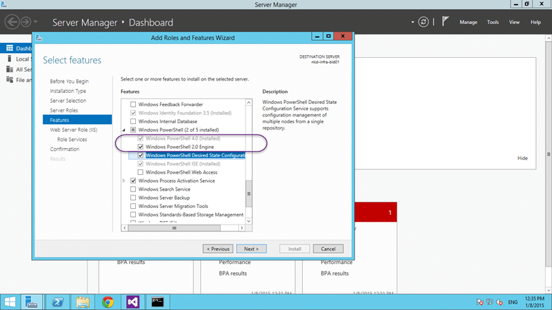

If you are setting up to run Team Foundation Server's vNext build system that Microsoft is previewing on VSO you may hit a "Unable to load task handler PowerShell for task VSBuild with version 1.0.1" error when you try to build on Windows Server Technical Preview.

#### Download Team Foundation Server 2015 today

Microsoft has released a CTP of TFS 2015 that includes the vNext build system. You can [download TFS 2015](https://www.visualstudio.com/en-us/downloads/visual-studio-2015-ctp-vs) and try it out today. Remember that this is _not_ a go-live version and you should _not_ install it in production.


{ .post-img }

After you have [configured a vNext build agent](http://nkdagility.com/configure-vso-vnext-build-agent/) you may get an error when you try and build. This error occurs regardless of the tasks that you pick for your build.

```
******************************************************************************
Starting Build (debug, any cpu)
******************************************************************************
Executing the following commandline:
C:\VsoWinAgent\agent\worker\vsoWorker.exe /name:Worker-4649b2ea-e06d-47b0-9a89-5f4aa4d545df /id:4649b2ea-e06d-47b0-9a89-5f4aa4d545df /rootFolder:"C:\VsoWinAgent" /logger:Forwarding,1.0.0;Verbosity=Verbose,Name=Agent1;JobId=4649b2ea-e06d-47b0-9a89-5f4aa4d545df
Unable to load task handler PowerShell for task VSBuild with version 1.0.1.
******************************************************************************
Finishing Build (debug, any cpu)
******************************************************************************
Worker Worker-4649b2ea-e06d-47b0-9a89-5f4aa4d545df finished running job 4649b2ea-e06d-47b0-9a89-5f4aa4d545df

```

I tried to build both with the "Visual Studio Build" task and the "MS Build" tasks that come out of the box. Both resulted in the same error and I can only assume that there is an internal dependency on a particular PowerShell version that is not present.

After some investigation on Windows Server Technical Preview I noticed that only PowerShell 5 is available and enabled out of the box. Just like on Server 2008 R2, if you want an older version of PowerShell or .NET to be available then you need to go manually enable it.


{ .post-img }

If you launch the "Add roles and features" you should see, on the features tab, an option for PowerShell with only PowerShell 5.0 installed. As this is only available in the Technical Preview my assumption would be that the team targeted the latest common version. Which would be the 2.x version.


{ .post-img }

On Server 2012 R2 you will also find that only PowerShell 4.0 is configured by default and you will need to add PowerShell 2.0 here as well. This will in addition also enable .NET 2 / 3.5 if it has not been already.


{ .post-img }

Although a better error message could be used, like detecting if the Windows feature is indeed enabled, this is an alfa version of the product and you don’t expect any such polish. After enabling the feature, and re-running the build…

And Poo, I still have a problem, so that’s not it. This brought me to the end of my wits and I had to go ask some folks.


{ .post-img }

After a flurry of emails to my peers on the champs list Jakob asked if I had Unblocked the Zip files! Do what now?

It turns out that if you download a zip file from the internet it may be "partially" blocked. Windows will block access to some files that it deems risky but not warn you nor stop you from unpacking it. Unfortunately it will only partially unpack… which rendered my build agent useless.

So if you are downloading a Zip file from the internet you may need to unblock them before you can use them fully.


{ .post-img }

Woohoo… A successful build on the new Build vNext…
