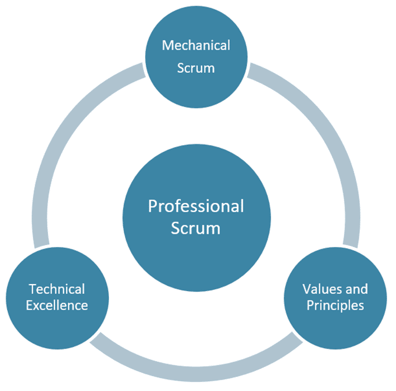

Last month I created an article for NDC Magazine on [Scaling]() [Scrum](). The guys at NDC must have liked it as they decided to put it on the cover. This article is a discussion and investigation into what it means to be a Professional [Scrum Team](), why we need it, and how we can scale it.

{ .post-img }

\[[Download NDC Magazine 2015.1 as a PDF](http://issuu.com/developermagazine/docs/ndc-magazine-1-2015-web/28)\]

### Excerpt from the article

Many organisations move towards Scrum and Agile for the allure of hyper-productivity. This is the promise that led them to Scrum in the first place and they are, more often than not, sorely disappointed when they don’t achieve it. The easiest way to make Scrum as ineffective as possible, is to pay lip service to it. Forgetting about the values, principles, and [technical excellence]() that are the underpinning of its effectiveness.

{ .post-img }

It's just fine to start with mechanical Scrum and work from there. Just don’t expect to get the effectiveness that you desire without the other two pillars. You need all three of the pillars to be able to ship twice the features in half the time.

### The desire: Twice the features in half the time

No really! You can ship twice the features in half the time, but only with [Professional Scrum](). In Professional Scrum we not only follow the framework, but enact the values and principles. In Professional Scrum we strive for technical excellence and really focus on doing the right thing and minimising [technical debt]() (yes, I know that unhedged fund is technically more accurate.)

Jeff Sutherland talks often of using Scrum to make money as a venture capitalist. His company buys struggling software companies and turning them around. Jeff does this by implementing Professional Scrum and turning that struggling software organisation into a highly tuned, effective team that turns ideas into customer value. He can then sell that company for many time that which he bought it for; professionals are worth far more than cowboys.

It beggars belief that so many organisations only practice flaccid Scrum and waste their investors' money. That’s bad when it is private investment, but down right criminal in a public company. And let's not get started with the public sector.

Is your organisation paying lip service to the values and principals? Does it feel more like 'yeeha', or a group of professionals?

Mechanical Scrum is only the start \[[read more...](http://issuu.com/developermagazine/docs/ndc-magazine-1-2015-web/28)\]
