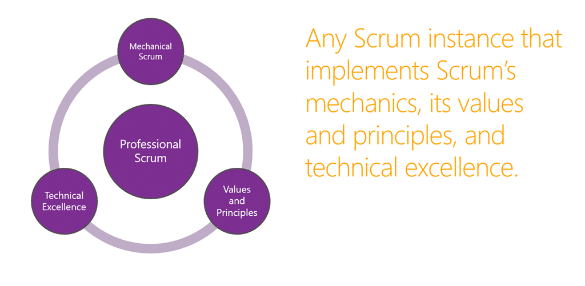

I was in Norway for NDC Oslo 2015 and I was there to talk about "Big Scrum: All you need and not enough" which is a kind of oxymoron as it really is enough, you just need to apply the values and principals at scale. I tried to cover what for me is a total 100% requirement for Scale.

\[embed\]https://vimeo.com/131642789\[/embed\]

{ .post-img }

In order to scale you first need Professional Team and not Amateur Teams. In the Scrum world that means that you need to [embody the values and principals of agile, have awesome engineering practices, and know the mechanics](http://nkdagility.com/big-scrum-are-you-doing-mechanical-scrum/). Its really not enough to simply pay lip service to your process. Dig in and really do it.

{ .post-img }

The second thing that I covered is why a cookie cutter process will not work. Your companies change is a unique fingerprint and the idea that you can buy and off-the-shelf process that will suit your culture and your journey is ludicrous.

{ .post-img }

To support scaling Scrum you need to have many Professional Scrum Teams working together, and for that we need a few extra communication lines that are not new, but that need enshrined in the model to make sure that it works. Check out the video below to get a walk-through of the new events and their significance and value.

At the end of the session I highlighted a small number of additional, but optional, practices that make scaling a lot easier. These practices only scratch the surface of what is presented in Scrum.org's new Scaled Professional Scrum course, but they are representative of practices that we know, from experience, you need to build software big.

> ## Big Scrum: All you need and not enough
>
> The proliferation of scaling frameworks shows there are real challenges in scaling agility, and the solutions don’t seem to involve inventing yet more frameworks or formal processes. So then, why is it so hard to find success in agility at scale? Large scale agility can be found in exploiting Scrum’s simplicity while emerging and sustaining technical excellence. Something that sounds so easy shouldn't be so hard, and for some it isn't. This session highlights successes in growing large scale agility using Big Scrum while maintaining technical excellence to deliver value faster.
