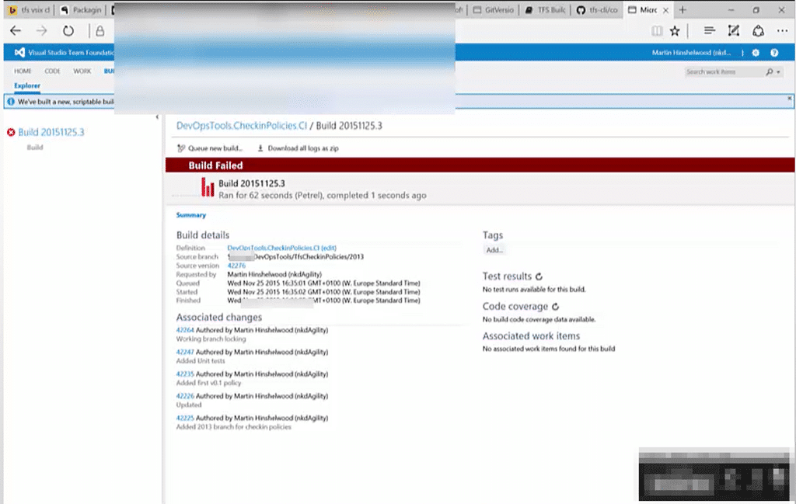
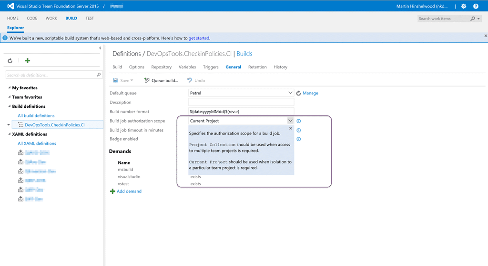
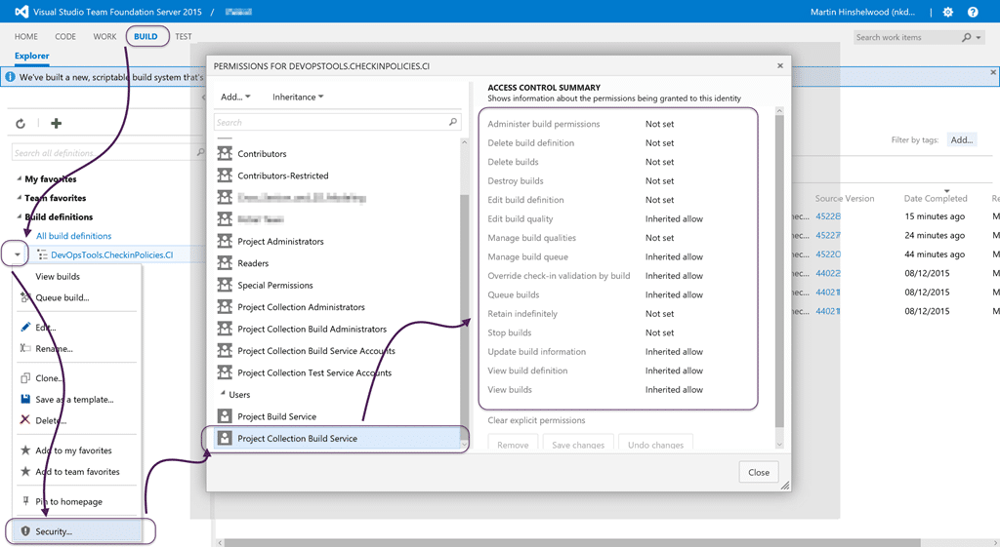
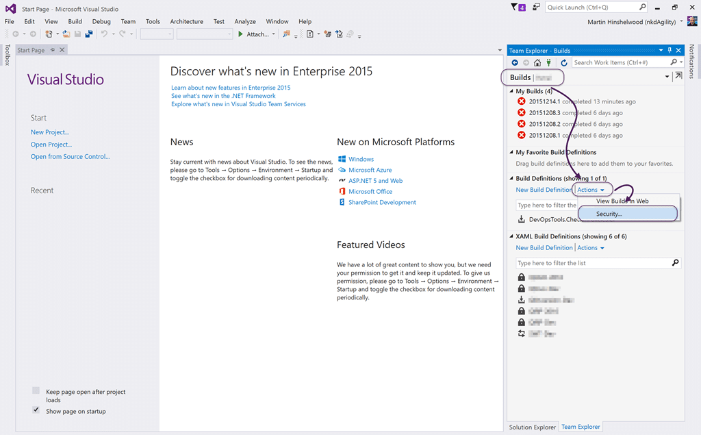
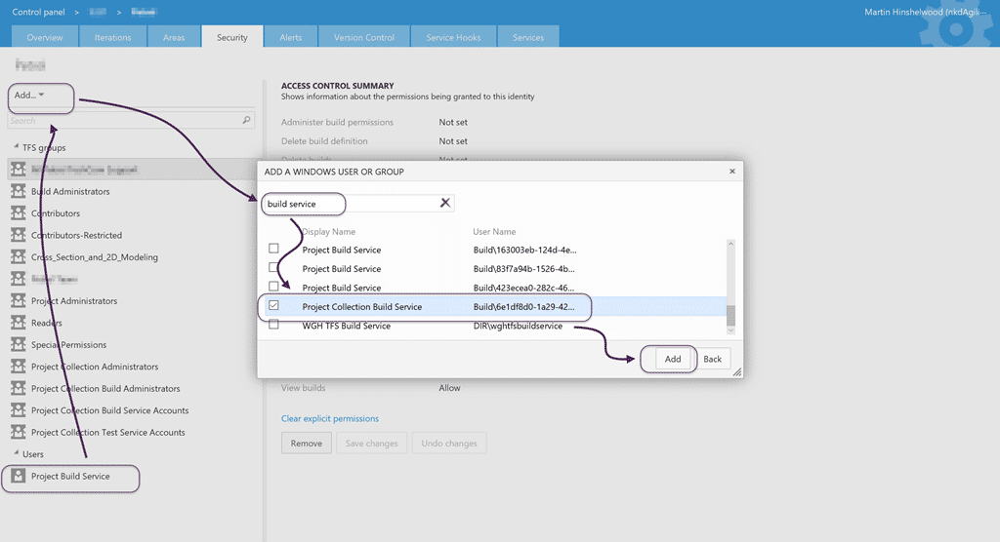
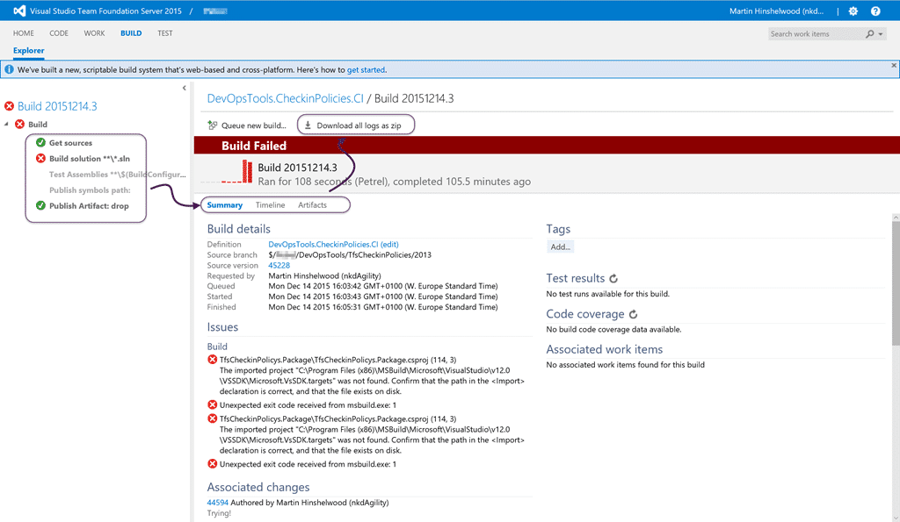

I was trying to setup a Build Agent within one of my current customers. They do over 1 million builds a year through Team City and I need to demonstrate that the new TFS build system is awesome before they will consider it. So it never instils confidence when you get an error…

```
10:01:25.328098 ---------------------------------------------------------------------------
10:01:25.341094 System.AggregateException: One or more errors occurred. ---> Microsoft.TeamFoundation.DistributedTask.WebApi.TaskOrchestrationPlanSecurityException: Access denied: Project Collection Build Service does not have write permissions for orchestration plan 13b88515-ebeb-4c2e-9213-cdcc683b8ff4.
10:01:25.341094 Microsoft.TeamFoundation.DistributedTask.WebApi.TaskOrchestrationPlanSecurityException: Access denied: Project Collection Build Service does not have write permissions for orchestration plan 13b88515-ebeb-4c2e-9213-cdcc683b8ff4.
```

I had one of their guys setup a TFS agent on one of their many enormously powerful build servers and tried a simple build. The build immediately errored out and greeted me with a "there was an error" message with no logs at all. I knew that something fundamental was up because of the lack of logs, and had to go to the server to get the cryptic message, Project Collection Build Service does not have write permissions for orchestration plan, that really did not help me much.


{ .post-img }

Boy was the lack of logs annoying. Especially since the only way to get any information was to log onto a server that I did not own to go get more info.

After much pain and suffering I got with Chris Paterson and isolated the issue to one of permissions. The new build system has two custom user accounts that are used to execute builds:

- Project Build Service
- Project Collection Build Service

Effectively you can choose to have the build configured to run at the Project level if you only need access to the data in a single project, and the collection level if you need to pull bits from multiple projects. As soon as he mentioned this I thought about one of the options that I changed during the configuration of the build definition.


{ .post-img }

These isolation levels make sense, however there is a bug in the TFS 2015 RTM upgrade that may result in the "Project Collection" level resulting in the "Task Orchestration Plan Security Exception" you see above.

At this point you can immediately unblock yourself by selecting "Current Project" from the list.

However if you need access to more than one Team Project, or might in the future, you need to dig a little deeper. If you have a look at the permissions on your build definition you should see the issue.


{ .post-img }

If you open the permissions for your build you should see both the "Project Build Service" and the "Project Collection Build Service" permissions with "Inherit Allow". You you don’t have both then you have an issue!

You can just add them to the Build Definition but you really want it to be inherited so that you don’t have to go add it for every Build Definition. To do that you have to go through Visual Studio to pop the correct UI.


{ .post-img }

It seams that the only way to pop the security panel for the root node of the Build Definitions, so that we can fix the cause, is in Visual Studio. So launch VS2015, head to the Builds page of Team Explorer, and click the "Actions" drop-down under "Build Definitions". Then select "Security"… this will pop the Web UI and get you strait to the right place.

Note: Not to be confused by the legacy XAML Build Definitions.


{ .post-img }

Once there you can see that I only have the "Project Build Service" in the "Users" list and I also need to have the "Project Collection Build Service". So even though this is not a [Windows]() user or group you need to click "Add" and then "Add Windows User or Group"… Then search for and add the "Project Collection Build Service".


{ .post-img }

Now, even though my build still fails, it fails for better reasons than just exploding. So if you run into the dreaded "Access denied: Project Collection Build Service does not have write permissions for orchestration plan" you will now know where to look and what might be the issue…
