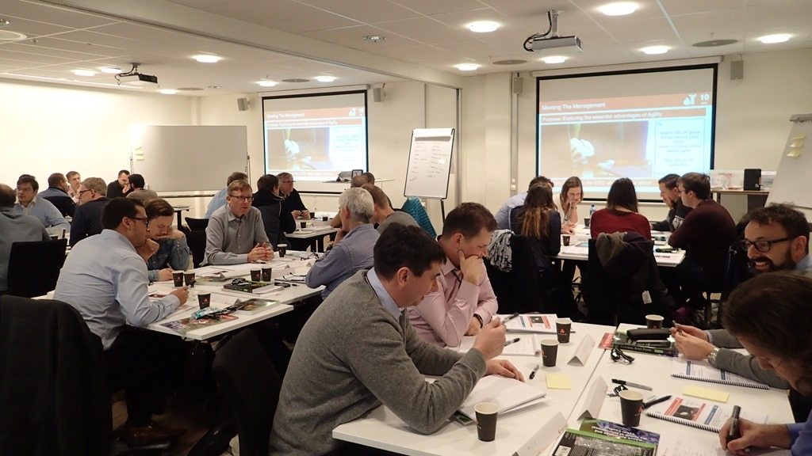

Just before the end of the year I taught my [first Professional Scrum Master course in Norway](http://nkdagility.com/training/courses/professional-scrum-master/) and it was a resounding success. We had 30 students from some of the largest and most successful companies in Norway. The feedback was incredible and I had an awesome time teaching it.

{ .post-img }

It has been so successful that we have scheduled 3 more Professional Scrum Master deliveries in Olso and one in Kongsberg, we have even scheduled a Professional Scrum Developer, also in Olso.

### Professional Scrum Master

The Professional Scrum Master course is equivalent to the Certified Scrum Practitioner and covers the key skills needed for experienced Scrum Masters to up their game. We dont really cover the basics of Scrum to allow us to focus the full two days on the mastery of managing the Scrum frameowrk for a team or organisation. There are lots of advanced topics like Coaching Stance and Active Listening that are the cornerstone of being a sucessfull Scrum Master.

<table width="800"><tbody><tr><td valign="top" width="89"></td><td width="729"><a href="http://nkdagility.com/training/courses/professional-scrum-master/">Professional Scrum Master</a> February 22, 2016 | Kongsberg, Norway</td></tr><tr><td width="89"></td><td width="729"><a href="http://nkdagility.com/training/courses/professional-scrum-master/">Professional Scrum Master</a> February 24, 2016 | Oslo, Norway</td></tr><tr><td width="89"></td><td width="729"><a href="http://nkdagility.com/training/courses/professional-scrum-master/">Professional Scrum Master</a> April 26, 2016 | Oslo, Norway</td></tr><tr><td width="89"></td><td width="729"><a href="http://nkdagility.com/training/courses/professional-scrum-master/">Professional Scrum Master</a> June 21, 2016 | Oslo, Norway</td></tr></tbody></table>

NOTE: If you are looking for a course similar to the Certified Scrum Master then you should look to the Professional Scrum Foundations course. Learning the basics does not make you a master :)

### Professional Scrum Developer

The Professional Scrum Developer course and certification is designed to give your development teams the skills and knowledge necessary to deliver high quality working software in less than 30 days. It is the only official training for Team Foundation Server (TFS) and Visual Studio Team Services (VSTS) from Microsoft and is maintained by Scrum.org and some of the best technical people in the world.

In just 3 days this course uses practical experiance to explore DevOps and Agile practices and tools that you need to get ahead and deliver frequently. The majority of the course is focused on the tools (Visual Studio with TFS or VSTS) and the practices (like SOLID and TDD) that you need to adopt inorder to increase delivery while maintaining quality.

<table cellspacing="0" cellpadding="2" width="800" border="0"><tbody><tr><td valign="top" width="97"></td><td valign="top" width="703"><a href="http://nkdagility.com/training/courses/professional-scrum-developer/">Professional Scrum Developer (PSD)</a> March 1, 2016 | Oslo, Norway</td></tr></tbody></table>

NOTE: Although the course can be taught with any programming language, this one will be .NET and C#. Feel free to request any language verient that you would like to see, however we would need at least 8 students to make it worth creating a custom version.
