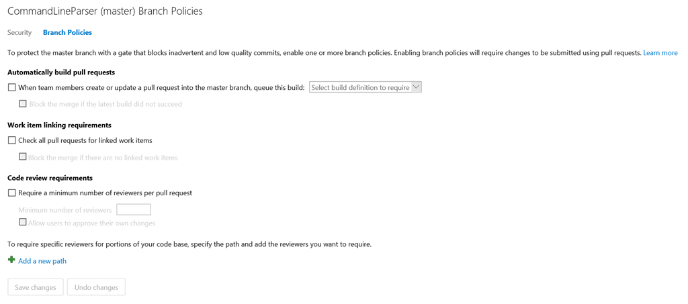
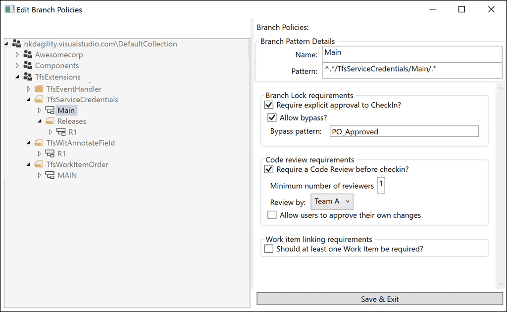
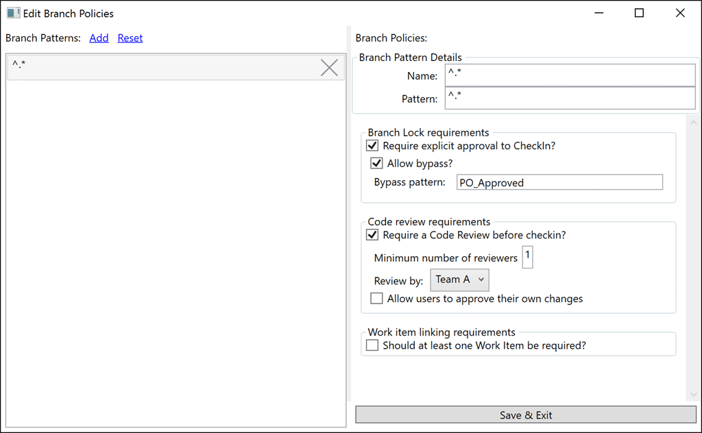

I have been working with a large customer in Norway that is moving to TFS whole sale and also needs to continue using a server based source control system for the time being. It would be awesome for them to be able to move to Git, however the codebase is currently incompatible. Work is ongoing to remove this issue, and many components will be able to move as soon as we can add Git repositories to a TFVC Team Project (in TFS 2015 Update 1). SO in the mean time we need a way to apply policies to particular branches.

\[[Download Tfvc Branch Policy](http://nkdagility.net/TfsBranchPolicy)\]

{ .post-img }

What I wanted was something like the existing Branch Policy feature for Git but in TFVC. This would need to be done as a Checkin Policy for it to work, so I went looking for existing policies, of which there are many. I found that while I could use existing policies in combination with the "pattern" policy that is part of the TFS Power Tools, however it would be an ugly and unwieldly solution.

The customer has many projects as part of a single Team Project, and that would make it very difficult to manage many policies based on paths. We needed a consolidated and simple solution.

{ .post-img }

This is what I wanted, a list of branches on the left, coupled to a set of policies on the right. We can then extend the policies as we decide what is needed. However it was quickly identified that they often applied policies across multiple branches. Specifically they have a year based branching structure that is replicated through all of the components. So for "Product 2016" they also deploy "Component A 2016". There are hundreds of components that make up the final Product so…

{ .post-img }

\[[Download Tfvc Branch Policy](http://nkdagility.net/TfsBranchPolicy)\]

…I moved to a much simpler to implement regular expression model. We have a list of regular expressions, and then apply that regular expression to the list of pending changes to find out which ones should be applied. Now that we have a list of matching Branch Patterns I can then integrate through each of them and evaluate the Branch Policies. These policies can be applied to multiple branches (paths) that match a simple pattern and then failures can then be transformed into messages for the developer.

The goal is not to create a list of 100 things developers have to go do. There is an expectation of due diligence and competence expected of every coder, so you will not see a "must run tests before checkin". The idea is that we want to make sure that folks with good intent don’t forget to do one of the big ticket items. Like builds, work items, code reviews, or production locks.

Current Policies that have been implemented:

1. **Branch Lock** - There are many reasons that you might want to lock a branch, maybe you need to prevent changes to code without approval as you move towards a release. Whatever the reason you can specify that a chosen pattern is locked and what the optional bypass string is. The bypass string needs to be entered into the comment for the checkin. Simple and effective.
2. **Code Review** - You must have at least one Code Review, and any Code Reviews need to have been successful
3. **Work Items** – Require at least one work item first, then I will likley implement the ability to select the types of workitems that are required.

This is a start and you are welcome to send feedback to \[bla\] in the form of issues or requests. Give it a try and provide me with feedback. All feedback is good feedback :) even if I don’t agree.

\[[Download Tfvc Branch Policy](http://nkdagility.net/TfsBranchPolicy)\]

You should also feel free to [contribute to this policy on GitHub](https://github.com/nkdAgility/TfvcBranchPolicy) where I will be happy to take pull requests.
