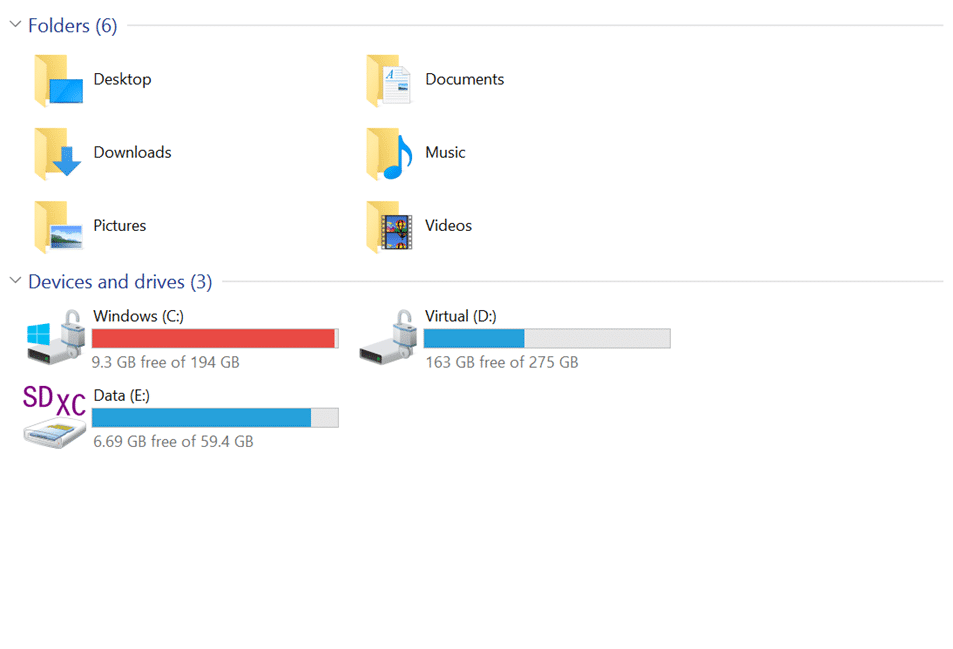
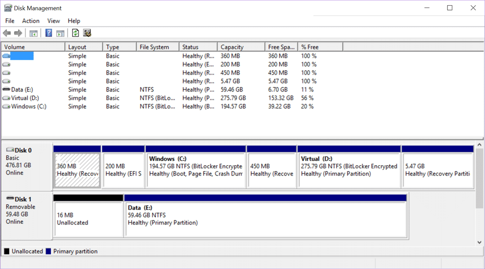
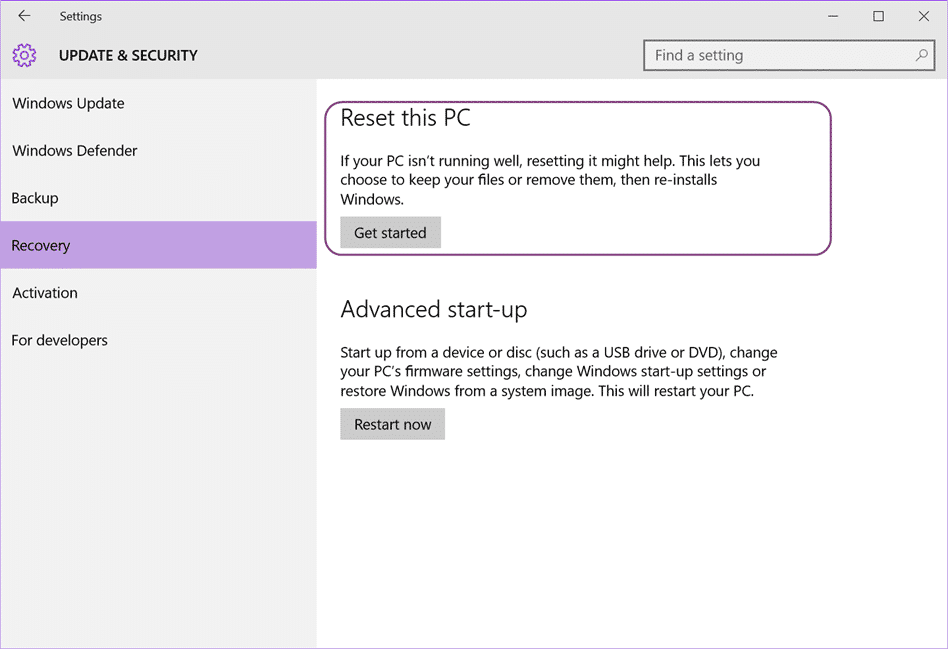
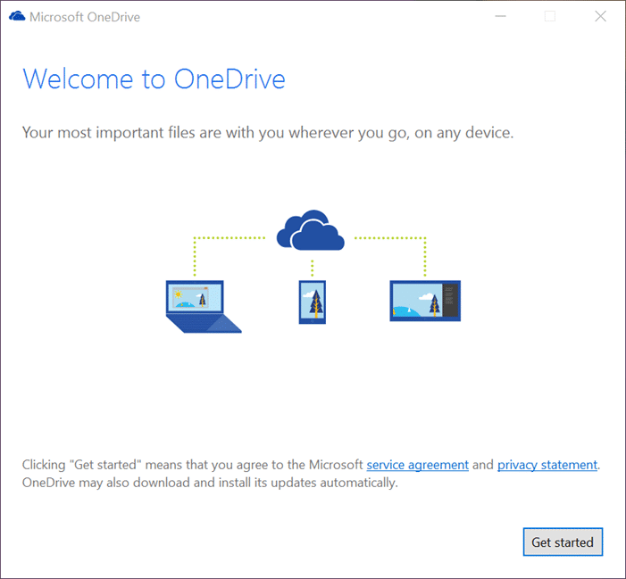
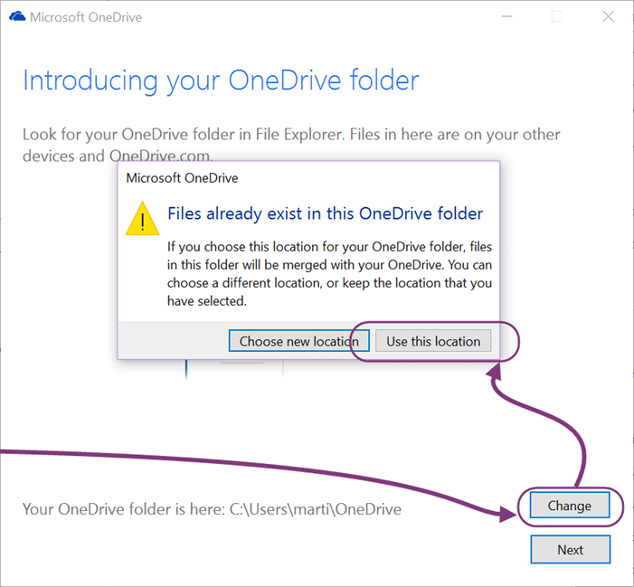

I recent ran into a problem where my OneDrive files were taking up too much space on my main drive and preventing Windows 10 updates on the Insider Program. This works for both OneDrive consumer application and the new OnDrive for Business beta application.

{ .post-img }

Many moons ago I had partitioned my drive so that I could limit the amount of space that my Virtual Machines use. However these days I only have a single VM that is the Brian Keller TFS demo box for… well… demos. All my other machines I run in Azure. So I tend to have more free space on the Virtual drive and less on the Windows drive these days…

My OneDrive file size is now up at 80GB+ so I really need the extra space on the C drive.

{ .post-img }

However after so long it would be difficult to resize the partitions without breaking the ability to recover my computer easily, which I like.

{ .post-img }

I love being able to pop into Recovery page and just reset Windows while keeping my files… awesome feature, especially if you are a Developer and incessant tinkerer and often break Windows.

So, in order to move your OneDrive location you need to first "Unlink" your OneDrive account and then relink it back to the new location. The online documentation for this says that you have to re-download all of your files, but stuff that on 80GB. What if you are on a crappy or cellular internet connection! I want to move my files to the new location and have OneDrive just fire up with all of the files there. Good this this is easy and seamless…

1. **First Unlink your OneDrive**  
    You need to be online to complete this procedure. I am currently onsite with a customer that has blocked OneDrive and had to connect through my phone. OneDrive takes some time to connect if you change connection, so using the tray Exit button and then running the OneDrive Desktop App (from Start) gives it a little kick.  
      
{ .post-img }
    Once you are online you can open the tray menu and click Settings.  
      
{ .post-img }
    Then click "Unlink". If your Unlink button is disabled, like above, then that means that you are not Online. You can connect to the internet and then reboot, or restart the OneDrive application.
2. **Copy your files to the new location**  
    You need to cop all of your existing files to the new location. If you don’t copy all of the files anything missing will need to be re-downloaded. As Windows copy also takes all of your file properties if you have made changes to files, then these will be synched successfully after the move.  
      
{ .post-img }
    I setup a d:\\Users\\MrHinsh\\OneDrive folder and "moved" all 80GB of my files over to the new location… this may take some time, or considerably longer depending on your drive speed. I happen to have a Surface 3 with SSD's so it's pretty quick for me.  
    You should also be mapping your Windows Special Folders to OneDrive so that you never lose a file again.
3. **Setup OneDrive using the OOB experience  
    **Now we need to setup OneDrive again but change the mapping to the new location of our files.  
      
{ .post-img }
    Just like the first time you setup Windows OneDrive you get the out-of-box experience when you click on the OneDrive folder.  
      
{ .post-img }
    On the configuration screen click "Change" and select the new folder. OneDrive will detect that this location is already in use and you should "use this location".  
    
{ .post-img }

And that’s it… your OneDrive files are not in a new location, and in my case, on a new disk. That’s 80GB freed up from my Windows drive…

