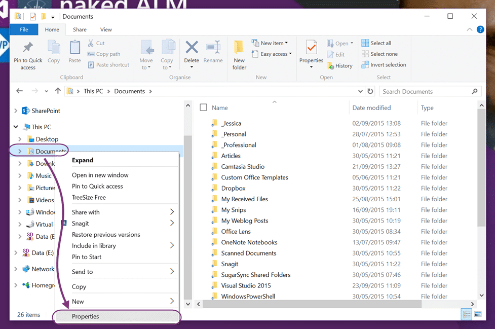

Do you worry that you will lose files on your computer? Well you should! At any time your harddrive can fail, or your house could be hit by a meteor, or stolen. I keep everything on my computer encrypted with BitLocker and can remote wipe any of my data, however I want to be able to access it from anywhere. Everything needs to be in at least two locations to be called a backup, a local separate disk is only partial backup and realis on being at home to backup leading to stale data. That means that the only viable place to securely store your data is the cloud.

I also tend to work on more than one computer. I have a number of tablets, from a Surface 4, Surface 3's to the Dell Venue, and even a couple of HP Stream 7's. I want to be able to edit a file on one, and pick that file back up on any of the other tablets. Or even on my phone, or on a friends PC.

For this I use OneDrive and OneDrive for Business depending on the content of the file. There are a couple of other solutions out there, like DropBox or iCloud, but OneDrive is mostly free and is built into the OS, and it just works. Oh it's had its issues over the years. I have about 40GB of personal data and 40GB of business user data all stored in OneDrive and OneDrive for Business respectively. Technically you only get 5GB for free, but if you get 1 terabyte with your Office 365 personal for OneDrive and 1 terabyte of OneDrive for Business for your business Office 365 subscription. There are a few other tasks that can get you more space, but if you bought a new PC you might have gotten two tokens. One for unlimited Skype for a year and the other for 1TB of OneDrive storage. I buy tablets and whatnot often enough that I have plenty…

So… to make things really easy I want to store all of my files on OneDrive and I don’t want to have to think about it. So I want my Documents, Desktop, Music, Pictures, and Videos to all be automagically synced.

In Windows all of those folders are special folders. They are given special powers by the operating system and this allows them to integrate into the OS and applications. And it's really simple to map them to another folder in your OneDrive or OneDrive for Business.

{ .post-img }

In Windows 10 (or 8, or 7) you can right click on any of the Special Folders, like Documents, and go to Properties…

{ .post-img }

…Here you will see a "Location" tab where the file location is set. If you change this and point it to your OneDrive or OneDrive for Business (or DropBox or iCloud) then anything you put in Documents will also be saved to the cloud.

I configured this for most of my family and while they don’t need to worry or care about it the number of times this has saved their bacon! Not only can you just re-sync a new computer, but OneDrive also has a recycle bin for anything deleted from it.

{ .post-img }

Once you have changed the folder you will be asked to move all of the files, which I recommend, and then you will be asked if you are really sure that you want to merge the files. Merging can't really be undone as the folders will be intermixed so make sure you have both locations in order before you just squish them together.

Now go do it for your other special folders, including Desktop, and everything you save will always be safe as long as you have an internet connection.
