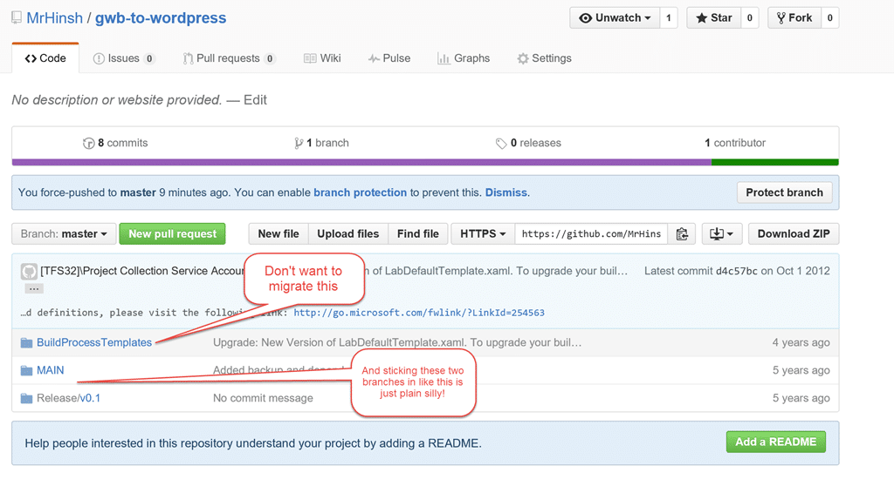
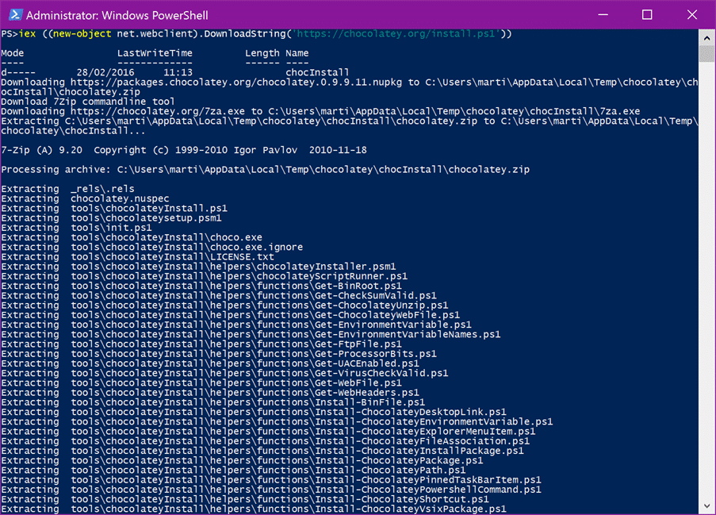
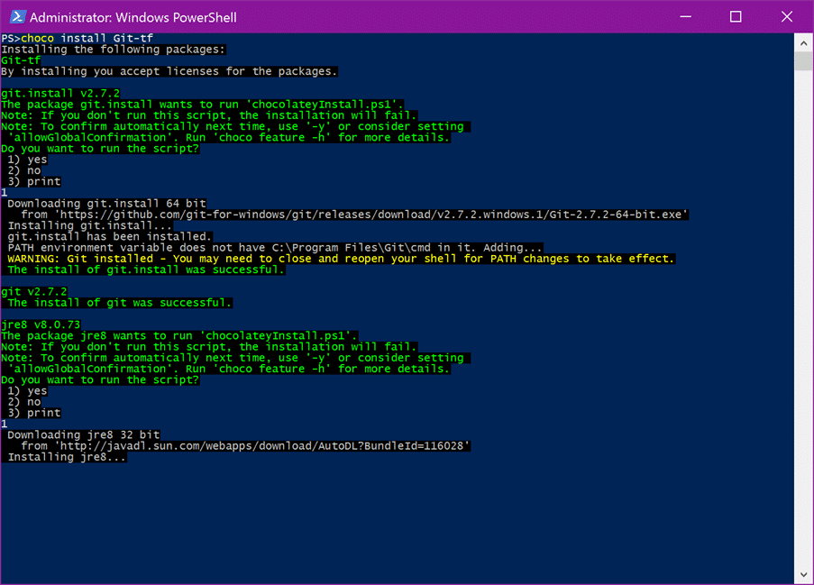

I have a repository on Codeplex that was the result of the code that I had to write to move my blog from GeeksWithBlogs many moons ago over to Wordpress. This was a very difficult process and recently quite a few of my friends have had to go through it as well. Since GeeksWithBlogs has been sold to 'the man' many bugs have crept into the system and features are sparse. With the most recent request for access I decided it was time to ditch Codeplex and move to Github. If you have not seen the writing on the wall yet the only Open Source host of any note is GitHub. All my private repositories are in VSTS ([http://tfs.visualstudio.com](http://tfs.visualstudio.com)) but anything Open Source will be moved to GitHub.

### Attempt 1: Using the Github Import tool #fail

My first attempt was to use GitHub's provided tool at [https://import.github.com/](https://import.github.com/) to pull my CodePlex repo into GitHub. However the results are not even remotely consistent with what you would want. The GitHub tool effectively just grabs the entire codebase under the team project and shoves it into a Git repo.

{ .post-img }

Effectively the GitHub import from TFS is inherently broken and is of no value to anyone. Well, maybe that’s a little harsh. If I was a complete incompetent and had the root of my project in the Team Project folder (not recommended by MSFT) then maybe it would be useful. I can't imagine that is a common scenario.

Suggestions to GitHub: You should allow me to select a folder for the root of the import… in this case $/TeamProject/MAIN/

I would take a guess that GitHub implemented this import just so that they can say that they support import from TFS and don’t really care if it is usable. It has some fairly fundamental flaws and I would avoid it at all costs.

_UPDATE: I have heard from Github support that they consider this result a bug and that Branches should be honoured. Not sure how that works without being able to select your MAIN branch, but they are looking into it._

### Attempt 2: Using Git-TF to GitHub

Next up is using Git-TF to do the import. This offers a lot more flexibility as you will see, so that we can import everything in a sane manner.

1.  **Install Chocolatey -** First we need the tools, and the easiest way to get them is with Chocolaty. If you don’t already have Chocolatey installed then head over to [https://chocolatey.org/](https://chocolatey.org/) and get it.
    
    { .post-img }
2.  **Install Git-TF** - The easyest way to install Git-TF is to now call "_Choco Install Git-TF_". This will go off and install all of the pre-requisites an the main event. Chocolatey is one of my favourite tools and allows you to install almost any development or productivity tool.
    
    { .post-img }
    After only a few minutes (depending on your download speed) you will be all up and running, ready with both the Git command line, and Git-TF extensions.

        

    { .post-img }
    You may find that you get errors when using "git tf". I am not sure where that rabbit hole goes, but you can use "git-tf" to access the same commands nad they work. I would suggest that this is a bug in the software.

3.  **Clone your TFVC repository to Git -** Now that we have all of the tools installed we need to get our code over. Now as I suggested with "Git-TF" you are able to select the folder that you want to clone. I made a new directory and navigated to that folder in PowerShell.
    `    Git-tf clone https://tfs.codeplex.com:443/tfs/TFS32 $/gwbtowp/MAIN --deep`

        

    { .post-img }
    As soon as you execute the command it will clone MAIN and create a new Git Repository in the current location with the same name as the folder. In this case I get a "MAIN". The "--deep" command will make sure that all of the history is taken, but watch out as this may take some time to complete if you have a large amount of history. Not perfect but it will work for me for now.

        If you need to make changes to the repository you can do it now and checkin… after that all we have to do is push the changes back to GitHub. For this I am going to add an origin and then push to that location.

4.  **Add Github remote and Push** – Now that we have a copy of the code locally we can easily add a second remote and deliberately push our new master branch to GitHub.
    `    Git remote add github https://github.com/MrHinsh/gwb-to-wordpress.git
Git push -u github master`

            

        { .post-img }
        That gets all of your code over onto GitHub but what about other things…

5.  **Moving your Wiki Pages** - You might also have one or more Wiki pages that you want to migrate. Unfortunately Codeplex uses HTML and Github uses Markdown.
    
    { .post-img }
    Luckily I found a rather nice [converter for HTML to Markdown](http://domchristie.github.io/to-markdown/) that let me do this easily. Very few tweeks later and I had my markdown page ready.

And that’t it, you might want to look at migrating other stuff like Releases and Issues, but really this is good enough for most people. Once you are happy you can go mark your CodePlex project as migrated..

Check out my migration on [https://github.com/MrHinsh/gwb-to-wordpress](https://github.com/MrHinsh/gwb-to-wordpress)
