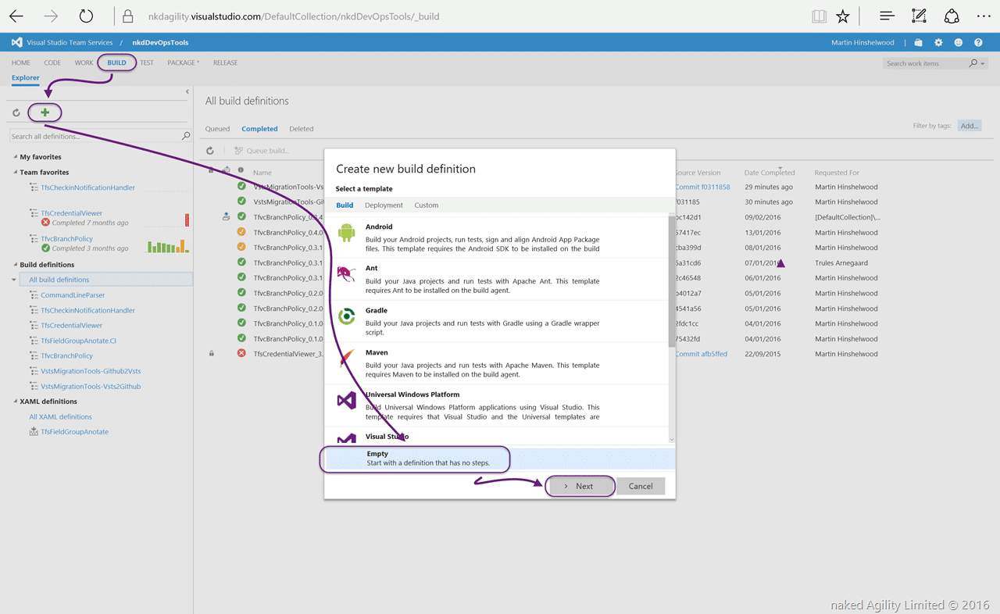
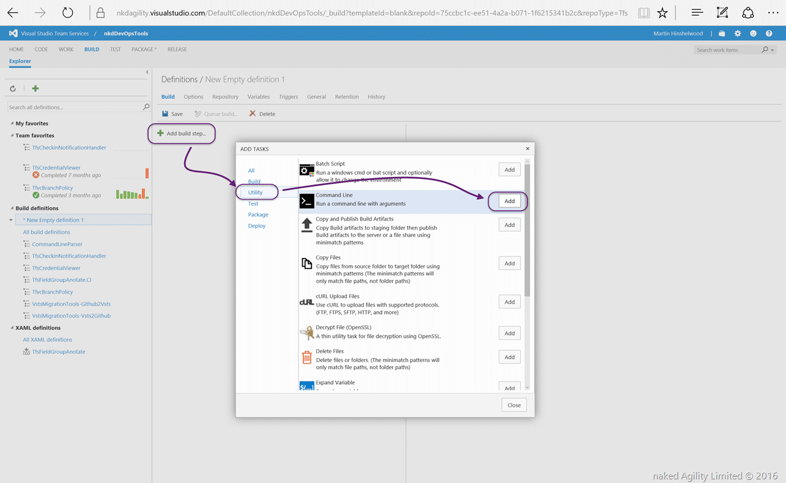
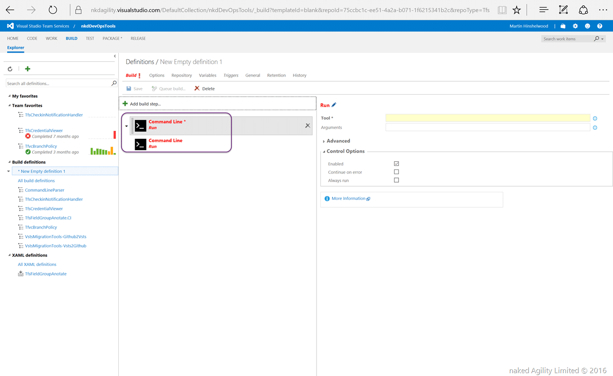
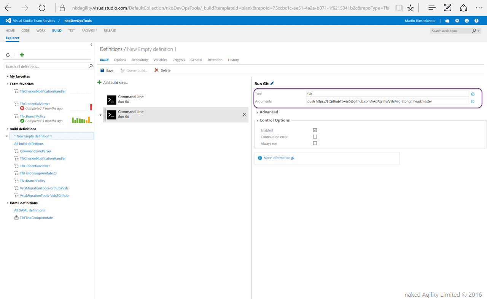
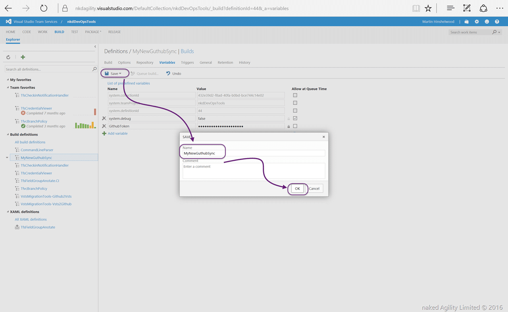
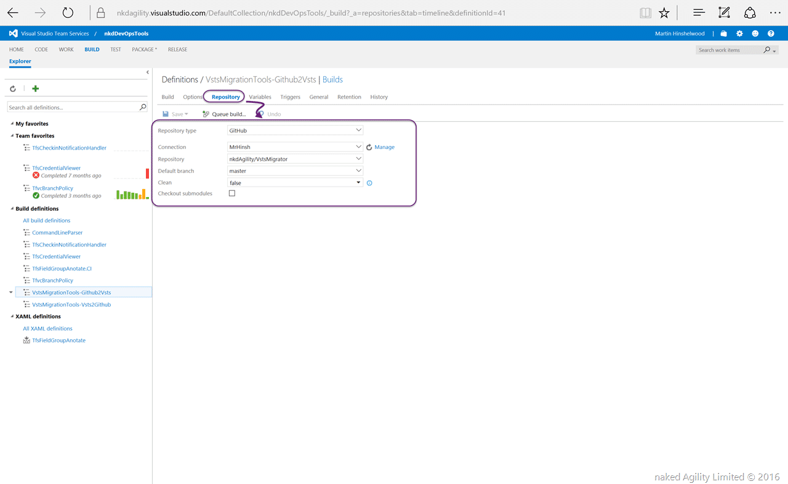

I have had quite a few requests from folks that want to use the full capabilities of VSTS or TFS but really need to have the code published in Github as it is Open-Source. Well I build a few Open-Source projects and I want to have my cake and eat it too.. I want to be able to use the full power of VSTS to reduce the friction of doing Agility and DevOps, but I want to publish the code and output to Github for public consumption. As Github really is the only place to store OSS software we need to figure out how to handle that.

UPDATE: David Corban suggested some edits around controlling the movement of code rather than just automatic. I added a Configuration Options secion...

And since Github gives us unlimited Public repos and VSTS gives us unlimited Private repositories it's almost a perfect match. VSTS provides a much better holistic end-to-end solution and Github provides public access.

I mainly want to sync the MASTER branches between VSTS and Github, but I might also want to specify a single branch that is synced. Solving this problem is relatively easy and I have documented it below. All we need is two automated builds in VSTS that sync the code. One triggered when a change is made in VSTS, and the other when a change is made in Github.

## Possible applications and configuration options

Based on some feedback for this post on different scenarios I though I should spell them out.

- **Synchronisation between VSTS and Github** - This is my main focus here and if you follow the post you will get full synchronisation
- **Manual Synchronisation** - If you turn off the CI you can choose when you synchronise
- **Selective Synchronisation** - You may want to have a VSTS topic branch synchronised with your GitHub MASTER. You can then Work in VSTS and choose when you publish to GitHub by merging to the Topic Branch. I probably would favour protecting both VSTS and GitHub MASTER and enabling a bypass for the synchronisation account. Then I can use Pull request to get into MASTER on either side which would result in a synchronisation.

If you have other scenarios that yo would like to support then feel free to comment and we can figure them out.

## Automated Push from VSTS to Github

If we were to look at the commands that we need to do then then it is fairly simple. We need to first PULL from Github's MASTER and then PUSH from VSTS to that Master.

```
Git pull https://github.com/nkdAgility/VstsMigrator.git master
Git push https://personalToken@github.com/nkdAgility/VstsMigrator.git head:master

```

Here you can see that we are authenticating for the push, but there is no need for the Pull as the repository in Github is public. Once you validate that you can run these two commands locally we need to automate these two tasks. The easiest way to do this is to create a Build definition that is triggered when we check into the VSTS Git repository.


{ .post-img }

On the Team Project that contains your Git repository you should create a new Empty build definition for us to execute the commands.


{ .post-img }

Next you select the Git repository that you want to work with and that you want to use it as a CI. This will allow our automation to trigger when the code in the repository has been changed.


{ .post-img }

Now that we have a blanc build definition in our Team Project we can go ahead and add the automation. In order to keep things simple and configurable I am going to simply add two "Command Line" tasks and call the commands that we need. This allows us to configure this easily in the web access without having to edit a script file. If you were doing this a lot you might create a custom task, but this keeps it configurable and easy.


{ .post-img }

Click "Add" twice to get two command line calls…


{ .post-img }

For each of the Git commands that we want to run we can easily select the Tool as "Git" and then pass the arguments into the arguments box. The first command is easy…

Since the Build system will automatically clone our VSTS git repository locally we can assume that it already exists. So when we make this call to PULL from Github we are updating the clean clone of VSTS with any updates that have occurred in Github since we last Pushed.


{ .post-img }

The second command is a little bit more interesting. We need to PUSH to Guthub which requires authentication. The easiest way to do this is to pass the authentication token in the URL of the command. Since I don’t want to expose this to everyone that can read my build definition I need to create a secret…


{ .post-img }

Head on over to the Variables tab and add a new variable. Here you enter the [Personal Token](https://github.com/blog/1509-personal-api-tokens) that you get from your account on Github. Done forget to click the little padlock to encrypt the data.

If, like me, you work with lots of people you might consider creating a Bot account on Github so that it does not look like all the changes are pushed by you. As long as you add your VSTS email addresses to Github then all of the commits will be attributed correctly.


{ .post-img }

Now save your build with an appropriate name.


{ .post-img }

All that is left now is to run the build and see the results.


{ .post-img }

Here you can see that the build has completed and all the secrets are preserved. Since we set this up as a continuous integration the final test is to make a change to the repo in VSTS and see it push to Github.


{ .post-img }

As you can see its supper simple to get your code Synching from VSTS to Github, but what if someone forks your repository on GitHub and then you accept a pull request.

## Automated Push from Github to VSTS

In order to push from Github to VSTS we need to trigger another VSTS build when Github has changed. This is also very easy and is out of the box in VSTS.

```
Git pull https://:personaltoken@nkdagility.visualstudio.com/DefaultCollection/defaultProject/_git/VstsMigrationTools master
Git push https://:personaltoken@nkdagility.visualstudio.com/DefaultCollection/defaultProject/_git/VstsMigrationTools head:master

```

Since there are no public repos in VSTS we need to authenticate both the PULL and the PUSH with a [personal token](https://www.visualstudio.com/en-us/get-started/setup/use-personal-access-tokens-to-authenticate) from VSTS.


{ .post-img }

And that is all…well… almost…


{ .post-img }

When you configure a continuous integration build that is linked to a Github repository VSTS will automatically create the service hook on the other end and Github will trigger your VSTS build when someone checks into the specified branch.

## Conclusion

It's really easy to setup and configure a synchronisation of code between Github and VSTS which allows you to take advantage of the capabilities of VSTS while still maintaining an open source repository and taking contributions. I can create work items in VSTS or TFS and create full-fidelity DevOps and agile practices for ideation, coding, testing, release, and monitoring…

Don’t get stuck with inferior tooling that is hard to setup and maintain. Use VSTS as your full-stack orchestration and management tool and publish what you want to Github.
