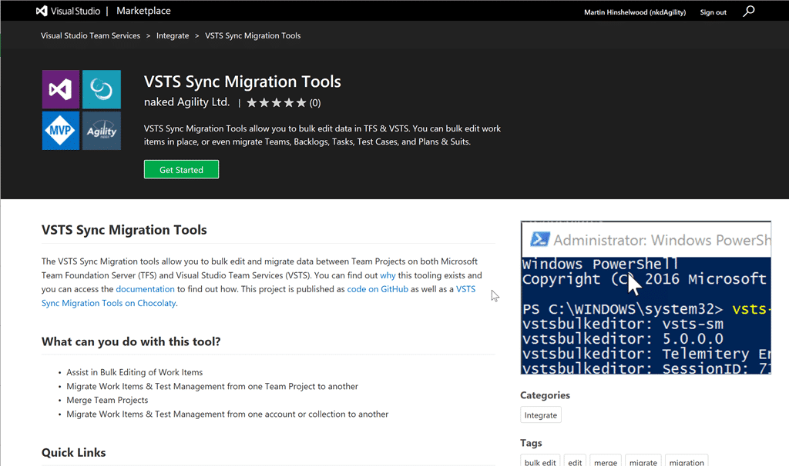

I have been working with a number of customers in the last year that want to move to VSTS. While many of them want to do the full Collection import, many do not.

Maybe they have too many Team Projects and they want to consolidate, maybe they just have too much baggage. Whatever the reason I needed to be able to push data around between TFS and VSTS… or even TFS to TFS. That is when the [VSTS Sync Migration tools](https://marketplace.visualstudio.com/items?itemName=nkdagility.vsts-sync-migration) were born.

I initially had but a single goal of migrating work items, but since then it has broadened out to include many different types of data:

- **Work Items** - I only ever worry about the Tip of Work Item tracking. Apart from the History (comments) field which I do migrate there is really no long term value in it aside from reporting. Since most migration tool mess up the dates the reporting value disappears as does the value in the history.
    
    Note: I do have some ideas around this and the new API capabilities since TFS 2012 should allow a higher fidelity of data migration, however I have not yet been unable to talk a customer out of History, and thus I have not had the need to build. So if you want to migrate with history and have the budget…
    
- **Test Plans & Suits** - The Test data is a lot trickier, but I managed to get Configurations, Variables, as well as Plans and Suits migrated. There are still some bugs but its way better than having to go make everything from scratch.
    
    Note: Test Runs are not currently migrated but I have been noodling on that problem. Again, once someone is desperate enough to give me a reason to go dive in…
    
- **Teams** \- Really simple, just the team names, but there is scope for a lot more.
    
- Area & Iteration Paths - Simply replicated the existing layout. I would love to have all of the Team Meta data but again, time…
    

Since most teams migrate from TFVC to Git in TFS I was not interested in migrating code. There are some really good solutions for that already with Git-TF and Git-TFS being the best. I wanted the tools to be free as well, so while I always work in VSTS I publish the code and releases out to GitHub so others can participate.

You are welcome to Fork the repository on GitHub and I will happily accept pull requests, but know that my MASTER is in VSTS and not GitHub along with the entire automated build and release system. I release to [NuGet](https://www.nuget.org/packages/VSTS.DataBulkEditor.Engine/), [Chocolatey](https://chocolatey.org/packages/vsts-sync-migrator), [GitHub](https://github.com/nkdAgility/vsts-sync-migration), and the [VSTS Marketplace](https://marketplace.visualstudio.com/items?itemName=nkdagility.vsts-sync-migration).

Let me know what you think of the tools…

