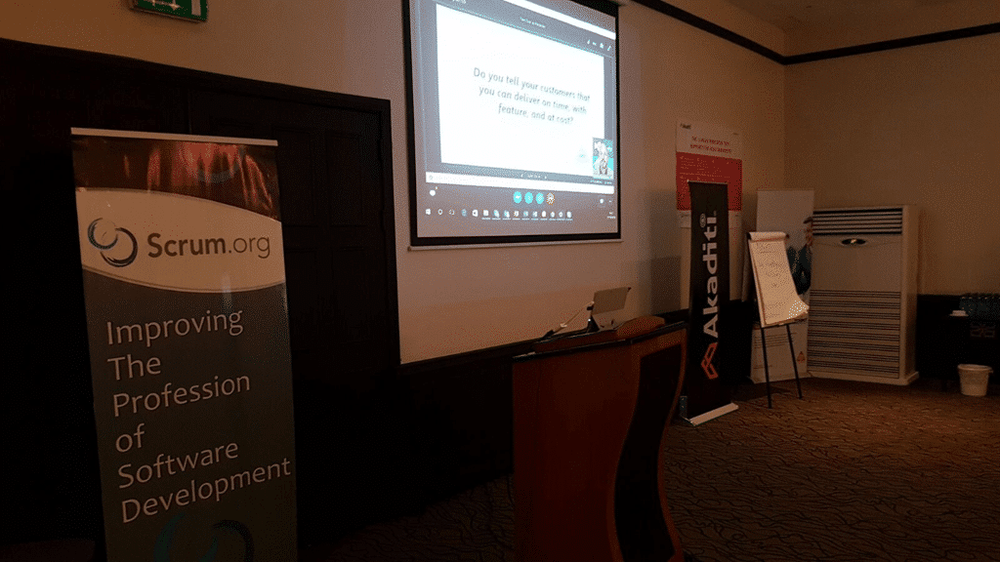

I have been honoured by being asked to speak at [Agile in Africa](http://agileinafrica.com/) today on the topic of [Kalabule or a Professional at Agile in Africa](http://agileinafrica.com/speaker/martin-hinshelwood/). I was a little disappointed when Nana asked me, as I had already booked a customer on those dates in Houston, Texas. Nana asked if I could do remote, so I could attend anyway :). This is my second presentation at Agile In Africa, and it sounds like this years event is just as awesome as the last.

**Download the Presentation:** [**Kalabule or Professional @ Agile In Africa**](https://doc.co/C7HRwP)

I have been covering the topic of Professionalism in software ever since I started doing the Scrum thing and finding that most companies, big and small, really have no idea what Scrum is beyond doing "Stand Ups" and "Demos"… neither of which are really part of Scrum…

{ .post-img }

Most teams working on software are kalabule (cowboys) who use excuses of poor management to try to seek forgiveness for their terrible software. Software that more often than not does not do what the customer asked for, was not delivered when they needed it, and cost far more than what they were expecting. That, my friends, is the experience of working with kalabule and con men…not professionals. The customers of these teams need to demand professionalism from the teams and vendors with the result being working software delivered on a regular cadence that meets their needs.

There is no excuse any more for kalabule. None…

[![clip_image001[4]](images/clip_image0014_thumb-3-3.png "clip_image001[4]")](https://nkdagility.com/wp-content/uploads/2016/10/clip_image0014.png)
{ .post-img }

Its was the last session in the day so I was expecting only a few people, but it looks like there was some turnout. Nana introduced the audience and I had Bankers, Farmers, and Software folks in the room. A good mix of Customers and Providers is always good when your message affects them both.

[![clip_image001[6]](images/clip_image0016_thumb-4-4.png "clip_image001[6]")](https://nkdagility.com/wp-content/uploads/2016/10/clip_image0016.png)
{ .post-img }

I talked a lot about why we are kalabule in the software industry and that neither mechanical Scrum, nor mere Engineering Practices alone can prevent the fear, disrespect, hidden rocks, and overall lack of commitment in the software industry. We also need some guiding values that we can use to make sure that we always do the right thing.

- Courage
- Focus
- Commitment
- Respect
- Openness

If these values are not something that you want, not just building software, but simply interacting with others on a daily bases, then you have no business interacting with them.

As an industry we need to step up and refuse to be kalabule (cowboys) and instead strive to be Professionals and embody the Values that we want to be known for. Its time to clean the unprofessional muck from our industry and reinvent ourselves…
