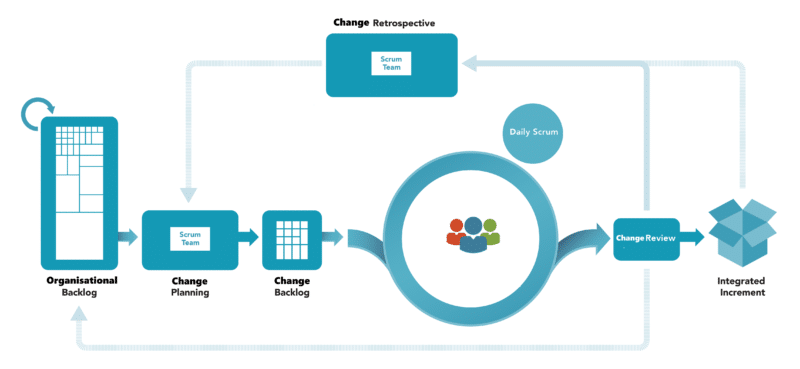
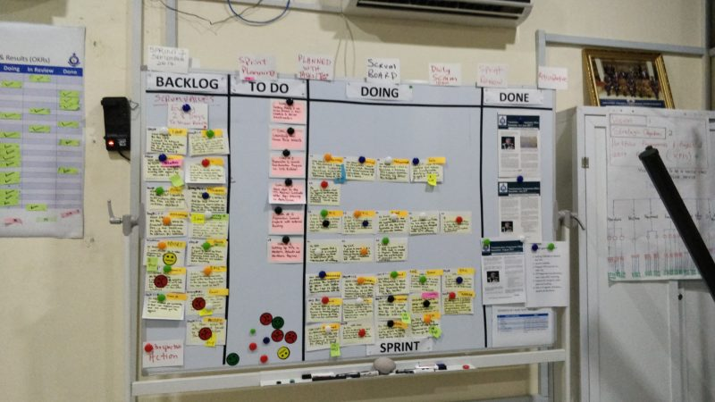

The [Ghana Police Service](http://police.gov.gh/) is in trouble. Over the last few last few decades each new Police organisation and government has tried in various ways to carry out some change but most changes have been ad-hoc, temporary, not robust enough or strategic. The old problems return to haunt new administrations and many police officers and the Public have lost hope.

In order to create any lasting and permanent change, a transformation is required. A departure from the old to a new modern and professional way to provide protective services to the public and uphold the law. For a permanent change to happen it requires 3 things.

1. A clear vision, goal, metrics underpinned by a servant leadership style that empowers people to believe in the power of possibilities.
2. A structured and strategic approach supported by a high performance framework to deliver results quickly.
3. A transformation network made up of change agents who are trained and empowered to promote the transformation nationally.

As it stands, public confidence has been eroded to record levels. New management plans to change that, and not by nibbling around the edges. The new Inspector General of Police (IGP) is leading the charge to transform the service into a world class police service with radical, and much needed change.

> Only when an organisation has completely and utterly failed to deliver will it contemplate radical change.
>
> \-Ken Schwaber

I have been working with [Akaditi](http://www.akaditi.com) and [Nana Abban](https://www.linkedin.com/in/nana-abban-2a43b460/) on the Ghana Police Service's organisational transformation, one of the first in the world, and I have never seen a clearer vision, nor a more empirical approach. The key to any transformation at the organisational level is leadership and vision. Even more so in a public sector organisation. The Ghana Police Service already have top down buy-in for the transformation, which is rare in any organisation. And when I say top down, you need to understand that not just the IGP, but his boss, the President of Ghana, are all bought in for change.

> #### VISION
>
> The Ghana Police Service seeks to become a world class Police Service capable of delivering planned, democratic, protective, and peaceful services up to the standards of international best practice
>
> #### MISSION
>
> The mission of the Police Service is to ensure crime prevention and detection, apprehension and prosecution of offenders, consistent with the expectations of Ghanaians for safe, secure and peaceful communities.

The question has always been, how do you adopt Scrum & Organisational Transformation in an empirical manner rather than a defined and traditional one. Oh the arguments that Steven Borg and I have had. A few years ago Scrum.org quietly released the Agility Path Guide as a way to do just that. It has been slowly gaining traction as more folks have had success.

I should not need to tell you that in order to effect lasting change in an organisation you need a [framework and not a methodology](https://nkdagility.com/organisational-change-create-path/). Since every organisation has its own way of doing things (unique people, processes, & practices) that reflect in a unique culture, why would someone else's blueprint work for you. You need a framework (much like constructing anything physical) around which you can build your custom methodology. The Agility Path Guide introduces a framework, based on Scrum, to effect Professional Organisational Change. This framework can be used to productively and creatively deliver organisational change of the highest possible value.

{ .post-img }

We need the framework, and not a methodology, because every team, group, and department within an organisation is different. Accepting that difference, this framework helps us make sure that we are all at least playing the same game from the start. If everything is open to change we can easily end up in chaos or stagnation. Just like Scrum the Professional Organisational Change framework is closed for modification, but open to extension.

{ .post-img }

One such awesome extension that I have seen used to great effect in both software and non-software endeavours is the Kanban board. It provides both transparency and at-a-glance status to what is going on. While this is the board from the Organisational Transformation office the Inspector General of Police has both a Kanban and a Scrum board in his 'war room' which is what his change team and visitors gather around to discuss strategy and what comes next. While we maintain the core framework to enshrine empiricism in our process many parts of the organisation will extend that framework in creating and unique ways to help them solve their independent individuals problems.

As you can imagine the Ghana Police Service is very hierarchical and relies heavily on rank to get things done. It has not had significant change in nearly 60 years, and they are still following the old ways. Command and control is the way things are done, and it is no longer working. The education level of officers has changed a lot in 60 years. By way of example the two Professional Scrum Foundations classes I ran for them this week had more MBA's, psychology, and other degrees than the same class in Europe or the US. There has been a big push, some say too much, on academic credentials, but it means that the workforce has changed. Command and control, that was designed for an uneducated work force will no longer be effective, and indeed works to erode moral. Command and control is a fallacy in the modern world and an enigma born of Taylorism and ignorance from a lost time.

{ .post-img }

Hell, the military realised that command and control was a losing strategy when Napoleon defeated the Persian army 300 years ago. The Ghana Police Service is certainly not the last to realise it as many European and US companies still try to use Command and Control in this way.

In any Agile organisation management changes from a 'telling people what to do' role, to one of servant leadership. They change from giving instructions to setting goals. They stop being a planner and become a teacher, coach, and leader.

Leadership has very little to do with giving instructions and barking commands.

