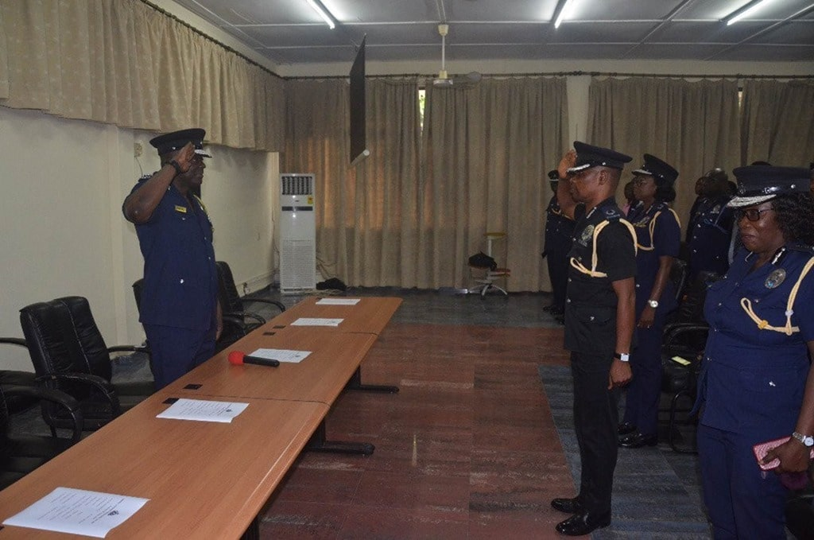
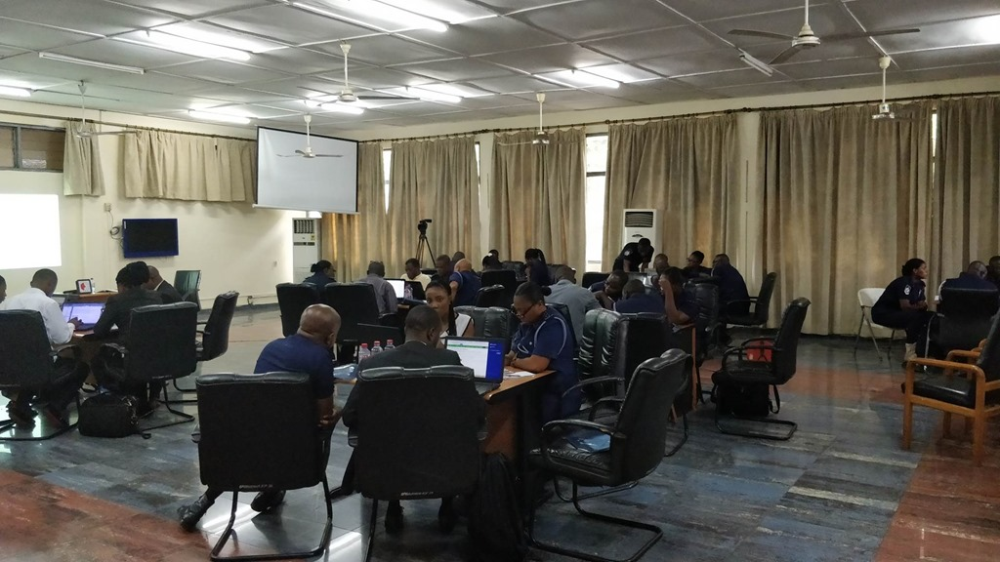
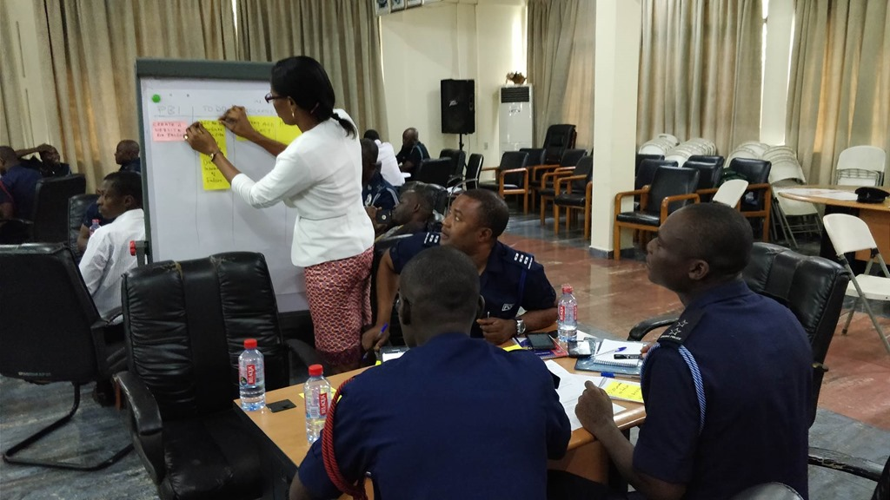
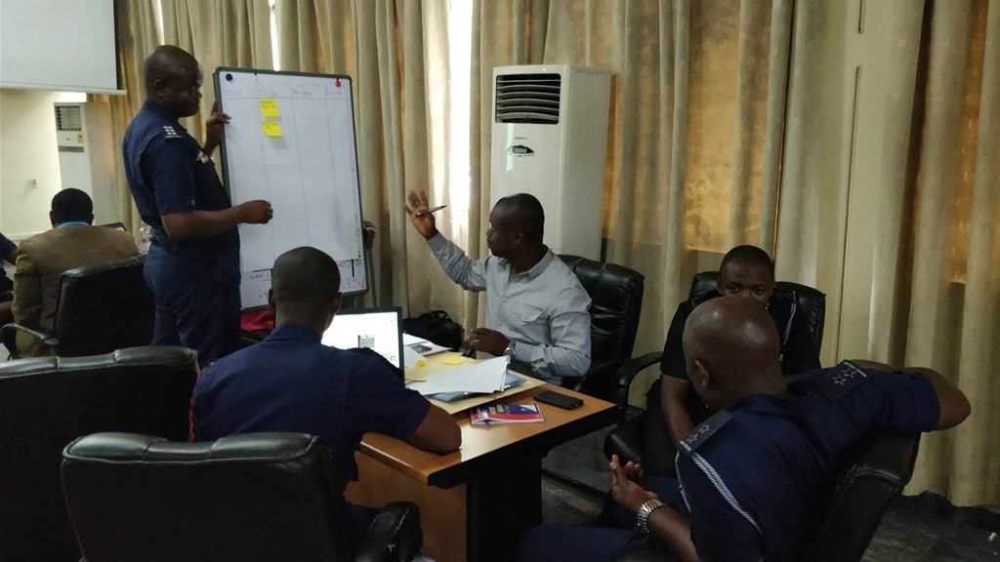

Last time I talked about the Ghana Police Service (GPS) I was talking about [Professional Organisational Change](https://nkdagility.com/professional-organisational-change-ghana-police-service/) and the approach the Inspector General of Police (IGP) is taking; using Scrum to incrementally make changes to the organisation. While Nana Abban and the IGP have been focusing on the big picture, I have been in Ghana to start the grass roots adoption of Scrum with two Professional Scrum Foundations (PSF) classes, the first ever run in Ghana.

> Note: You can download the [Agility Guide to Evidence-based Change](https://www.scrum.org/resources/agility-guide-evidence-based-change) from Scrum.org

## Kicking off the Professional Scrum Training

I am not kidding or being metaphorical when I say that these fantastic officers split into groups and, with limited IT knowledge, organised around creating working software in the form of a website. You can imagine the look on their faces when I proposed such a task, but you can't imagine the look of pride and satisfaction in what they produced.

{ .post-img }

> When it comes to complexity of creative work l, there really is nothing as complex as software development.
>
> Ken Schwaber, CEO and Founder of Scrum.org

{ .post-img }

I arrived late on Sunday and first thing Monday I was whisked to the Ghana Police Headquarters to meet with the IGP . We had met before, two years earlier at the very first Agile In Africa conference when he was not the IGP and did a talk on solving complex chases (in this case a serial killer) using agile ideas and practices. He is big on Scrum having seen it used effectively in his time at Interpol, and he understands the foundational agile concepts of empiricism and how they can be applied to policing. The \[vision and mission\] I mentioned before is unlikely to be realised predictively and will require significant empirical experimentation to get right.

{ .post-img }

Because this was the very first class, and the first time many of the rank and file had even heard of Agile or Scrum we had a kick-off ceremony and some photo opportunities. In case you can't find me, I'm sitting in the front row, third from the left, with the IGP in the middle and Nana Abban on the right. The folks behind me are the students for the very first Professional Scrum Foundations class in West Africa. It's important as you move into a new endeavour to make sure that everyone understands the fundamentals of how you plan on achieving your goals, and why it works.

{ .post-img }

After the ceremony it was time to get down to the business of learning Scrum.

## Real Sprints in Professional Scrum Foundations

If you are not familiar with the PSF it was designed, originally by David Starr, as an intensely practical course. Just explaining agile and Scrum is not enough and students have to live it, and feel it. To that end we do actual sprints building working software in the class. Not only was this the first PSF in West Africa, but it was the first course that the Police and civilians were collaborating on. For most of the officers it was also their first experience building software with their prior experience being in Word and Excel.

{ .post-img }

I have used the PSF effectively in software organisations to train everyone, from the guy driving the forklift in the warehouse, to the CEO of the company. It's effective because everyone in your company learns how and why Scrum works, and because everyone then understands the problem domain. Software is hard. For Police Officers I had a conundrum; do I change the topic away from software, or do I follow through and take folks out of their comfort zone.

{ .post-img }

I decided to follow through and the look on everyone's face when I asked them to collaborate on creating a working website was priceless. The PSF is usually made up of 4 sprints of 60 minutes during the class. Since we were also introducing technology we only really had time for 2 of the sprints, but I learned enough to think that I can push for 3 next time around. There were a lot of discussions, that I don't have from software students, on how to relate Scrum and our software exercises to police work. While the goal for the training is focused on facilitating organisational change, the reality is that folks in the room care about the work that they do. We had some especially interesting conversations about the difference between creative work, suited for Agile/Scrum and non-creative work, suited for Lean/Kanban.

{ .post-img }

The overall flow of the class revels the workings of Scrum iteratively with practical exercises helping to allow students to attain the knowledge incrementally:

- **Introductions** - Getting to know each other is important for understanding how to form teams and making sure that every team has the required skills.
- **Sprint 1 -** The purpose of the first sprint is for students to see that a group of people just working together for a common goal can get things done. No work breakdown structure required.
- **Fundamentals to Scrum** - We also need an understanding of the problem we are trying to solve. Here we discuss taylorism, predictive vs empirical, and maintaining an ability to change.
- **Scrum Framework 1** - Then it's time to dive into Scrum and the Roles (for accountability), the Artifacts (for transparency), and the Events (for inspect and adapt) that make it work.
- **Sprint 2** - In the second sprint the team's have selected a Scrum Master, and Product Owner. They do explicit Sprint Planning, Review, and Retrospective. Things should go a little more smoothly.
- **Scrum Framework 2** - This is a second deeper iteration over the Roles (for accountability), the Artifacts (for transparency), and the Events (for inspect and adapt) to add a little more detail and answer the new questions that arise from the Second Sprint.
- **Mastering Scrum** - the added value of Scrum is People working together in self-organising Teams and being given the freedom of self-determination to achieve technical mastery of their profession. We focus a lot on Autonomy, Mastery, and Purpose here as it is key to maintaining happy and healthy teams.
- **Sprint 3** - Depending on how folks are getting on I would normally introduce some team dysfunctions for this Sprint, showing how disruptive they can be. Teams generally get frustrated here, and we have some serious discussions in the Retrospective.
- **Planning in Scrum** - Dispelling the myths that Agile teams don't do any planning, and that more planning leads to more accurate estimates is the order of Planning in Scrum. Lots of exercises and exposure to many of the complimentary practices that often used for planning, like Stories and Story Points.
- **Sprint 4** - The 4th Sprint generally brings with it some significant change in tactical direction due to a business need. Its common in the real world, and we want to show students that even significant change can be managed and need not result in chaos.
- **Getting Started** - After the class there is an expectation that students will use what they just learned, and use it in anger. For this class each of the Regional Commanders will be starting Scrum Teams to action organisational change. So lets feed the backlog a little. Leadership, while good at figuring out what changes need to be made, are often quite far from the actual work being done. This leads to a gap, obvious to people on the ground, on what the next most important thing is to change. After a few discussion around how the organization functions the students get some time to write their own Organisational Change backlog items...we got quite a few...

> NOTE: I only managed to get through 2 sprints for the GPS. Part of that was that both classes were shortened by a half day. The first because of a ceremony with the IGP and the second due to the Friday being a holiday. I have had to miss out Sprint 4, but never both 3 and 4 before. I was quite distraught the first class, but accepting in the second. The students still learned so much.

## Retrospective for the Professional Scrum Training in Ghana

I had some assumptions before arriving at the class that were just not true. My biggest mistake was that the students would know why they were there and what they were going to learn. That is not usually a problem in a software organisation since at least we have a frame of reference and a significant body of knowledge. With the group of Police Officers, even though we had a few techies, that reference point was missing. We spent a lot of time in the first class creating that reference point and heading off dead ends and blind allies. Many were confused as to what they were going to use this for.

For the second class we had already learned from the feedback of the first, yes it was the very next day, and we started differently. We had a short speech by one of the Police Officers from the Organisational Transformation office to frame the class and its purpose, specifically within the context of the attendees. This seamed to help a lot and things were a lot smother. I also got on a lot better relating Scrum and Software Development to Police Work from the first class. I am now totally comfortable teaching this class to 35 people that have no idea how to build software.

{ .post-img }

Some things I would do differently:

1. Have all students emailed the Scrum Guide as well as an introduction to what we are trying to achieve in the realm of Organisational Change within the Service. This was something we intended to do for these classes but there was a lot of complications in organising 50 officers from many districts. Many of whom has to travel for more than 10 hours just to get to the class.
2. Frame earlier that the purpose of the class is to familiarise the Police Officers with Scrum as they are stakeholders to, or maybe Team Members on, the Organisational Change team.

## Conclusion

Teaching non techies is hard, especially for a certifiable geek like myself. However I totally enjoyed my time in Ghana teaching Scrum for the Ghana Police Service and am looking forward to doing it again. I'm back in Ghana for the Agile In Africa conference, and again in December to teach a Professional Scrum Developer (this time to techies). More classes are scheduled next year...

If you are in Ghana or anywhere in West Africa you can get in touch with [Akaditi](http://www.akaditi.com/) for both public and private classes for your Organisation.
