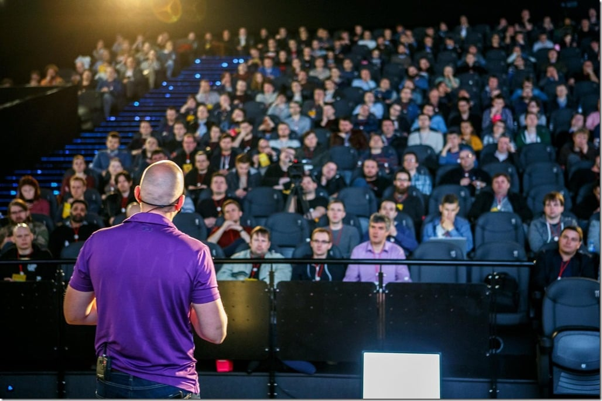
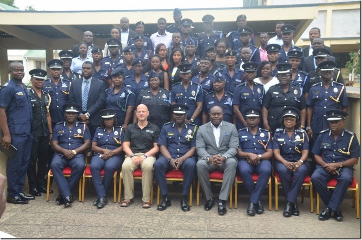

This year has been relatively busy for conferences. Which is unusual since I usually forget until after the call for papers and wonder what's going on. Well, this time I got some submissions in on time. It does, however, baffle me which papers are selected. I always submit around 6 papers for workshops and talks, and always the one I would least like to present is picked.

 Figure: [DevOps Vilnius 2017 (Keynote) - Agile is Dead?](http://nkdagility.net/2jOeQ0c)
{ .post-img }

Getting out of my comfort zone is something that was instilled in me working with Adam Cogan and Steven Borg. That fear of failure that drives me to be that little bit better is what seems to set me apart…

I worked for Adam Cogan when, on my first visit to Australia, he told me the day before that I was doing two talks at the Silverlight Code Camp; one on TFS and the other on SharePoint. I worked with Steven Borg through the night on his presentation for the ALM Forum. It has been an exciting last seven years since I left the FTE world behind; What's in store for me next…

Here is a round-up of all of the 2017 conferences with links to the presentation that I used:

- [NDC London 2017 - Agile Is Dead](http://nkdagility.net/2zrKU13)
- [NDC Mini Copenhagen 2017 - Big Scrum: Scaling Scrum to the Enterprise](http://nkdagility.net/2A1XZe9)
- [DevOps Vilnius 2017 (Keynote) - Agile is Dead?](http://nkdagility.net/2jOeQ0c)
- [DevOps Vilnius 2017 - DevOps Zero to Hero](http://nkdagility.net/2hUtmDa)
- [Scrum Day London 2017 - Agile is Dead: Long live DevOps](http://nkdagility.net/2hJG9Er)
- [NDC Oslo 2017 - Building big Teams with Nexus](http://nkdagility.net/2iHy18o)
- [Agile In Africa 2017 - Building Big Teams with Nexus](http://nkdagility.net/2zYaf1N)
- [Agile in Africa 2017 - Leading Agile Change](http://nkdagility.net/2zc3N3G)
- [Ghana School of Engineering - Students Agile Survival Guide](http://nkdagility.net/2zZ36Oq)
- [Lean-Agile Glasgow (October 2017) - Leading Agile Change in Africa](http://nkdagility.net/2AmTZbs)
- [Build Stuff LT 2017 - Sprint Zero and Working Software too](http://nkdagility.net/2A1tCVh)

In between, I ran many workshops and courses in Norway, Ghana, India, USA, UK, Lithuania, & Poland… I am finding more and more than the value in training vastly outweighs the value in consulting. I believe that every customer I leave should have more knowledge than when I arrived. If we can do that in a structured and fun way that leaves the majority with many more tools in their toolbox, then that's even better. Although I have been teaching a lot of [Scrum]() classes rather than technical its that technical foundation in building lousy software that gives me the energy to help everyone else.

{ .post-img }

Figure: [Professional Scrum]() Foundations training for the Ghana Police Service

The stories I could tell! And I do… if you come to one of my courses you can find out that your practices and processes are not that bad after all…

- [Professional Agile Retreat](https://nkdagility.com/training/courses/professional-agile-retreat-with-psm-pal/) – 3 days of training in Professional Scrum with a two day Professional [Scrum Master]() and a 1-day Professional Agile [Leadership](). Here is the rub, it's in Cancun.. come for the week and spend the rest on the beach, maybe we will spend all of it on the beach.
  - [January 29th, 2018 | Cancun, Mexico \[PAL-e + PSM\]](https://nkdagility.com/training/scheduled/professional-agile-retreat-with-psm-pal-in-cancun-mexico-on-29th-january-2018/)
- [Professional Scrum Master Training](https://nkdagility.com/training/courses/professional-scrum-master/) – Everyone wants to be a Scrum Master…
  - [December 4, 2017 | Oslo, Norway](https://nkdagility.com/training/scheduled/professional-scrum-master-oslo-december-2017/)
  - [January 8th, 2018 | Edinburgh, Scotland](https://nkdagility.com/training/scheduled/professional-scrum-master-edinburgh-scotland-8th-january-2018/)
  - [January 15th, 2018 | Oslo, Norway](https://nkdagility.com/training/scheduled/professional-scrum-master-oslo-norway-15th-january-2018/)
- [Professional Scrum Developer Training](https://nkdagility.com/training/courses/professional-scrum-developer-training/) – Engineering teams learn what [engineering excellence]() really means for the [engineering practices]() that one requires for outstanding agility.
  - [December 11, 2017 | Accra, Ghana](https://nkdagility.com/training/scheduled/professional-scrum-developer-accra-ghana-11th-december-2017/)
  - [January 10th, 2018 | Edinburgh, Scotland](https://nkdagility.com/training/scheduled/professional-scrum-developer-edinburgh-scotland-january-2018/)

That's just a few of the classes that I have already booked for 2018, and you can find more on the [training](https://nkdagility.com/training) page.

I think that 2018 is going to be more training than consulting, although now I have booked a bunch of training I have customers looking for consulting time… ho hum… that's the way it is I guess…
